# Redis基础

## Redis简介

### 问题现象

- 海量用户
- 高并发

### 罪魁祸首——关系型数据库——关系型数据库

- 性能瓶颈：磁盘IO性能低下
- 扩展瓶颈：数据关系复杂，扩展性差，不便于大规模集群

### 解决思路

- 降低磁盘IO次数，越低越好        ——内存存储-------------------------------->Nosql
- 去除数据间关系，越简单越好    ——不存储关系，仅存储数据---------->Nosql<!--more-->

### Nosql

即Not-Only-SQL(泛指非关系型的数据库)，<span style = "color:red">作为关系型数据库的补充</span>

作用：应对基于<span style = "color:red">海量用户和海量数据</span>前提下的数据处理问题

特征：

- 可扩容、可伸缩
- 大数据量下高性能 
- 灵活的数据模型
- 高可用

常用的Nosql数据库：


- Redis
- memcache
- HBase
- MongoDB

### Redis

概念：Redis(REmote DIctionary Server)是<span style = "color:red">高性能</span>键值对(<span style = "color:red">key-value</span>)数据库。

特征：

1、数据间没有必然的关联关系

2、内部采用<span style = "color:red">单线程</span>机制进行工作

3、高性能，官方提供测试数据，50个并发执行100000个请求，读的速度是110000次/s，写的速度是81000次/s。

4、多数据类型支持

- 字符串类型——String：最简单最常用的
- 哈希(散列)类型——hash：也叫散列,类似于Java中的HashMap结构（field：value），<span style ="color:red">适合用于存储对象</span>
- 列表类型——list：队列，按照插入顺序排序，可以**有重复元素**，类似于Java中的LinkedList
- 集合类型——set：无序集合，**没有重复元素**，类似于Java中的HashSet
- 有序集合类型——sorted set/zset：集合中每个元素关联一个分数(score)，根据分数升序排序，没有重复元素

5、持久化支持，可以进行<span style = "color:red">数据灾难恢复</span>，防止断电的情况。

### Redis的应用

- 为<span style = "color:red">热点数据加速查询</span>（主要场景），如热点商品、热点新闻、热点资讯、推广类等<span style = "color :red">高访问量信息</span>等
- 任务队列，如秒杀、抢购、购票排队等
- 即时信息查询，如各位排行榜、各类网站访问统计、公交到站信息、在线人数信息(聊天室、网站)、设备信号等
- 时效性信息控制，如验证码控制、投票控制等
- <span style = "color:red">分布式数据共享</span>，如分布式集群架构中的session分离
- 消息队列
- 分布式锁

### Redis的基本操作

命令行模式工具使用思考

- 功能性命令
- 清除屏幕信息
- 帮助信息查阅
- 退出指令

信息添加

- 功能：设置key，value数据
- 命令：SET key value
- 范例：set name itheima

信息查询

- 功能：根据key查询对应的value，如果不存在，返回空(nil)
- 命令：GET key
- 范例：get name

清楚屏幕信息

- 功能：清除屏幕中的信息
- 命令：clear

帮助

- 功能：获取命令帮助文档，获取组中所有命令信息名称
- 命令：help 命令名称                      help @组名

退出客户端命令行模型

- 功能：退出客户端
- 命令：quit  exit  \<ESC>

## Redis数据类型

### 业务数据的特殊性

#### 作为缓存使用

1、原始业务功能设计

- 秒杀
- 618活动
- 双11活动

2、运营平台监控到的突发高频访问数据

- 突发时政要闻，被强势关注围观

3、高频、复杂的统计数据

- 在线人数
- 投票排行榜

#### 附加功能

系统功能优化或升级

- 单服务器升级集群
- Session管理
- Token管理

### 字符串String操作命令

String类型

- 存储的数据：单个数据，最简单的数据存储类型，也是最常用的数据存储类型
- 存储数据的格式：一个存储空间保存一个数据
- 存储内容：通常使用字符串，如果字符串以<span style = "color:red">整数</span>的形式展示，<span style = "color:red">可以作为数字操作使用</span>

string类型数据的基本操作

- SET key value：设置指定key的 值
- GET key：获取指定key的值
- DEL key：删除指定key的值
- SETNX key value：只有在key不存在时设置key的值，不存在key的时候返回0并创建key-value，反之为1并不创建key-value，应用场景：分布式锁
- MSET key1 value1 key2 value2：修改/添加多个数据
- MGET key1 key2...：获取多个数据
- STRLEN key：获取数据字符个数(字符串长度)
- APPEND key value：追加信息到原始信息后部（如果原始信息存在就追加，否则新建）

#### 单数据操作与多数据操作的选择之惑

单指令(set)3条指令的执行过程：发送指令时间x6+执行指令x2

多指令(mset)3条指令的执行过程：发送指令时间x2+执行指令x2

#### String类型数据的扩展操作

##### 解决方案

- 设置数值数据增加指定范围的值
  - incr key：一次增加一个单位的值
  - incrby key increment：设置增长的值进行增加（不能增加小数）
  - incrbyfloat key increment：设置增加的浮点型值
- 设置数值数据减少指定范围的值
  - de cr key：一次减少一个单位的值
  - decrby key increment

- string作为数值操作
  - string再redis内存存储默认就是一个<span style = "color:red">字符串</span>，当遇到增减类操作incr，decr时会转成数值型进行计算。
  - redis所有的操作都是原子性的，<span style = "color:red">采用单线程处理</span>所有业务，命令是一个一个执行的，因此无需考虑并发带来的数据影响。
  - 注意：按数值进行操作的数据，如果原始数据不能转换成数值，或超越了redis数值上限范围将报错。

- 设置数据具有指定的生命周期
  - SETEX key seconds value：设置指定key的值，并将key的过期时间设为sconds秒，到时间后自动被redis清理，常见于短信验证码等短时间有效的数据
  - PSETEX key milliseconds value：设置时间为毫秒
  - 通过数据是否失效控制业务行为，适用于所有具有时效性限定控制的操作。

##### 注意事项

- 数据操作不成功的反馈与数据正常操作之间的差异
  - 表示运行结果是否成功
    - (integer)0 ->false 失败
    - (integer)1 ->true 成功
  - 表示运行结果值
    - (integer)3 ->3    3个
    - (integer)1 ->1    1个
  - 数据最大存储量
    - 512MB
  - 数值最大范围(java中long的最大值)
    - 9223372036854775807

##### key的设置约定

- 数据库中的热点数据key命名惯例
 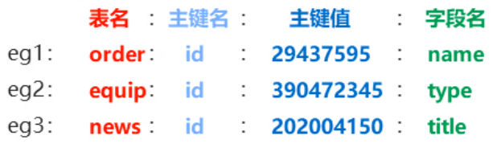

### Hash哈希操作命令

#### 存储的困惑

对象类数据的存储如果具有较繁琐的更新需求操作会显得笨重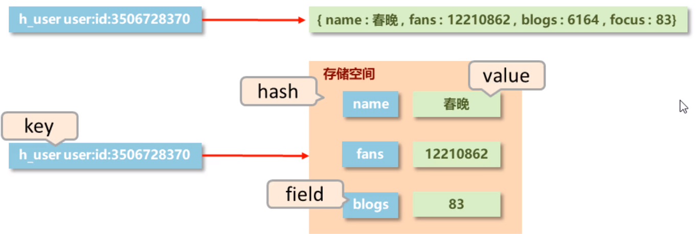

hash类型

- 新的存储需求：对一系列存储的数据进行编组，方便管理，典型应用存储对象信息
- 需要的存储结构：一个存储空间保存多个键值对数据
- hash类型：底层使用<span style = "color:red">哈希表</span>结构实现数据存储

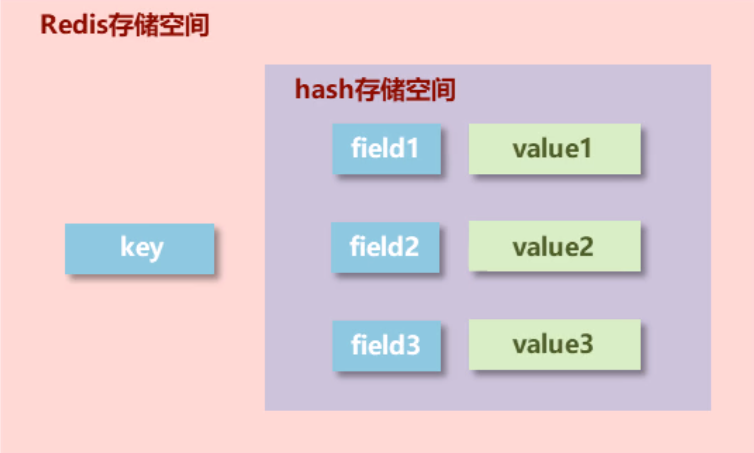

hash存储结构优化

- 如果field数量<span style = "color:red">较少</span>，存储结构优化为<span style = "color:red">类数组结构</span>
- 如果field数量<span style = "color:red">较多</span>，存储结构使用<span style = "color:red">HashMap结构</span>

基本操作

- HSET key field value：设置哈希表中key中的field的value，类似于表名-属性-值
- HGET key field：获取指定字段的值
- HGETALL key：获取所有字段的值
- HDEL key field：删除指定的field字段
- HMSET key field1 value1 field2 value2：添加/修改多个数据
- HMGET key field1 field2...：获取多个数据
- HLEN key：获取哈希表(field)中字段的数量
- HEXISTS key field：获取哈希表中是否存在指定的字段
- HKEYS key：获取哈希表中所有的<span style = "color:red">字段名</span>
- HVALS key：获取哈希表中所有的<span style = "color:red">字段值</span>
- HINCRBY key field increment：设置指定字段的数值数据增加指定范围的值
- HINCRBYFLOAT key field increment：设置指定字段的数值数据增加指定范围的<span style = "color:red">浮点值</span>
- HSETNX key field value：判断是否存在这个field没有就添加值，反之不添加

hash类型数据操作的注意事项

- hash类型下的value<span style = "color:red">只能存储字符串，不允许存储其他数据类型</span>，**不存在嵌套现象**。如果数据未获取到，对应的值为(nil)
- 每个hash可以<span style = "color:red">存储2<sup>32</sup>-1个键值对</span>
- hash类型十分贴近对象的数据存储形式，并且可以灵活添加删除对象属性。但hash设计初衷<span style = "color:red">不是为了存储大量对象</span>而设计的，不可滥用，更不可将hash作为对象列表使用
- hgetall操作获取全部属性，<span style = "color:red">如果内部field过多，遍历整体数据效率就会很低</span>，有可能成为数据访问瓶颈

应用场景

- 电商网站购物车设计与实现
  - 比如购物车数据，用户id作为key，商品id作为field，数量作为value
  - 业务分析
    - 仅分析购物车的redis存储模型
      - 添加、浏览、更改数量、删除、清空
    - 购物车于数据库间持久化同步
    - 购物车于订单间的关系
      - 提交购物车：读取数据生成订单
      - 商家临时价格调整：隶属于订单级别
      - 商家临时价格调整：隶属于订单级别
    - 未登录用户购物车信息存储
      - cookie存储

业务场景

- 双11活动日，销售手机充值卡的商家对移动、联通、电信的30元、50元、100元商品推出抢购活动，每种商品抢购上限1000张

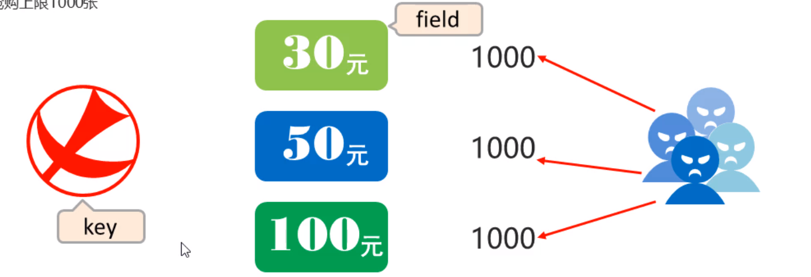

string存储对象(json)与hash存储对象

- string存讲究整体性（读为主），hash更适合更新的概念

### list类型

数据存储需求：存储多个数据，并对数据进入存储空间的顺序进行区分

需要的存储结构：一个存储空间保存多个数据，且通过数据可以体现进入顺序

list类型：保存多个数据，底层使用<span style = "color :red">双向链表</span>存储结构实现

#### list类型数据基本操作

- LPUSH key value[value2]：头插法插入数据（左边插入），先进先出
- RPUSH key value[value2]：尾插法插入数据（右边插入）
- LRANGE key start stop：查询数据从start下标到stop下标
- LINDEX key index：获取对应下标数据
- LLEN key：获取列表长度
- RPOP key：移除并获取列表最后一个元素，也可以LPOP从左边删除
- LPOP key：移除并获取列表第一个元素
- LREM key count value：移除指定数据,count指的是删除几个

#### list类型数据扩展操作

- blpop key1 [key2] timeout：我认为是监听key，在timeout时间内如果有数据立刻拿出来一个，如果内部没有数据就在timeout时间内一旦插入立刻拿出来，brpop同理
- brpop key1 [key2] timeout

- 业务场景
  - 微信朋友圈点赞，要求按照点赞顺序显示点赞好友信息

#### list类型数据操作注意事项

- list中保存的数据都是string类型的，数据总容量是有限的，最多2<sup>32</sup>-1个元素(4294967295)
- list具有索引的概念，但是操作数据时通常以<span style = "color:red">队列</span>的形式进行入队出队操作，或以栈的形式进行入栈出栈操作
- 获取全部数据操作结束索引设置为-1
- list可以对数据进行分页操作，通常第一页的信息来自于list，第2页及更多的信息通过数据库的形式加载
- 业务场景
  - twitter、新浪微博、腾讯微博中个人用户的关注列表需要按照用户的关注顺序进行展示，粉丝列表<span style = "color:red">需要将最近关注的粉丝列在前面</span>。
  - 企业运营工程中，系统将产生大量的运营数据，如何保障多台服务器操作日志的统一顺序输出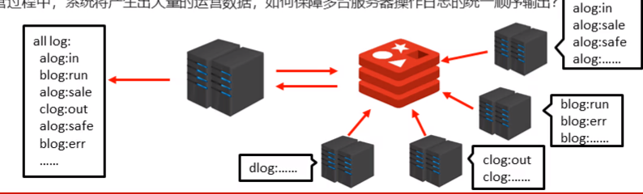
- 解决方案
  - 依赖list的数据具有顺序的特征对信息进行管理
  - 使用队列模型解决多路信息汇总合并的问题
  - 使用栈模型解决最新消息的问题
  - 应用于最新消息得展示

### Set类型

简介

- 新的存储需求：存储大量的数据，在查询方面提供更高的效率
- 需要的存储结构：能够保存大量的数据，搞笑的内部存储机制，便于查询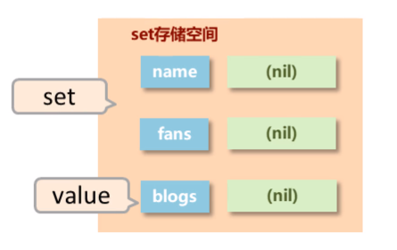
- set类型：与hash存储结构完全相同，仅存储键，不存储值(nil)，并且<span style = "color:red">值是不允许重复的</span>

#### set类型数据的基本操作

是String类型的<span style="color:red">无序集合</span>。集合成员是<span style = "color : red">唯一的，集合中不能出现重复的数据</span>

- SADD key member1[member2]:向集合添加一个或多个成员
- SMEMBERS key：返回集合中的所有成员
- SCARD key：获取集合的成员数
- SINTER key1[key2]：返回给定所有集合的<span style="color:red">交集</span>
- SUNION key1[key2]：返回所有给定集合的<span style="color:red">并集</span>
- SREM key member1[member2]：删除集合中的元素
- SISMEMBER key member：获取集合中是否包括指定数据

#### set类型数据的扩展操作

##### 业务场景1

每位用户首次使用今日头条时会设置3项爱好的内容，但是后期为了增加用户的活跃度、兴趣点，必须让用户对其他信息类别逐渐产生兴趣，增加客户留存度

###### 业务分析

- 系统分析出各个分类的最新或最热点信息条目并组织成set集合
- 随机挑选其中部分信息
- 配合用户关注信息分类中的热点信息组织成展示的全信息集合

###### 解决方案

- SRANDMEMBER key [count]：<span style = "color:red">随机</span>获取集合中指定数量的数据
- SPOP key：<span style = "color:red">随机</span>获取集合中的某个数据并将该数据移出集合

- tips：redis应用于随机推荐类信息检索，例如热点歌单推荐，热点新闻推荐，热卖旅游线路，应用APP推荐，大V推荐等

##### 业务场景2

脉脉为了促进用户间的交流，保障业务成单率的提升，需要让每位用户拥有大量的好友，事实上职场新人不具有更多的职场好友，如何快速为用户积累更多的好友——这就好比微信和QQ有时候会推荐好友，你们有多少个共同好友

###### 解决方案

- 求2个集合的交、并、差集
  - SINTER key1 [key2]
  - SUNION key1 [key2]
  - SDIFF key1 [key2]
- 求2个集合的交、并、差集并存储到指定集合中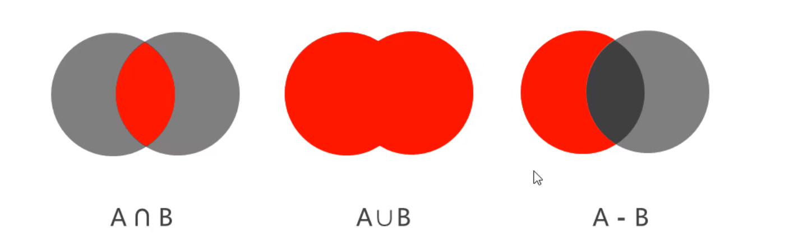
  - SINTERSTORE destination key1 [key2]
  - SUNIONSTORE destination key1 [key2]
  - SDIFFSTORE destination key1 [key2]
- 将指定数据从原始集合中移动到目标集合中
  - SMOVE source destination member
- tips
  - redis应用于同类信息的关联搜索，二度关联搜索，深度关联搜索
  - 显示共同关注(一度)
  - 显示共同好友(一度)
  - 由用户A出发，获取到好友用户B的好友信息列表(一度)
  - 由用户A出发，获取到好友用户B的购物清单列表(二度)
  - 由用户A出发，获取到好友用户B的游戏充值列表(二度)

set类型数据操作的注意事项

- set类型不允许数据重复，如果添加的数据在set中已经存在，将只保留一份
- set虽然与hash的存储结构相同，但是无法启动hash中存储值的空间

##### 业务场景3

集团公司共具有12000名员工，内部OA系统中具有700多个角色，3000多个业务操作，23000多种数据，每位员工具有一个或多个角色，如何快速进行业务操作的权限校验。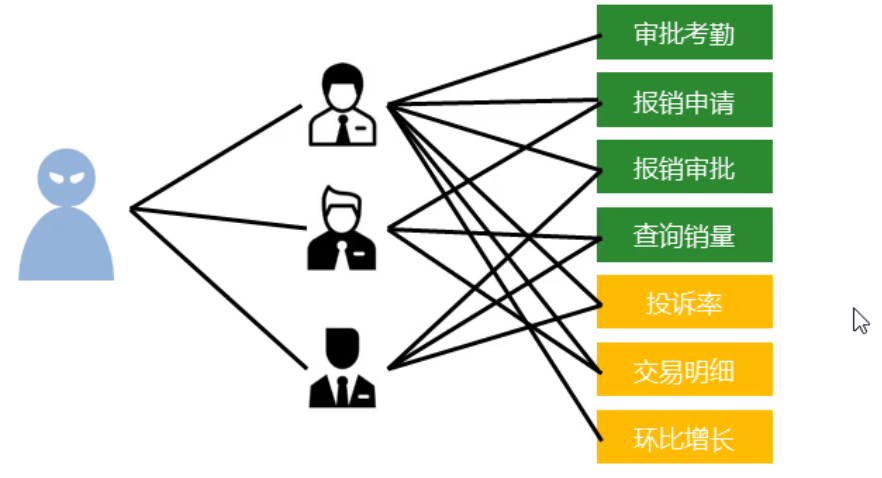

###### 解决方案

- 依赖set集合数据不重复的特征，依赖set集合hash存储结构特征完成数据过滤与快速查询
- 根据用户id获取用户所有角色
- 根据用户所有角色<span style = "color:red">获取用户所有操作权限放入set集合</span>
- 根据用户所有角色<span style = "color:red">获取用户所有数据全选放入set集合</span>
- tips
  - redis应用于同类型不重复数据的合并操作

##### 业务场景4

公司对旗下新的网站做推广，统计网站的PV（访问量）,UV(独立访客)，IP（独立IP）。

PV：<span style = "color:red">网站被访问次数</span>，可通过刷新页面提高访问量

UV：<span style = "color:red">网站被不同用户访问的次数</span>，可<span style = "color:red">通过cookie统计</span>访问量，**相同用户切换IP地址**，UV不变

IP：<span style = "color:red">网站被不同IP地址访问的总次数</span>，可通过IP地址统计访问量，相同IP不同用户访问，IP不变

###### 解放方案

- 利用set集合的数据去重特征，记录各种访问数据
- 建立string模型，利用incr统计日访问量（PV）
- 建立set模型，记录不同cookie数量（UV）
- 建立set模型，记录不同IP数量（IP）
- tips
  - redis应用于同类型数据的快速去重

##### 业务场景5

黑名单与白名单问题，在资讯类信息类网站追求高访问量，但是由于其信息的价值，会通过爬虫技术快速获取信息，个别特种行业网站信息通过爬虫获取分析后，转化为商业机密销售，例如：第三方火车票、机票、电商刷评论等。同时爬虫带来的伪流量会给经营者带来错觉，因此基于技术层面区分出爬虫用户后，需要将此类用户屏蔽。而对于安全性更高的应用访问，就可以设置白名单，依赖白名单做更为严苛的访问验证。

###### 解决方案

- 基于经营战略设定问题用户发现、鉴别规则
- 周期性更新满足规则的用户黑名单，加入set集合
- 用户行为信息达到后与黑名单进行比对，确认行为去向
- 黑名单过滤ip地址：应用于开放游客访问权限的信息源
- 黑名单过滤设备信息：应用于限定访问设备的信息源
- 黑名单过滤用户：应用基于访问权限的信息源
- tips
  - redis应用于基于黑名单与白名单设定的服务控制

### sorted_set类型

新的存储需求：数据排序有利于数据的有效展示，需要提供一种可以<span style = "color:red">根据自身特征进行排序的方式</span>

需要的存储结构：可以保存可排序的数据

sorted_set类型：在set的存储结构基础上添加可排序字段

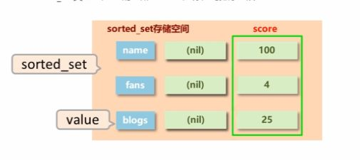

#### sorted_set类型数据的基本操作

添加数据

- ZADD key score1 member1 [score2 member2]

获取全部数据

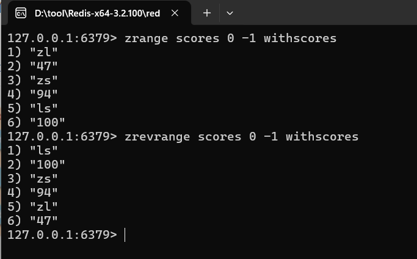

- ZRANGE key start stop [WITHSCORES]
- ZREVRANGE key start stop [WITHSCORES]

删除数据

- ZREM key member [member]

按条件获取数据

- ZRANGEBYSCORE key min max [WITHSCORES] [LIMIMT]
- ZREVRANGEBYSCORE key max min [WITHSCORES]

条件删除数据

- ZREMRANGEBYRANK key start stop
- ZREMRANGEBYSCORE key min max

注意

- min和max用于限定搜索查询的条件
- start和stop用于限定查询范围，作用于索引，表示开始和结束索引
- offset与count用于限定查询范围，作用于查询结果，表示开始位置和数据总量

获取集合数据总量

- zcard key
- zcount key min max

集合交、并操作

- zinterstore destination numkeys key [key...]
- zunionstore destination numkeys key [key...]

#### 业务场景1

- 票选广东十大杰出青年，各类综艺选秀海选投票

- 各类资源网站TOP10（电影，歌曲，文档，电商，游戏等）

- 聊天室活跃度统计

- 游戏好友亲密度

##### 业务分析

- 为所有参与排名的资源建立排序依据

##### 解决方案

- 获取数据对应的索引（排名）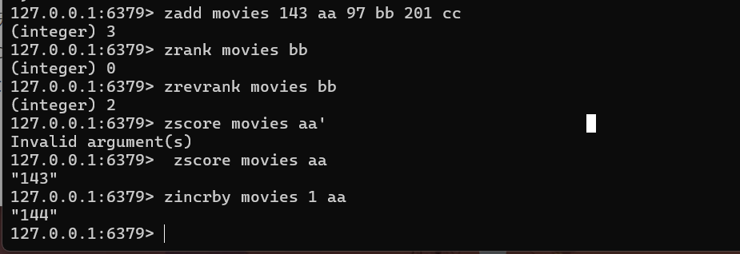
  - ZRANK key member
  - ZREVRANK key member
- score值获取与修改
  - ZSCORE key member
  - ZINCRBY key increment member

#### sorted_set类型数据操作的注意事项

- score保存的<span style = "color:red">数据存储空间是64位</span>，如果是整数范围是-9007199254740992~~~~9007199254740992
- score保存的数据也可以是一个<span style = "color:red">双精度的double值</span>，基于双精度浮点数的特征，<span style = "color:red">可能会丢失精度</span>，使用时候要谨慎
- sorted_set底层存储还是基于set结构的，因此数据不重复，如果重复添加相同的数据，score值将被反复覆盖，<span style = "color:red">保留最后一次修改的结果</span>

#### 业务场景2

基础服务+增值服务类网站会设定各位会员的试用，让用户充分体验会员优势。例如观影试用VIP、游戏VIP体验、云盘下载体验VIP、数据查看体验VIP。当VIP体验到期后，如果有效管理此类消息。即便对于正式VIP用户也存在对应的管理方式。

网站会定期开启投票、讨论，限时进行，逾期作废。如何有效管理此类过期信息。

##### 解决方案

- 对于<span style = "color:red">基于时间线限定的任务处理</span>，将处理时间记录为score值，<span style = "color:red">利用排序功能区分处理的先后顺序</span>
- 记录下一个要处理的时间，当到期后处理对应任务，移除redis中的记录，并记录下一个要处理的时间
- 当新任务加入时，判定并更新当前下一个要处理的任务时间
- 为提升sorted_set的性能，通常将任务根据特征存储成若干个sorted_set。例如1小时内，1天内，周内，月内，季内，年度等，操作时逐级提升，将即将操作的若干个任务纳入到1小时内处理的队列中。

- 获取当前系统时间
  - time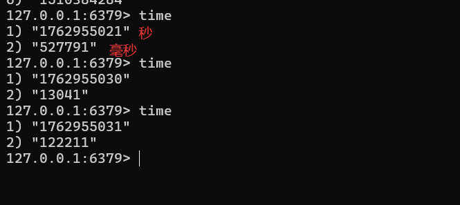

- tips:
  - redis应用于定时任务执行顺序管理或任务过期管理

#### 业务场景3

任务/消息权重设定应用

- 当任务或者消息待处理，形成了任务队列或消息队列时，对于高优先级的任务要保障对其优先处理，如何实现任务权重管理

##### 解决方案

- 对于带有权重的任务，优先处理权重高的任务，<span style = "color:red">采用score记录</span>权重即可

​        多条件任务权重设定

​                如果权重条件过多时，需要对排序score值进行处理，保障score值能够兼容2条件或者多条件，例如外贸订单优先于国内订单，总裁订单优先于员工订单，经理订单优先于员工订单

- 因score长度受限，需要对数据进行截断处理，尤其是时间设置为小时或分钟级即可(折算后)
- 先设定订单类别，后设定订单发起角色类别，整体score长度必须是统一的，不足位补0，第一排序规则首位不得是0
  - 例如外贸101，国内102，经理004，员工008
  - 员工下的外贸单score值为101008（优先）
  - 经理下的国内单score值为102004
- tips：
  - redis应用于即时任务/消息队列执行管理

### 数据类型实践案例

#### 业务场景1

人工只能领域的语义识别与自动对话将是未来服务业机器人应答呼叫体系中的重要技术，百度自研用户评价语义识别服务，免费开放给企业试用，同时训练百度自己的模型。现对试用用户的使用行为将进行限速，限速每个用户每分钟最多发起10次调用

##### 解决方案

- 设计计时器，<span style = "color:red">记录调用次数</span>，用于控制业务执行次数。以用户id作为key，试用次数作为value
- 在调用前获取次数，判断是否超过限定次数
  - 不超过次数的情况下，每次调用技术+1
  - 业务调用失败，计数-1
- 为计时器设置生命周期为指定周期。例如1秒/分钟，自动清空周期内使用次数

###### 解决方案改良

- 取消最大值的判定，利用incr操作超过最大值抛出异常的形式替代每次判断是否大于最大值
- 判断是否为nil
  - 如果是，设置为Max-次数
  - 如果不是，计数+1
  - 业务调用失败，计数-1
- 遇到异常即+操作超过上限，视为使用达到上限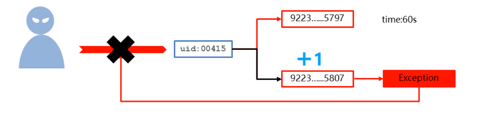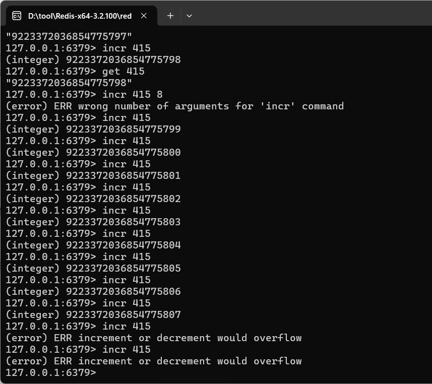

#### 业务场景2

使用微信的过程中，当微信接收消息后，会默认将最近接受的消息置顶，当多个好友及关注的订阅号同时发送消息时，该排序会不停的进行交替。同时还可以将重要的会话设置为置顶。一旦用户离线后，再次打开微信时，消息该按照什么样的顺序显示。

##### 解决方案

- 依赖list的数据具有顺序的特征对消息进行管理，将list结构作为栈使用
- 对置顶与普通会话分别创建独立的list分别管理
- 当某个list中接收到用户消息后，将消息发送方的id从list的一侧加入list(此处设定左侧)
- 多个相同id发出的消息反复入栈会出现问题，在入栈之前无论是否具有当前id对应的消息，先删除对应id
- 推送消息时先推送置顶会话list，再推送普通会话list，推送完成的list清除所有数据
- <span style = "color:red">消息的数量，也就是微信用户对话数量采用计数器的思想另行记录，伴随list操作同步更新</span>
- tips
  - redis应用于基于时间顺序的数据操作，而不关注具体时间

## Redis通用指令

### key通用指令

##### key特征

- key是一个字符串，通过key获取redis中保存的数据

##### key应该设计哪些操作

- 对于key自身状态的相关操作，例如：删除，判定存在，获取类型等
- 对于key有效性控制相关操作，例如：有效期设定，判定是否有效，有效状态的切换等
- 对于key快速查询操作，例如：按指定策略查询key

##### key基本操作

删除指定key

- del key

获取key是否存在

- exists key

获取key的类型

- type key

##### key扩展操作（时效性控制）

为指定key设置有效期

- expire key seconds
- pexpire key milliseconds
- expireat key timestamp
- pexpireat key milliseconds-timestamp

获取key的有效时间

- ttl key
- pttl key

切换key从时效性转换为永久性

- persist key

##### key扩展操作(查询模式)

查询key

- keys pattern

###### 查询模式规则

*：匹配任意数量的任意符号                 ？：配合一个任意符号         []：匹配一个指定符号

|keys *|查询所有|
|---------|-------------|
|keys it*|查询所有以it开头|
|keys *heima|查询所有以heima结尾|
|keys ??heima|查询所有前面2个字符任意，后面以heima结尾|
|keys user:?|查询所有以user:开头，最后一个字符任意|
|keys u[st]er:1|查询所有以u开头，以er:1结尾，中间包含一个字母，s或t|

###### key其他操作

为key改名

- rename key newkey
- renamenx key newkey：如果不存在再改名

对所有key排序

- sort

其他key通用操作

- help @generic

### 数据库通用指令

#### key的重复问题

- redis在使用过程中，伴随着操作数据量的增加，会出现大量的数据以及对应的key
- 数据不区分种类、类别混杂在一起，极易出现重复或冲突

##### 解决方案

- redis为每个服务提供有16个数据库，编号从0到15
- 每个数据库之间的数据相互独立

#### db基本操作

切换数据库

- select index

其他操作

- quit：退出
- ping：测试连通性
- echo message：相当于在redis控制输出日志

数据移动

- move key db

数据清除

- dbsize：查看当前数据库的数据总量
- flushdb：清除<span style = "color:red">当前数据库</span>的数据
- flushall：清除<span style = "color:red">所有数据库</span>中所拥有的数据

## Jedis

JAVA语言连接redis服务

- Jedis
- SpringData Redis
- Lettuce

###  客户端连接redis

分三步

- 连接redis

```java
Jedis jedis = new Jedis("127.0.0.1", 6379);
```

- 操作redis——和在控制台一样的操作

```JAVA
//jedis.set("name","itheima");
String name = jedis.get("name");
System.out.println(name);
```

- 关闭redis连接

```JAVA
jedis.close();
```

