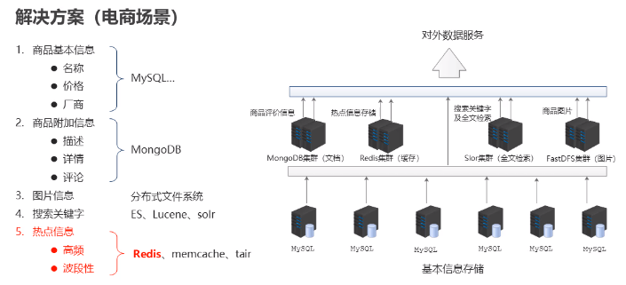

# Redis基础

## Redis简介

### 问题现象

- 海量用户
- 高并发

### 罪魁祸首——关系型数据库——关系型数据库

- 性能瓶颈：磁盘IO性能低下
- 扩展瓶颈：数据关系复杂，扩展性差，不便于大规模集群

### 解决思路

- 降低磁盘IO次数，越低越好        ——内存存储-------------------------------->Nosql
- 去除数据间关系，越简单越好    ——不存储关系，仅存储数据---------->Nosql<!--more-->

### Nosql

即Not-Only-SQL(泛指非关系型的数据库)，作为关系型数据库的补充

作用：应对基于海量用户和海量数据前提下的数据处理问题

特征：

- 可扩容、可伸缩
- 大数据量下高性能 
- 灵活的数据模型
- 高可用

常用的Nosql数据库：

- Redis
- memcache
- HBase
- MongoDB

### Redis

概念：Redis(REmote DIctionary Server)是高性能键值对(key-value)数据库。

特征：

1、数据间没有必然的关联关系

2、内部采用单线程机制进行工作

3、高性能，官方提供测试数据，50个并发执行100000个请求，读的速度是110000次/s，写的速度是81000次/s。

4、多数据类型支持

- 字符串类型——String：最简单最常用的
- 哈希(散列)类型——hash：也叫散列,类似于Java中的HashMap结构（field：value），适合用于存储对象
- 列表类型——list：队列，按照插入顺序排序，可以**有重复元素**，类似于Java中的LinkedList
- 集合类型——set：无序集合，**没有重复元素**，类似于Java中的HashSet
- 有序集合类型——sorted set/zset：集合中每个元素关联一个分数(score)，根据分数升序排序，没有重复元素

5、持久化支持，可以进行数据灾难恢复，防止断电的情况。

### Redis的应用

- 为热点数据加速查询（主要场景），如热点商品、热点新闻、热点资讯、推广类等高访问量信息等
- 任务队列，如秒杀、抢购、购票排队等
- 即时信息查询，如各位排行榜、各类网站访问统计、公交到站信息、在线人数信息(聊天室、网站)、设备信号等
- 时效性信息控制，如验证码控制、投票控制等
- 分布式数据共享，如分布式集群架构中的session分离
- 消息队列
- 分布式锁

### Redis的基本操作

命令行模式工具使用思考

- 功能性命令
- 清除屏幕信息
- 帮助信息查阅
- 退出指令

信息添加

- 功能：设置key，value数据
- 命令：SET key value
- 范例：set name itheima

信息查询

- 功能：根据key查询对应的value，如果不存在，返回空(nil)
- 命令：GET key
- 范例：get name

清楚屏幕信息

- 功能：清除屏幕中的信息
- 命令：clear

帮助

- 功能：获取命令帮助文档，获取组中所有命令信息名称
- 命令：help 命令名称                      help @组名

退出客户端命令行模型

- 功能：退出客户端
- 命令：quit  exit  \<ESC>

## Redis数据类型

### 业务数据的特殊性

#### 作为缓存使用

1、原始业务功能设计

- 秒杀
- 618活动
- 双11活动

2、运营平台监控到的突发高频访问数据

- 突发时政要闻，被强势关注围观

3、高频、复杂的统计数据

- 在线人数
- 投票排行榜

#### 附加功能

系统功能优化或升级

- 单服务器升级集群
- Session管理
- Token管理

### 字符串String操作命令

String类型

- 存储的数据：单个数据，最简单的数据存储类型，也是最常用的数据存储类型
- 存储数据的格式：一个存储空间保存一个数据
- 存储内容：通常使用字符串，如果字符串以整数的形式展示，可以作为数字操作使用

string类型数据的基本操作

- SET key value：设置指定key的 值
- GET key：获取指定key的值
- DEL key：删除指定key的值
- SETEX key seconds value：设置指定key的值，并将key的过期时间设为sconds秒，到时间后自动被redis清理，常见于短信验证码等短时间有效的数据
- SETNX key value：只有在key不存在时设置key的值，不存在key的时候返回0并创建key-value，反之为1并不创建key-value，应用场景：分布式锁
- MSET key1 value1 key2 value2：修改/添加多个数据
- MGET key1 key2...：获取多个数据
- STRLEN key：获取数据字符个数(字符串长度)
- APPEND key value：追加信息到原始信息后部（如果原始信息存在就追加，否则新建）

#### 单数据操作与多数据操作的选择之惑

单指令(set)3条指令的执行过程：发送指令时间x6+执行指令x2

多指令(mset)3条指令的执行过程：发送指令时间x2+执行指令x2

#### String类型数据的扩展操作

##### 解决方案

- 设置数值数据增加指定范围的值
  - incr key
  - incrby key increment
  - incrbyloat key increment
- 设置数值数据减少指定范围的值
  - decr key
  - decrby key increment
