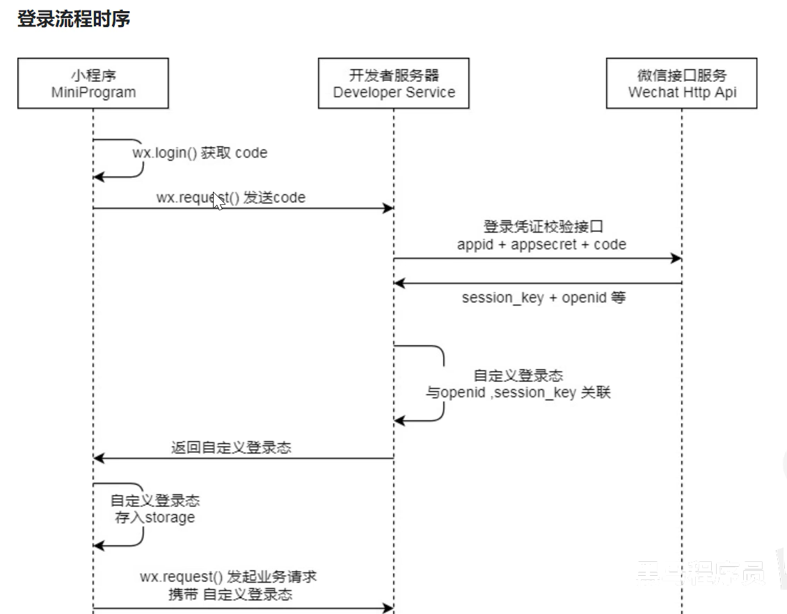
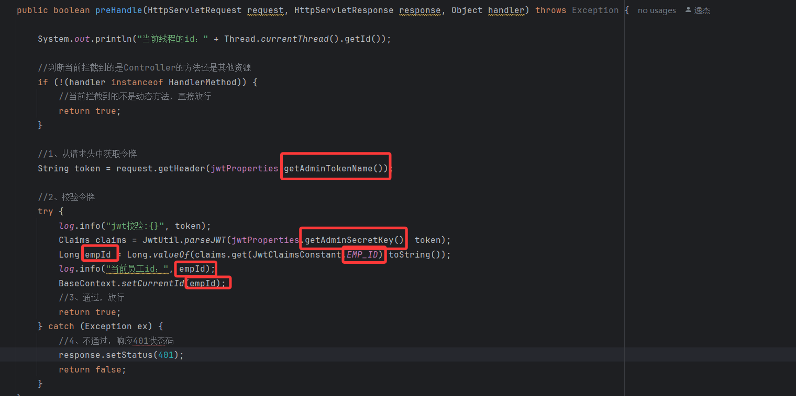

# 微信登录

## 登录流程时序图

<!--more-->

## 登录凭证校验接口

| appid      | AppID                                |
| :--------- | ------------------------------------ |
| secret     | AppSecret(小程序密钥)                |
| js_code    | 使用微信开发者工具编译一次获取到code |
| grant_type | 只能输入authorization_code           |

通过以上Query参数获取到openid的值，openid仅有效一次，再次获取会报错。

## 代码开发

配置微信登录所需配置项：

```yml
sky:  
    wechat:
        appid: xxx  //通过微信开发者平台的小程序下的开发管理获取AppID
        secret: yyy //AppSecret(小程序密钥)	
```

配置Userjwt属性

```yml
sky:
    jwt:
        user-secret-key: itheima
        user-ttl: 7200000
        user-token-name: authentication //这个值不能改变和前端商量好的值
```

复制JwtTokenAdminInterceptor改变为JwtTokenUserInterceptor并修改一下值，这里<span style="color:red">一定！一定！一定！</span>要一一对比仔细修改，不然微信小程序获取不了jwt信息导致无法登录。

微信登陆

```JAVA
UserController类	
    @Autowired
    private UserService userService;

    @Autowired
    private JwtProperties jwtProperties;

    /**
     * 微信登录
     * @param userLoginDTO
     * @return
     */
    @PostMapping("/login")
    @ApiOperation("微信登录")
    public Result<UserLoginVO> login(@RequestBody UserLoginDTO userLoginDTO){
        log.info("微信用户登录:{}",userLoginDTO.getCode());

        //微信登录
        User user = userService.wxLogin(userLoginDTO);
        //苍穹外卖把JWT写在了Controller层但是我并不建议这样做，Controller应该只是调用接口的，实现方法应该写在Service层
        //微信用户生成jwt令牌
        Map<String, Object> claims = new HashMap<>();
        claims.put(JwtClaimsConstant.USER_ID,user.getId());
        String token = JwtUtil.createJWT(jwtProperties.getUserSecretKey(), jwtProperties.getUserTtl(), claims);

        UserLoginVO userLoginVO = UserLoginVO.builder()
                .id(user.getId())
                .openid(user.getOpenid())
                .token(token)
                .build();
        return Result.success(userLoginVO);
    }
```

```JAVA
public interface UserService {
    /**
     * 微信登录
     * @param userLoginDTO
     * @return
     */
    User wxLogin(UserLoginDTO userLoginDTO);
}
```

```JAVA
public class UserServiceImpl implements UserService {

    public static final String WX_LOGIN = "https://api.weixin.qq.com/sns/jscode2session";
    public static final String AUTHORIZATION_CODE = "authorization_code";

    @Autowired
    private WeChatProperties weChatProperties;

    @Autowired
    private UserMapper userMapper;

    /**
     * 微信登录
     * @param userLoginDTO
     * @return
     */
    @Override
    public User wxLogin(UserLoginDTO userLoginDTO) {
        String openid = getOpenid(userLoginDTO.getCode());

        //判断openid是否为空，如果为空表示登录失败，抛出业务异常
        if (openid == null){
            throw new LoginFailedException(MessageConstant.LOGIN_FAILED);
        }

        //判断当前用户是否为新用户
        User user = userMapper.getByOpenid(openid);

        //如果是新用户，自动完成注册
        if(user == null){
            user =User.builder()
                    .openid(openid)
                    .createTime(LocalDateTime.now())
                    .build();
            userMapper.insert(user);
        }

        return user;
    }

    private String getOpenid(String code){
        //调用微信接口服务，获得当前微信用户的openid
        Map<String, String> map = new HashMap<>();
        map.put("appid",weChatProperties.getAppid());
        map.put("secret",weChatProperties.getSecret());
        map.put("js_code",code);
        map.put("grant_type",AUTHORIZATION_CODE);
        String json = HttpClientUtil.doGet(WX_LOGIN, map);

        JSONObject jsonObject = JSON.parseObject(json);
        String openid = jsonObject.getString("openid");
        return openid;
    }
```

```JAVA
public interface UserMapper {

    /**
     * 根据openid查询用户
     * @param openid
     * @return
     */
    @Select("select * from user where openid = #{openid}")
    User getByOpenid(String openid);

    /**
     * 插入数据
     * @param user
     */
    void insert(User user);
}
```

```JAVA
<insert id="insert" useGeneratedKeys="true" keyProperty="id">
        insert into user(openid, name, phone, sex, id_number, avatar, create_time) VALUES
        (#{openid},#{name},#{phone},#{sex},#{idNumber},#{avatar},#{createTime})
</insert>
```

# 商品浏览功能

不建议直接导入代码，建议还是自己写一下，其实都是接口和思路可以学习一下

## 查询分类接口

这里提醒一下由于user包下的CategoryController类和admin下的类名字一样并且都配置了bean工厂加入了IOC容器，因此这时候IOC容器当中存在2个相同的bean通常我们有两个解决方法：

第一：就是直接修改类名，但是这样太麻烦了，如果只要涉及这种情况就需要给每个类前面添加admin和user，麻烦。不推荐。

第二：我们可以在该类加上bean工厂之前给他的bean命名比如下方@RestController("userCategoryController")将bean名称改为userCategroyController将admin的bean改为adminCategoryController这样就避免了bean重复的问题，是我比较推荐的方法。

```JAVA
@RestController("userCategoryController")
@RequestMapping("/user/category")
@Api(tags = "C端-分类接口")
@Slf4j
public class CategoryController {

    @Autowired
    private CategoryService categoryService;

    /**
     * 查询分类
     * @param type
     * @return
     */
    @GetMapping("/list")
    @ApiOperation("查询分类")
    public Result<List<Category>> list(Integer type){
        log.info("条件查询:{}",type);
        List<Category> list = categoryService.list(type);
        return Result.success(list);
    }
}
```

list方法是之前写过的，所以直接使用就行。

## 菜品浏览接口

```JAVA
    DishController
    @Autowired
    private DishService dishService;

    /**
     * 根据分类id查询菜品
     * @param categoryId
     * @return
     */
    @GetMapping("/list")
    @ApiOperation("根据分类id查询菜品")
    public Result<List<DishVO>> list(Long categoryId){
        log.info("根据分类id查询菜品:{}",categoryId);
        List<DishVO> list = dishService.getByCategory(categoryId);
        return Result.success(list);
    }
```

```JAVA
     DishServiceImpl
     /**
     * 根据套餐id查询包含的菜品
     * @return
     */
    @Override
    public List<DishItemVO> getDishItemById(Long id) {
        return setmealDishMapper.getDishItemBySetmeaId(id);
    }
```

```JAVA
    /**
     * 根据套餐id查询包含的菜品
     * @param setmealId
     * @return
     */
    @Select("select sd.copies,sd.name,d.description,d.image from setmeal_dish sd left join dish d on sd.dish_id = d.id where sd.setmeal_id = #{setmealId}")
    List<DishItemVO> getDishItemBySetmeaId(Long setmealId);
```

## 套餐浏览接口

### 根据分类ID查询套餐

```JAVA
SetmealController
    /**
     * 根据分类id查询套餐
     * @param categoryId
     * @return
     */
    @GetMapping("/list")
    @ApiOperation("根据分类id查询套餐")
    public Result<List<Setmeal>> list(Long categoryId){
        log.info("根据分类id查询套餐:{}",categoryId);
        List<Setmeal> list = setmealService.list(categoryId);
        return Result.success(list);
    }
```

```JAVA
SetmealServiceImpl
    /**
     * 用户根据分类id查询套餐
     * @param categoryId
     * @return
     */
    @Override
    public List<Setmeal> list(Long categoryId) {
        Setmeal setmeal = Setmeal.builder()
                .categoryId(categoryId)
                .status(StatusConstant.ENABLE)//查询起售状态的套餐
                .build();
        List<Setmeal> list= setmealMapper.list(setmeal);
        return list;
    }
```

# 总结

我认为day6有几个坑需要注意

- 第一：JWT的配置在复制的时候需要注意是否所有的都改变为user了，需要万分注意
- 第二：我认为Controller层不应该出现功能实现的代码，在Controller层写实现个人认为是不太好的习惯，主要还是调用接口的地方。


day6结束了，加油加油加油！
