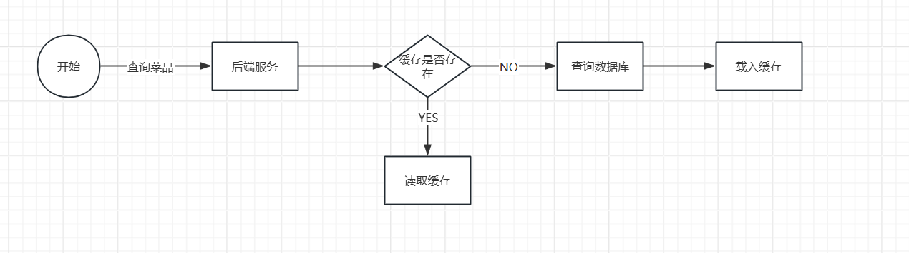

# 缓存菜品

## 缓存菜品

前提：如果客户端用户访问量过大，数据库访问压力也会随着而增大导致查询性能下降(即导致系统响应慢、用户体验下降等)，这样该如何解决呢。<!--more-->

### 实现思路

通过Redis来缓存菜品数据，减少数据库查询操作



#### 缓存逻辑分析

- 每个分类下的菜品保存一份缓存数据
- 数据库中菜品数据有变更时清理缓存数据

## 核心代码

视频中的缓存是添加在Controller层的，我还是不太习惯在Controller层写实现的代码，因此我还是写在Service层的

```JAVA
/**
     * 根据分类id查询菜品
     * @return
     */
    @Override
    public List<DishVO> getByCategory(Long categoryId) {

        //构造redis中的key，规则：dish_分类id
        String key = "dish" + categoryId;

        //查询redis中是否存在菜品数据
        List<DishVO> list =(List<DishVO>) redisTemplate.opsForValue().get(key);
        if(list != null && list.size()>0){
            //如果存在，直接返回，无需查询数据
            return list;
        }

        // 如果不存在，查询数据库，将查询到的数据放入redis中
        //查询到对应的菜品
        Dish dish = Dish.builder()
                .categoryId(categoryId)
                .status(StatusConstant.ENABLE)//查询起售中的菜品
                .build();
        List<Dish> dishList = dishMapper.list(dish);

        List<DishVO> dishVOList = new ArrayList<>();
        for (Dish d : dishList) {
            DishVO dishVO = new DishVO();
            BeanUtils.copyProperties(d,dishVO);

            //根据菜品id查询对应的口味
            List<DishFlavor> flavors = dishFlavorMapper.getByDishId(d.getId());

            dishVO.setFlavors(flavors);
            dishVOList.add(dishVO);
        }
        //将查询到的数据放入redis中
        redisTemplate.opsForValue().set(key,dishVOList);

        return dishVOList;
    }
```

### 代码解释

这里使用的redis中的string类型value，我们将需要获取的分类id设置成相应的key值，然后根据判断redis中是否存在相应的key-value属性，如果说存在则直接返回对应key的值，如果不存在就从数据库中获取需要的数据，并且将查询到的数据放入到redis中以便下次使用。

# 缓存数据修改

## 情景

当管理端修改了redis中对应value的菜品信息，这个时候数据库的数据已经得到了修改，然而redis缓存中并没有进行修改，这个时候需要对缓存数据进行修改。其中包括新增菜品、修改菜品、批量删除菜品、起售、停售菜品。

## 实现方法

### 原版

通过设置key字段来访问redis服务器进行删除对应的key，对于需要批量删除、修改菜品，起售停售等操作直接全部删除缓存

```JAVA
    /**
     * 清除redis缓存
     * @param patten
     */
    private void cleanCache(String patten){
        Set keys = redisTemplate.keys(patten);
        redisTemplate.delete(keys);
    }
使用：
    String keys = "dish*";//注意redis删除的key格式是否和添加的一致
    cleanCache(keys);
```

### 修改

由于本人认为这样全部删除并不方便，所以进行修改，我的思路是通过List数组添加需要删除的id，然后统一使用List集合遍历来删除，这里仅仅代表个人思想，如果存在反优化问题，烦请指出，谢谢。

# Spring Cache(缓存套餐)

## 简介

Spring Cache框架实现了基于<span style = "color:red">注解</span>的缓存功能，只需要加入注解实现缓存。核心思想是<span style="color:red">基于AOP的拦截机制</span>，具体来说，当调用被缓存注解（如 `@Cacheable`）标记的方法时，Spring 会通过 AOP 生成代理对象，拦截方法调用。拦截后，先根据规则检查缓存中是否存在目标数据：若存在，则直接返回缓存数据，跳过方法执行；若不存在，则执行原方法，再将方法返回结果存入缓存，供下次调用使用。

Spring Cache提供了一层抽象，底层可以切换不同的缓存实现，例如：

- EHCache
- Caffeine
- Redis

## 依赖注入

```JAVA
<dependency>
    <groupId>org.springframework.boot</groupId>
    <artifactId>spring-boot-starter-cache</artifactId>
</dependency>
```

## 常用注解

| 注解             | 说明                                                         |
| ---------------- | ------------------------------------------------------------ |
| `@EnableCaching` | 开启缓存注解功能，通常加载<span style = "color:red">启动类</span>上 |
| `@Cacheable`     | 在**方法执行前**先查询缓存中是否有数据，如果有数据，则直接返回缓存数据；如果没有缓存数据，调用方法并将方法返回值放到缓存中<span style="color:red">(既可以取，又可以放)</span> |
| `@CachePut`      | 将方法的返回值放到缓存中<span style="color:red">(只可以放)</span> |
| `@CacheEvict`    | 将一条或多条数据从缓存中删除                                 |

首先提醒：注意修改yml文件中redis的密码，视频中用的是老师自己的。

@EnableCaching一定要写在启动类上否则会出错。

### @cachePut使用

| 方式                                                         | 说明                                                         |
| ------------------------------------------------------------ | ------------------------------------------------------------ |
| @CachePut(cacheNames = "userCache", key = "#user.id")        | 如果使用spring cache缓存数据，key的生成：userCache::abc<span style="color:red">(建议)</span> |
| @CachePut(cacheNames = "userCache", key = "#result.id")      | 直接通过<span style="color:red">返回值return的结果</span>来获取对应的属性。 |
| @CachePut(cacheNames = "userCache", key = "#p0.id")          | p0代表获取<span style="color:red">参数</span>中的第一个参数  |
| @CachePut(cacheNames = "userCache", key = "#a0.id")          | 与上方同理                                                   |
| @CachePut(cacheNames = "userCache", key = "#root.args[0].id") | 与上方同理                                                   |

<span style = "color:red">PS：后面的点(.)属于对象导航，用于获取其中的属性</span>

#### 代码

```JAVA
@PostMapping
    @CachePut(cacheNames = "userCache", key = "#user.id")
    @CachePut(cacheNames = "userCache", key = "#result.id")
    @CachePut(cacheNames = "userCache", key = "#p0.id")
    @CachePut(cacheNames = "userCache", key = "#a0.id")
    @CachePut(cacheNames = "userCache", key = "#root.args[0].id")//任选其一
    public User save(@RequestBody User user){//SpEL需要#后面的字符串和参数相同，
        userMapper.insert(user);
        return user;
    }
```

### @Cacheable使用

#### 注解形式

`@Cacheable(cacheNames = "userCahce",key = "#id")`key的生成：userCache::id

#### 使用说明以及一些底层理解

使用说明：Cacheable在<span style = "color:red">使用该接口前</span>通过查看redis缓存是否存在userCache::id的key，如果没有查询到，就会<span style = "color:red">通过反射机制获取返回结果</span>进行缓存。
底层原理主要是<span style = "color:red">动态代理技术</span>，Cacheable在运行后为该Controller创建一个<span style = "color:red">代理对象</span>，在代理对象中查询redis。

### @CacheEvict使用

#### 注解形式

`@CacheEvict(cacheNames = "userCache",key = "#id")`用于删除单个缓存

`@CacheEvict(cacheNames = "userCache",allEntries = true)`用于删除所有缓存，同样的这里如果是修改数据也可以使用这个删除所有缓存

## 实现思路

具体实现思路：

- 导入相关依赖
- 启动类上添加`@EnableCaching`注解，开启缓存注解功能
- 添加注解

用户端和管理端的修改套餐、停售或起售、批量删除正常添加，但是新增套餐需要使用删除缓存进行添加。

```JAVA
     SetmealController
     /**
     * 新增套餐
     * @param setmealDTO
     * @return
     */
    @PostMapping
    @ApiOperation("新增套餐")
    @CacheEvict(cacheNames = "setmealCache",key = "#setmealDTO.categoryId")
    public Result save(@RequestBody SetmealDTO setmealDTO){
        log.info("新增套餐：{}",setmealDTO);
        setmealService.setmealWithDish(setmealDTO);
        return Result.success();
    }
```

新增cacheput误区：新增的是套餐setmeal，但是缓存存放的是categoryId查的多个套餐，所以要把整个categoryId的所有套餐删了，不能单独把一个套餐加到缓存中。

# 添加购物车

## 需求分析和设计

接口设计：

- 请求方式：POST
- 请求路径：/user/shoppingCart/add
- 请求参数：套餐id、菜品id、口味
- 返回结果：code、data、msg

## 代码及其分析

```JAVA
ShoppingCartController
     /**
     * 添加购物车
     * @param shoppingCartDTO
     * @return
     */
    @PostMapping("/add")
    @ApiOperation("添加购物车")
    public Result add(@RequestBody ShoppingCartDTO shoppingCartDTO){
        log.info("添加购物车:{}",shoppingCartDTO);
        shoppingCartService.addShoppingCart(shoppingCartDTO);
        return Result.success();
    }
```

```JAVA
ShoppingCartServiceImpl
public void addShoppingCart(ShoppingCartDTO shoppingCartDTO) {
        //属性复制
        ShoppingCart shoppingCart = new ShoppingCart();
        BeanUtils.copyProperties(shoppingCartDTO, shoppingCart);

        //获取userid值
        Long userId = BaseContext.getCurrentId();
        shoppingCart.setUserId(userId);

        //判断当前加入到购物车中的商品是否以及存在了
        List<ShoppingCart> list = shoppingCartMapper.list(shoppingCart);

        //如果已经存在了，只需要将数量+1
        if (list != null && list.size() > 0) {
            ShoppingCart cart = list.get(0);
            cart.setNumber(cart.getNumber() + 1);//update shopping set unmber = ? where id = ?

            shoppingCartMapper.updateNumberById(shoppingCart);
        } else {
            //如果不存在，需要插入一条购物车数据

            //判断本次添加到购物车的是菜品还是套餐
            Long dishId = shoppingCartDTO.getDishId();
            if (dishId != null) {
                //本次添加到购物车的是菜品
                Dish dish = dishMapper.getById(dishId);
                shoppingCart.setName(dish.getName());
                shoppingCart.setImage(dish.getImage());
                shoppingCart.setAmount(dish.getPrice());
            } else {
                //本次添加到购物车的是套餐
                Long setmealId = shoppingCartDTO.getSetmealId();
                Setmeal setmeal = setmealMapper.getById(setmealId);

                shoppingCart.setName(setmeal.getName());
                shoppingCart.setImage(setmeal.getImage());
                shoppingCart.setAmount(setmeal.getPrice());

            }
            shoppingCart.setNumber(DISH_NUMBER);
            shoppingCart.setCreateTime(LocalDateTime.now());

            shoppingCartMapper.insert(shoppingCart);
        }


    }
```

### 代码分析

首先我们从前端获取到数据放入在的DTO数据中的全部属性复制给ShoppingCart类中，然后我们通过获取当前的客户id进入数据库中查询购物车中是否存在已经添加的菜品或套餐，如果存在我们仅仅将菜品/套餐的数量+1并修改表单，如果不存在，就需要往shopping_cart表中添加数据，由于shopping_cart表中是吧菜品信息和套餐信息的结构都有，因此我们需要进行判断是菜品还是套餐，进行相应的添加，因此我们从shoppingCart类中获取dishId，如果存在，我们就对菜品部分进行赋值，反之，就对套餐部分进行赋值，但是由于我们都需要一开始添加的1份的数量和当前的时间，因此可以进行一个总的赋值后再添加数据。

# 查看购物车

## 需求分析

接口设计：

- 请求方式：GET
- 请求路径：/user/shoppingCart/list
- 返回结果：ShoppingCart集合的数据

首先为什么没有请求参数为null，<span style= "color:red">因为当我们调用接口的时候，能够拦截到我们当前的userid</span>，这个时候我们只需要再实现类中获取到当前id再进行查询。

## 代码

```JAVA
ShoppingCartController
     /**
     * 查看购物车
     * @return
     */
    @GetMapping("/list")
    @ApiOperation("查看购物车")
    public Result<List<ShoppingCart>> list(){
        List<ShoppingCart> list= shoppingCartService.showShoppingCart();
        return Result.success(list);
    }
```

```JAVA
ShoppingCartServiceImpl
    /**
     * 查看购物车
     *
     * @return
     */
    @Override
    public List<ShoppingCart> showShoppingCart() {
        Long currentId = BaseContext.getCurrentId();
        ShoppingCart shoppingCart = ShoppingCart.builder()
                .userId(currentId)
                .build();
        List<ShoppingCart> list = shoppingCartMapper.list(shoppingCart);

        return list;
    }
```

# 清空购物车

## 需求分析

接口设计：

- 请求方式：DELETE
- 请求路径：/user/shoppingCart/clean
- 返回结果：code、data、msg

请求参数不需要的<span style = "color: red">原因如上</span>

## 代码

```JAVA
ShoppingCartController
     /**
     * 清空购物车
     * @return
     */
    @DeleteMapping("/clean")
    @ApiOperation("清空购物车")
    public Result cleean(){
        shoppingCartService.cleanShoppingCart();
        return Result.success();
    }
```

```JAVA
ShoppingCartServiceImpl
    /**
     * 清空购物车
     */
    @Override
    public void cleanShoppingCart() {
        Long currentId = BaseContext.getCurrentId();
        shoppingCartMapper.deleteByUserId(currentId);
    }
```

# 删除购物车中一个商品

## 需求分析

接口设计：

- 请求方式： POST
- 请求路径：/user/shoppingCart/sub
- 返回结果：code、data、msg
- 请求参数：需要封装的ShoppingCartDTO数据

## 代码

```JAVA
ShoppingCartController
    /**
     * 删除购物车中一个商品
     * @param shoppingCartDTO
     * @return
     */
    @PostMapping("/sub")
    @ApiOperation("删除购物车中一个商品")
    public Result sub(@RequestBody ShoppingCartDTO shoppingCartDTO){
        log.info("删除购物车中一个商品：{}",shoppingCartDTO);
        shoppingCartService.deleteAShopping(shoppingCartDTO);
        return Result.success();
    }
```

```JAVA
 @Override
    public void deleteAShopping(ShoppingCartDTO shoppingCartDTO) {
        shoppingCartMapper.delete(shoppingCartDTO);
    }
```

再删除购物车中的一个商品的时候，需要<span style = "color:red">判断是菜品还是套餐数据</span>，因此需要<span style = "color:red">动态删除</span>。


day07完成，最近由于事情太忙，所以day07做了整整3天，加油加油！！！！！！！
