# 支付流程

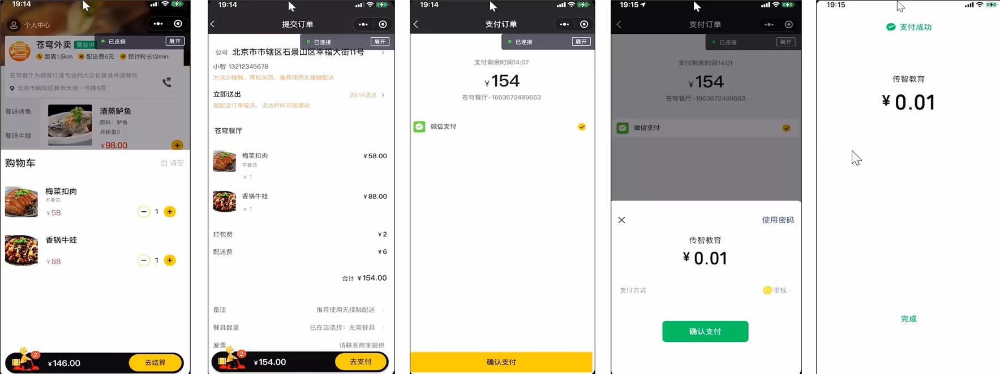

<!--more-->

# 导入地址薄模块功能

## 产品原型

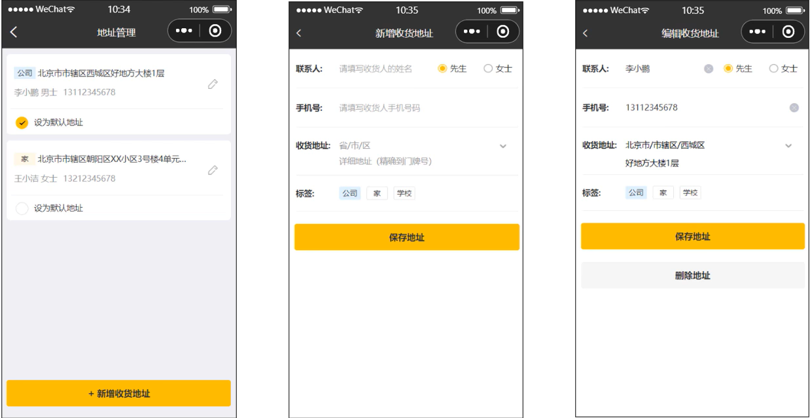

业务功能：

- 查询地址列表

- 新增地址

- 修改地址

- 删除地址

- 设置默认地址

- 查询默认地址

接口设计：

- 新增地址
- 查询当前登录用户的所有地址信息
- 查询默认地址
- 根据id修改地址
- 根据id删除地址
- 根据id查询地址
- 设置默认地址

<span style = "color:red">建议自己写一遍，虽然都是简单的接口，但是写一遍熟悉一边逻辑，我认为更好。</span>

# 用户下单

## 需求分析

用户下单业务说明：

在电商系统中，用户是通过下单的方式通知商家，用户已经购买了商品，需要商家进行备货和 发货。

用户点餐业务流程：

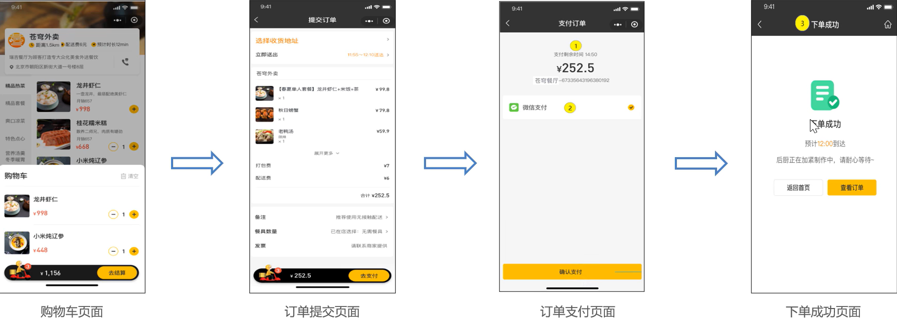

## 接口设计(分析)

请求方式：POST

请求路径:/user/order/submit

参数：

- 地址簿id
- 配送状态(立即送出、选择送出时间)
- 打包费
- 总金额
- 备注
- 餐具数量

订单支付接口返回数据：

- 下单时间
- 订单总金额
- 订单号
- 订单id

数据库设计：

- 订单表orders
- 订单明细表order_detail
- 订单表和订单明细表的关系：一对多

## 代码开发

### OrderController

```JAVA
package com.sky.controller.user;

import com.sky.dto.OrdersPaymentDTO;
import com.sky.dto.OrdersSubmitDTO;
import com.sky.entity.OrderDetail;
import com.sky.entity.Orders;
import com.sky.mapper.OrderMapper;
import com.sky.result.PageResult;
import com.sky.result.Result;
import com.sky.service.OrderService;
import com.sky.vo.OrderPaymentVO;
import com.sky.vo.OrderSubmitVO;
import com.sky.vo.OrderVO;
import io.swagger.annotations.Api;
import io.swagger.annotations.ApiOperation;
import lombok.extern.slf4j.Slf4j;
import org.springframework.beans.factory.annotation.Autowired;
import org.springframework.web.bind.annotation.*;

@RestController("userOrderController")
@RequestMapping("/user/order")
@Slf4j
@Api(tags = "C端-订单接口")
public class OrderController {

    @Autowired
    private OrderService orderService;

    /**
     * 用户下单
     *
     * @param ordersSubmitDTO
     * @return
     */
    @PostMapping("/submit")
    @ApiOperation("用户下单")
    public Result<OrderSubmitVO> submit(@RequestBody OrdersSubmitDTO ordersSubmitDTO) {
        log.info("用户下单:{}", ordersSubmitDTO);
        OrderSubmitVO orderSubmitVO = orderService.submitOrder(ordersSubmitDTO);
        return Result.success(orderSubmitVO);
    }
```

### OrderService

```JAVA
    /**
     * 用户下单
     *
     * @param ordersSubmitDTO
     * @return
     */
    OrderSubmitVO submitOrder(OrdersSubmitDTO ordersSubmitDTO);
```

### OrderServiceImpl

```JAVA
/**
     * 用户下单
     *
     * @param ordersSubmitDTO
     * @return
     */
    @Override
    @Transactional
    public OrderSubmitVO submitOrder(OrdersSubmitDTO ordersSubmitDTO) {

        //各种业务异常（地址簿，购物车数据为空）
        AddressBook addressBook = addressBookMapper.getById(ordersSubmitDTO.getAddressBookId());
        if (addressBook == null) {
            //抛出异常
            throw new AddressBookBusinessException(MessageConstant.ADDRESS_BOOK_IS_NULL);
        }

        //检查用户得收货地址是否超出配送范围
        checkOutOfRange(addressBook.getProvinceName() + addressBook.getCityName()
                + addressBook.getDistrictName() + addressBook.getDetail());

        //拼接地址
        String address = addressBook.getProvinceName() + addressBook.getDistrictName()
                + addressBook.getDetail();

        //查询用户的购物车数据
        Long currentId = BaseContext.getCurrentId();
        ShoppingCart shoppingCart = new ShoppingCart();
        shoppingCart.setUserId(currentId);
        List<ShoppingCart> list = shoppingCartMapper.list(shoppingCart);
        if (list == null || list.size() == 0) {
            throw new ShoppingCartBusinessException(MessageConstant.SHOPPING_CART_IS_NULL);
        }

        //向订单表插入一条数据
        Orders orders = new Orders();
        BeanUtils.copyProperties(ordersSubmitDTO, orders);
        orders.setOrderTime(LocalDateTime.now());
        orders.setPayStatus(Orders.UN_PAID);//未支付
        orders.setStatus(Orders.PENDING_PAYMENT);
        orders.setNumber(String.valueOf(System.currentTimeMillis()));
        orders.setPhone(addressBook.getPhone());
        orders.setConsignee(addressBook.getConsignee());
        orders.setUserId(currentId);
        orders.setAddress(address);
        orderMapper.insert(orders);

        List<OrderDetail> orderDetails = new ArrayList<>();
        //向订单明细表插入n条数据
        for (ShoppingCart cart : list) {
            OrderDetail orderDetail = new OrderDetail();//订单明细
            BeanUtils.copyProperties(cart, orderDetail);
            orderDetail.setOrderId(orders.getId());//设置当前订单明细关联的订单id
            orderDetails.add(orderDetail);
        }
        orderDetailMapper.insertBatch(orderDetails);

        //清空用户的购物车数据
        //todo 需要优化
        shoppingCartMapper.deleteByUserId(currentId);

        //封装VO返回结果
        OrderSubmitVO orderSubmitVO = OrderSubmitVO.builder()
                .id(orders.getId())
                .orderTime(orders.getOrderTime())
                .orderNumber(orders.getNumber())
                .orderAmount(orders.getAmount())
                .build();

        return orderSubmitVO;
    }
    /**
     * 检查客户的收货地址是否超出配送范围
     * @param address
     */
    private void checkOutOfRange(String address) {
        Map map = new HashMap();
        map.put("address", shopAddress);
        map.put("output", "json");
        map.put("ak", ak);

        //获取店铺的经纬度坐标
        String shopCoordinate = HttpClientUtil.doGet("https://api.map.baidu.com/geocoding/v3", map);

        JSONObject jsonObject = JSON.parseObject(shopCoordinate);
        if (!jsonObject.getString("status").equals("0")) {
            throw new OrderBusinessException("店铺地址解析失败");
        }

        //数据解析
        JSONObject location = jsonObject.getJSONObject("result").getJSONObject("location");
        String lat = location.getString("lat");
        String lng = location.getString("lng");
        //店铺经纬度坐标
        String shopLngLat = lat + "," + lng;

        map.put("address", address);
        //获取用户收货地址的经纬度坐标
        String userCoordinate = HttpClientUtil.doGet("https://api.map.baidu.com/geocoding/v3", map);

        jsonObject = JSON.parseObject(userCoordinate);
        if (!jsonObject.getString("status").equals("0")) {
            throw new OrderBusinessException("收货地址解析失败");
        }

        //数据解析
        location = jsonObject.getJSONObject("result").getJSONObject("location");
        lat = location.getString("lat");
        lng = location.getString("lng");
        //用户收货地址经纬度坐标
        String userLngLat = lat + "," + lng;

        map.put("origin", shopLngLat);
        map.put("destination", userLngLat);
        map.put("steps_info", "0");

        //路线规划
        String json = HttpClientUtil.doGet("https://api.map.baidu.com/directionlite/v1/riding", map);

        jsonObject = JSON.parseObject(json);
        if (!jsonObject.getString("status").equals("0")) {
            throw new OrderBusinessException("配送路线规划失败");
        }

        //数据解析
        JSONObject result = jsonObject.getJSONObject("result");
        JSONArray jsonArray = (JSONArray) result.get("routes");
        Integer distance = (Integer) ((JSONObject) jsonArray.get(0)).get("distance");

        if (distance > 5000) {
            //配送距离超过5000米
            throw new OrderBusinessException("超出配送范围");
        }
    }
```

思路梳理:

- 首先我们通过从前端获取的DTO数据查询地址簿是否为空并处理异常
- 我们通过拼接的地址调用checkOutOfRange检查地址是否超出范围
- 这里需要注意老师的代码没有添加用户地址导致表单的地址为null
- 根据用户id查询用户的购物车数据，如果为空就返回异常，不为空就向订单表插入一条数据
- 然后我们通过之前查询的购物车数据返回的list给订单明细表查询n条数据
- 最后通过OrderSubmitVO封装数据返回给前端。

陌生知识梳理

- 通过调用HttpClientUtil.doGet()方法发起HTTP GET请求，请求URL为百度地图地理编码API，传递的参数有：address、output、ak

### OrderDetailMapper.java

```JAVA
    /**
     * 批量插入订单明细数据
     * @param orderDetails
     */
    void insertBatch(List<OrderDetail> orderDetails);
```

### OrderDetailMapper.xml

```xml
    <insert id="insertBatch">
        insert into order_detail (name, image, order_id, dish_id, setmeal_id, dish_flavor, amount) VALUES
        <foreach collection="list" item="od" separator=",">
            (#{od.name},#{od.image},#{od.orderId},#{od.dishId},#{od.setmealId},#{od.dishFlavor},#{od.amount})
        </foreach>
    </insert>
```


# 订单支付

## 微信支付介绍

### 微信支付产品

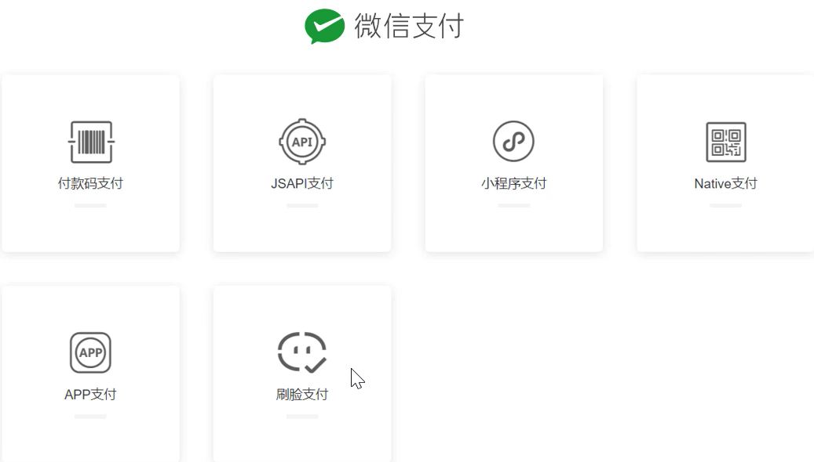

### 微信支付接入流程：


微信小程序支付时序图：

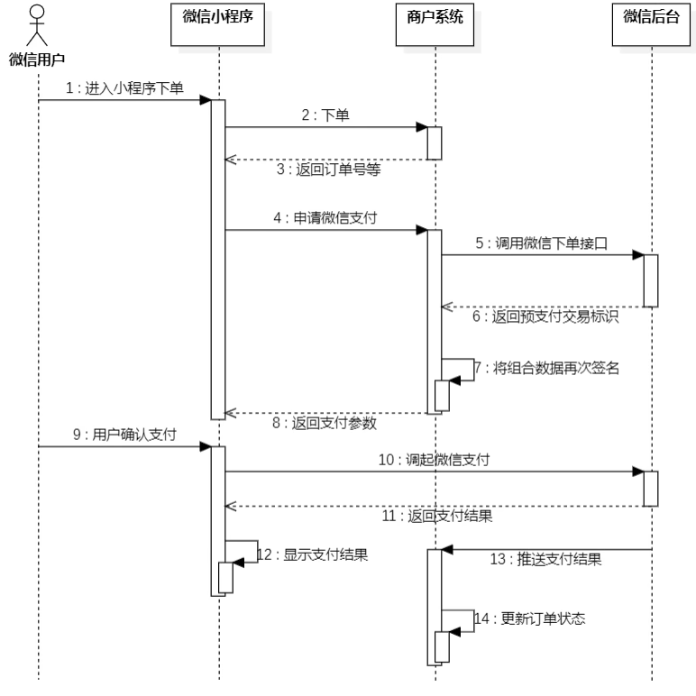

### 访问接口文档

#### JSAPI下单

商户系统调用该接口在微信支付服务后台生成<span style = "color:red">预支付交易单</span>。

- 适用对象：直连商户
- 请求URL：https://api.mch.weixin.qq.com/v3/pay/transactions/jsapi
- 请求方式：POST

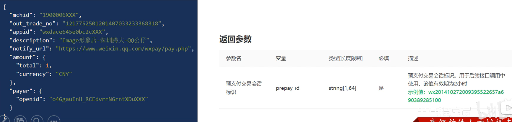

#### 微信小程序调起支付：

通过JSAPI下单接口获取到发起支付的必要参数prepay_id，然后使用微信支付提供的小程序方法调用起小程序支付。调用wx.requestPayment(OBJECT)发起微信支付。

实例：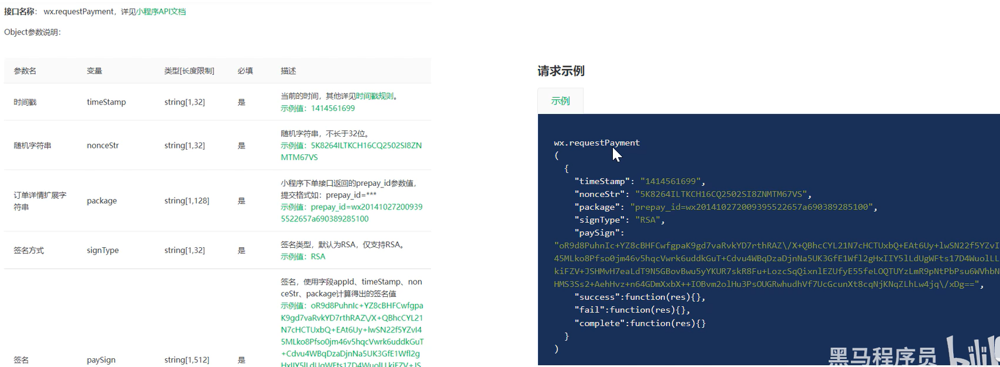

### 微信支付准备工作

#### 如何保证数据安全？

完成微信支付有两个关键的步骤： 

- 第一个就是需要在商户系统当中<span style = "color:red">调用微信后台的一个下单接口</span>，就是生成预支付交易单。 
- 第二个就是<span style = "color:red">支付成功之后微信后台会给推送消息</span>。 这两个接口数据的安全性，要求其实是非常高的。 

解决： 微信提供的方式就是对数据进行<span style = "color:red">加密、解密、签名</span>多种方式。要完成数据加密解密，需要提前准备相应的一些文件，其实就是一些证书。 获取微信支付平台证书、商户私钥文件(需要开通商户之类得才行，属于人家公司得，没有这玩意也无伤大雅)：

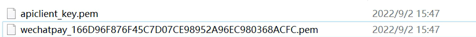

#### 如何调用到商户系统？

微信后台会调用到商户系统给推送支付的结果，在这里我们就会遇到一个问题，就是微信后台怎么就能调用到我们这个商户系统呢？

因为这个调用过程，其实<span style = "color:red">本质上也是一个 HTTP 请求</span>。 目前，**商户系统它的 ip 地址就是当前自己电脑的 ip 地址**，只是一个局域网内的 ip 地址，微信后台无法调用到。 

解决：内网穿透。通过 cpolar 软件可以获得一个临时域名，而这个临时域名是一个公网 ip，这样，微信后台就可以请求到商户系统了。

获取临时域名：支付成功后微信服务通过该域名回调我们的程序。

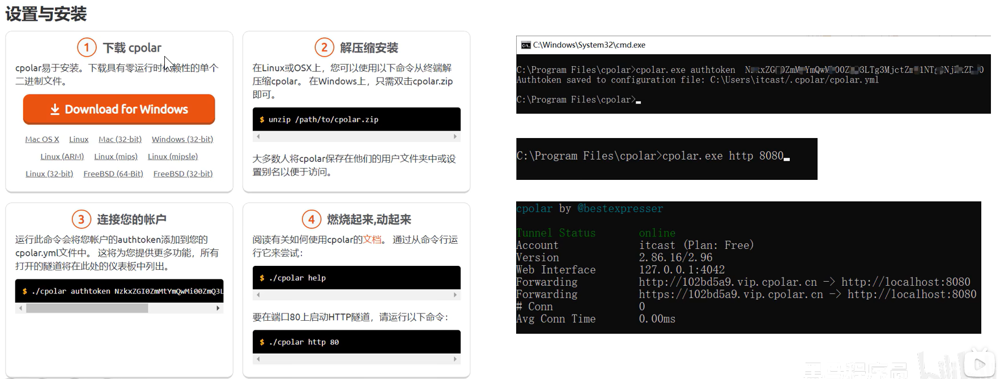

以上软件就在苍穹外卖day08的安装包文件夹里面点击安装即可。如果想要自己安装的可以通过:[cpolar - secure introspectable tunnels to localhost](https://dashboard.cpolar.com/auth)

在我们安装好了cpolar后我们需要获取到验证的authtoken值来运行命令，通过安装cpolar的根目录文件执行cmd输入<span style = "color:red">cpolar.exe authtoken (你的隧道Authtoken)</span>生成cpolar.yml文件。而cpolar.yml就是我们的内网穿透文件。

获取临时域名——>由于我们已经有个cpolar.yml文件，因此我们可以通过cpolar.exe http 8080获取一个临时域名，其中8080属于我们后端的端口。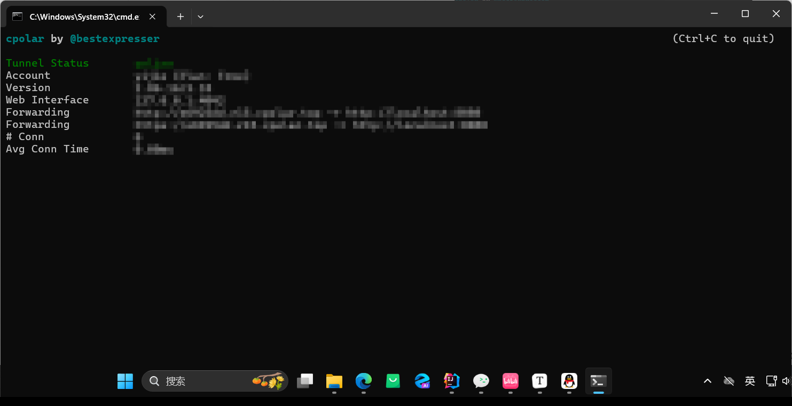

页面展示<span style = "color:red">(注意这里需要把项目跑起来)</span>：

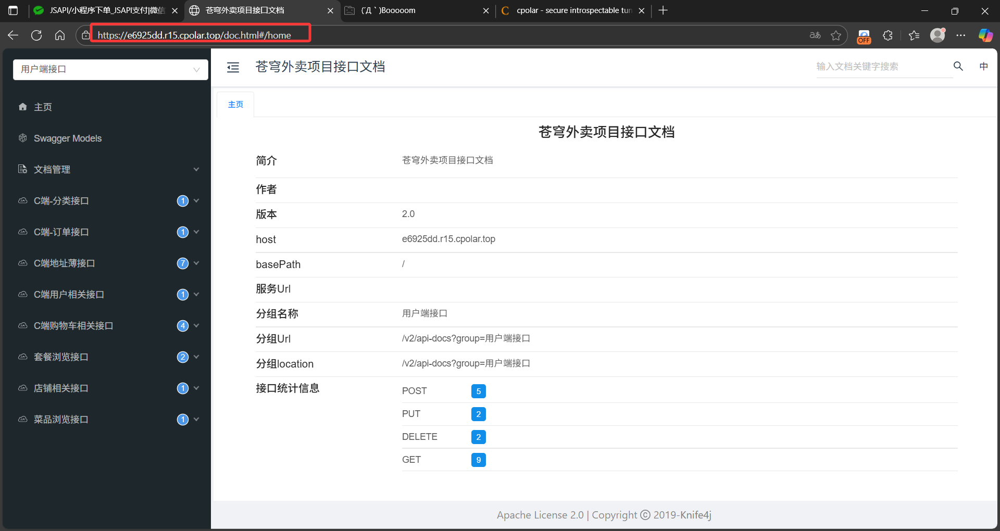

## 代码导入

### 微信支付相关配置

这里由于我们没有申请商户，所以并不能获取到相关文件，因此这里采取的是跳过的方法。

#### 第一步：注释掉小程序的调用微信支付的接口

这一步大概在220多行左右，很好找。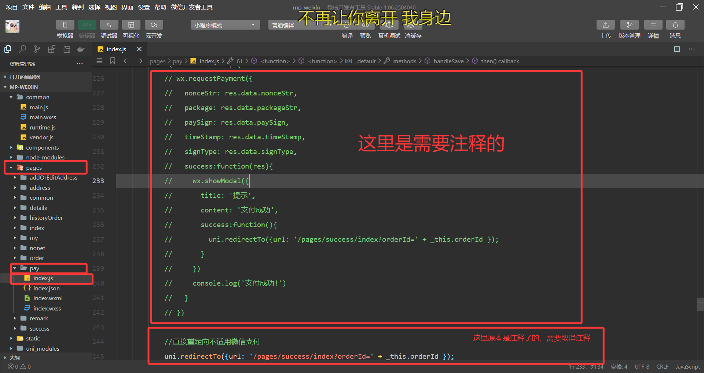

这样就不会调用到wx.requestPayment了。实现微信支付的跳过。

#### 第二步：正常导入视频要求的代码

#### 第三步：修改OrderServiceImpl

```JAVA
/**
     * 订单支付
     *
     * @param ordersPaymentDTO
     * @return
     */
    public OrderPaymentVO payment(OrdersPaymentDTO ordersPaymentDTO) throws Exception {
        // 当前登录用户id
        Long userId = BaseContext.getCurrentId();
        User user = userMapper.getById(userId);

        //调用微信支付接口，生成预支付交易单
        /*JSONObject jsonObject = weChatPayUtil.pay(
                ordersPaymentDTO.getOrderNumber(), //商户订单号
                new BigDecimal(0.01), //支付金额，单位 元
                "苍穹外卖订单", //商品描述
                user.getOpenid() //微信用户的openid
        );

        if (jsonObject.getString("code") != null && jsonObject.getString("code").equals("ORDERPAID")) {
            throw new OrderBusinessException("该订单已支付");
        }

        OrderPaymentVO vo = jsonObject.toJavaObject(OrderPaymentVO.class);
        vo.setPackageStr(jsonObject.getString("package"));
*/
        log.info("跳过微信支付，支付成功");

        paySuccess(ordersPaymentDTO.getOrderNumber());
        return new OrderPaymentVO();
    }
```

这里我们可以看到直接把调用微信支付接口给注释了，这样我们就可以直接跳过需要商户注册获取的两个文件解析的过程，这里主要还是理解大体的支付流程。

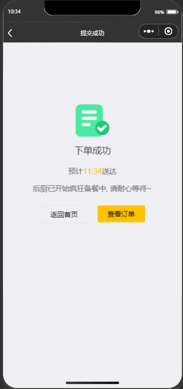

这样就大功告成了
