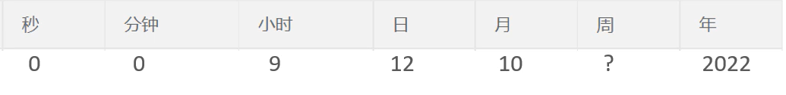
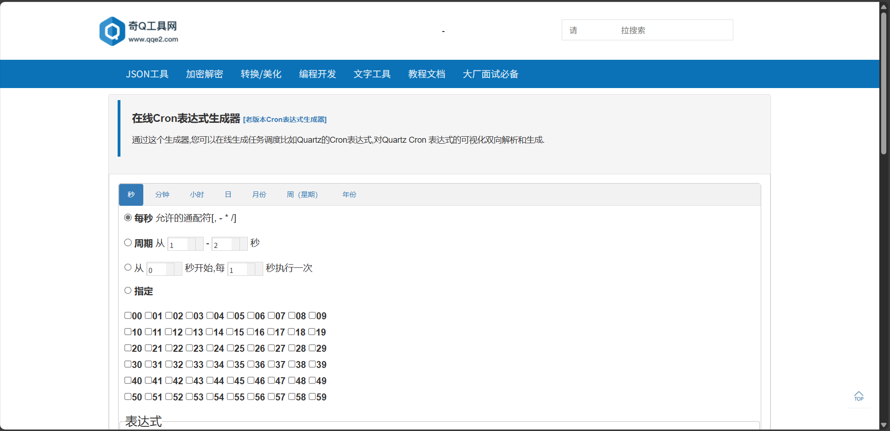
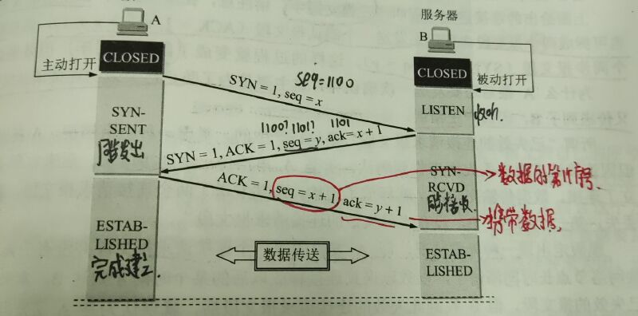

# Spring Task

## 介绍

Spring Task是Spring框架提供的任务调度工具，可以<span style = "color:red">按照约定的时间</span>自动执行某个代码逻辑。

定位：定时任务框架

作用：定时自动执行某段java代码<!--more-->

应用场景：

- 信用卡每月还款提醒
- 银行贷款每月还款提醒
- 火车票售票系统处理未支付订单
- 入职纪念日为用户发送通知

## cron表达式

cron表达式其实就是一个<span style = "color:red">字符串</span>，通过cron表达式可以<span style = "color:red">定义任务触发的时间</span>

构成规则：分为6到7个域，由空格分隔开，每个域代表一个含义

每个域的含义分别为：秒、分钟、小时、日、月、周、年(可选)

​        2022年10月12日上午9点整对应的cron表达式为：cron=0 0 9 12 10 ? 2022

​        cron表达式在线生成器：https://cron.qqe2.com

## 入门

使用步骤：

- 导入Maven坐标spring-context(集成在了spring-boot-starter包中)
- 启动类添加注解@EnableScheduling开启任务调度
- 自定义定时任务类

```JAVA
     /**
     * 定时任务，每隔5秒执行一次
     */
    @Scheduled(cron = "0/5 * * * * ?")
    public void executeTask(){
        log.info("定时任务开始执行:{}",new Date());
    }
```

效果为：每过5秒执行一次executeTask

# 订单状态定时处理

## 需求分析

用户下单后可能存在的情况：

- 下单后未支付，订单一直处于<span style = "color:red">“待支付”</span>状态
- 用户收货后管理端未点击完成按钮，订单一直处于<span style = "color:red">"派送中"</span>状态

对于上面两种情况需要通过<span style = "color:red">定时任务</span>来修改订单状态，具体逻辑为：

- 通过定时认为**每分钟检查一次**是否存在支付超时订单（下单后超过15分钟仍未支付则判定为支付超时订单），如果存在则修改订单状态为“已取消”
- 通过定时任务每天凌晨1点检查一次是否存在“派送中”的订单，如果存在则修改订单状态为“已完成”

## 代码开发

```JAVA
/**
 * 定时任务类，定时处理订单状态
 */
@Component
@Slf4j
public class OrderTask {

    @Autowired
    private OrderMapper orderMapper;

    /**
     * 处理超时订单的方法
     *
     */
    @Scheduled(cron = "0 * * * * ?")
    public void processTimeoutOrder(){
        log.info("定时处理超时订单：{}", LocalDateTime.now());

        LocalDateTime orderTime = LocalDateTime.now().plusMinutes(-15);
        //select * from orders where status = 1 and order_time < （当前时间 - 15分钟）
        List<Orders> ordersList = orderMapper.getByStatusAndOrderTimeLT(Orders.PENDING_PAYMENT, orderTime);


        if(ordersList != null && ordersList.size() > 0){
            for (Orders orders : ordersList) {
                orders.setStatus(Orders.CANCELLED);
                orders.setCancelReason("订单超时，自动取消");
                orders.setCancelTime(LocalDateTime.now());
                orderMapper.update(orders);
            }
        }
    }

    /**
     * 处理一直处于派送状态的订单
     */
    @Scheduled(cron = "0 0 1 * * ? ")//每天凌晨1点触发一次
    public void processDeliverOrder(){
        log.info("定时处理处于派送状态的订单：{}", LocalDateTime.now());
        LocalDateTime localDateTime = LocalDateTime.now().plusHours(-1);
        List<Orders> ordersList = orderMapper.getByStatusAndOrderTimeLT(Orders.DELIVERY_IN_PROGRESS, localDateTime);
        if(ordersList != null && ordersList.size() > 0){
            for (Orders orders : ordersList) {
                orders.setStatus(Orders.COMPLETED);
                orderMapper.update(orders);
            }
        }
    }
}

```

<span style = "color:red">PS:这里如果直接粘贴在线Cron表达式生成器的cron，代码会进行报错，这是因为Spring框架要求cron表达式必须是6个字段：秒 分 时 日 月 周，并没有年份。</span>

```Error
Error creating bean with name 'orderTask' defined in file [D:\IdeaProjects\sky-take-out\sky-server\target\classes\com\sky\task\OrderTask.class]: Initialization of bean failed; nested exception is java.lang.IllegalStateException: Encountered invalid @Scheduled method 'processDeliverOrder': Cron expression must consist of 6 fields (found 7 in "0 0 1 * * ? *")
```

# WebSocket

## 介绍

是一种<span style = "color:red">基于TCP</span>的一种网络协议。实现了B/S(浏览器与服务器)全双工通信——B/S只需要<span style = "color : red" >完成一次握手</span>，两者就创建长连接(即创建<span style = "color:red">持久性</span>的连接，进行<span style = "color :red">双向</span>数据传输)

TCP三次握手



### 应用场景

- 视频弹幕
- 网页聊天
- 体育实况更新
- 股票基金报价实时更新

## 入门案例

实现步骤：

- 直接使用websocket.html页面座位WebSocket客户端
- 导入maven坐标
              org.springframework.boot
              spring-boot-starter-websocke

- 导入WebSocket服务端组件WebSocketServer，用于和客户端通信
- 导入配置类WebSocketConfiguration，注册WebSocket的服务端组件
- 导入定时任务类WebScoketTask，定时向客户端推送数据

# 来单提醒

## 需求分析和设计

用户下单并且支付成功后，需要第一时间通知外卖商家。通知的形式有如下两种：

- 语音播报
- 弹出提示框

设计：

- 通过WebSocket实现管理端页面和服务端保持<span style = "color:red">长连接状态</span>
- 当客户支付后，调用WebSocket的相关API实现服务端向客户端推送消息
- 客户端浏览器解析服务端推送的消息，判断是来单提醒还是客户催单，进行相应的消息提示和语言播报
- 约定服务端发送给客户端浏览器的数据格式为JSON，字段包括：type、orderId、content
  - type为消息类型，1为来单提醒2为客户催单
  - orderId为订单id
  - content为消息内容

## 代码

```JAVA
    @Autowired
    private WebSocketServer webSocketServer;
    /**
     * 支付成功，修改订单状态
     *
     * @param outTradeNo
     */
    public void paySuccess(String outTradeNo) {

        // 根据订单号查询订单
        Orders ordersDB = orderMapper.getByNumber(outTradeNo);

        // 根据订单id更新订单的状态、支付方式、支付状态、结账时间
        Orders orders = Orders.builder()
                .id(ordersDB.getId())
                .status(Orders.TO_BE_CONFIRMED)
                .payStatus(Orders.PAID)
                .checkoutTime(LocalDateTime.now())
                .build();

        orderMapper.update(orders);

        //通过WebSocket向客户端推送消息 type orderId content
        //这里是需要添加的
        Map map = new HashMap();
        map.put("type", 1);//1表示来单提醒 2表示客户催单
        map.put("orderId", ordersDB.getId());
        map.put("content", "订单号：" + outTradeNo);

        String json = JSON.toJSONString(map);
        webSocketServer.sendToAllClient(json);


    }
```

<span style = "color:red">重要提示:</span>

- 如果听不到语音提示的话，可以将浏览器的媒体自动播放权限打开。
- 如果语音播报一直提示，可以将导入的WebSocketTask类中的**每隔5秒向客户端发送消息**注释掉即可。

# 客户催单

## 需求分析和设计

用户在小程序点击催单按钮后，需要第一时间通知外卖商家。通知的形式有如下两种：

- 语音播报
- 弹出提示框

设计：

- 通过WebSocket实现管理端页面和服务端保持<span style = "color:red">长连接状态</span>
- 当客户催单后，调用WebSocket的相关API实现服务端向客户端推送消息
- 客户端浏览器解析服务端推送的消息，判断是来单提醒还是客户催单，进行相应的消息提示和语言播报
- 约定服务端发送给客户端浏览器的数据格式为JSON，字段包括：type、orderId、content
  - type为消息类型，1为来单提醒2为客户催单
  - orderId为订单id
  - content为消息内容

## 代码开发

```JAVA
    OrderController
    /**
     * 用户催单
     *
     * @param id
     * @return
     */
    @GetMapping("/reminder/{id}")
    @ApiOperation("用户催单")
    public Result reminder(@PathVariable Long id){
        log.info("用户催单：{}",id);
        orderService.reminder(id);
        return Result.success();
    }
```

```JAVA
OrderServiceImpl
    /**
     * 客户催单
     *
     * @param id
     */
    @Override
    public void reminder(Long id) {
        //根据id查询订单
        Orders ordersDB = orderMapper.getById(id);

        //校验订单是否存在
        if (ordersDB == null){
            throw new OrderBusinessException(MessageConstant.ORDER_NOT_FOUND);
        }

        Map map = new HashMap();
        map.put("type", 2);
        map.put("orderId", id);
        map.put("content","订单号:" + ordersDB.getNumber());


        //通过websocket推送消息
        webSocketServer.sendToAllClient(JSON.toJSONString(map));
    }
```

用户催单和来电提醒的实现代码几乎是相同的，主要还是通过前端返回的id来获取订单详情，然后根据返回的数据来校验订单是否存在，如果不存在就返回订单不存在的错误信息，如果存在则需要根据约定服务端发送给客户端浏览器的数据格式为JSON推送给webSocketServer。


Day10结束！！！！
