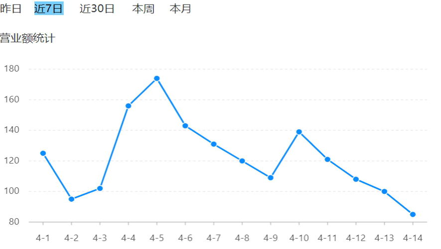
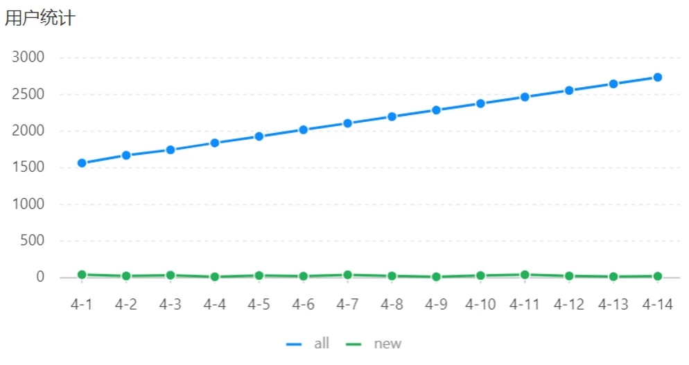
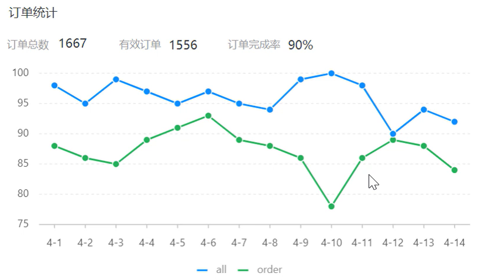
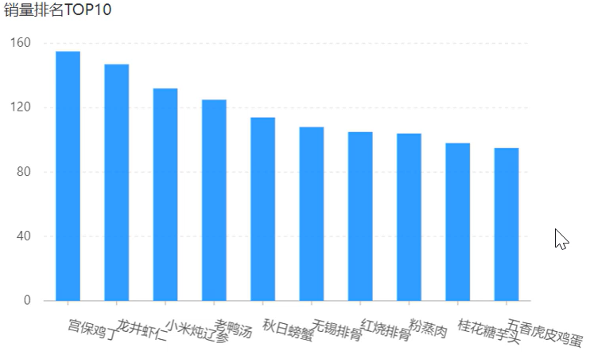

# Apache ECharts

## 介绍

是一款基于Javascript的<span style = "color:red">数据可视化</span>图标库，提供直观、生动、可交互，可个性化定制的数据可视化图标。

官网地址：https://echarts.apache.org/zh/index.html

快速入门：https://echarts.apache.org/handbook/zh/get-started<!--more-->

# 营业额统计

## 需求分析和设计

### 产品原型



### 业务规则

- 营业额指订单状态为已完成的订单金额合计
- 基于可视化报表的折线图展示营业额数据，x轴为日期，Y轴为营业额
- 根据时间选择区间，展示每天的营业额数据

总结：使用Echarts，<span style = "color:red">重点在于研究当前图表所需的数据格式</span>。通常是需要后端提供符合格式要求的动态数据，然后相应给前端来展示图表。

## 代码开发

```JAVA
ReportController
/**
 * 数据统计相关接口
 */
@RestController
@RequestMapping("/admin/report")
@Api(tags = "数据统计相关接口")
@Slf4j
public class ReportController {

    @Autowired
    private ReportService reportService;

    /**
     * 营业额统计
     * @param begin
     * @param end
     * @return
     */
    @GetMapping("/turnoverStatistics")
    @ApiOperation("营业额统计")
    public Result<TurnoverReportVO> turnoverStatistics(
        @DateTimeFormat(pattern = "yyyy-MM-dd") LocalDate begin,
        @DateTimeFormat(pattern = "yyyy-MM-dd") LocalDate end){
        log.info("查询日期区间{}到{}的营业额数据", begin, end);
        TurnoverReportVO turnoverStatistics = reportService.getTurnoverStatistics(begin, end);
        return Result.success(turnoverStatistics);
    }
}
```

这里需要获取到前端传递来的年月日的格式的数据因此需要使用到DateTimeFormat注解规范数据格式。

```JAVA
ReportServiceImpl
    @Autowired
    private OrderMapper orderMapper;

    /**
     * 统计指定时间区间内的营业额数据
     *
     * @param begin
     * @param end
     * @return
     */
    @Override
    public TurnoverReportVO getTurnoverStatistics(LocalDate begin, LocalDate end) {
        //当前集合用于存放从begin到end范围内的每天的日期
        List<LocalDate> dateList = new ArrayList<>();
        dateList.add(begin);
        while (!begin.equals(end)) {
            //日期计算，计算指定日期的后一天对应的日期
            begin = begin.plusDays(1);
            dateList.add(begin);
        }

        List<Double> turnoverList = new ArrayList<>();
        for (LocalDate date : dateList) {
            //查询date日期对应的营业额数据，营业额是指：状态为“已完成”的订单金额合计
            LocalDateTime beginTime = LocalDateTime.of(date, LocalTime.MIN);//年月日时分秒0点0分0秒
            LocalDateTime endTime = LocalDateTime.of(date, LocalTime.MAX);//无限接近0点的最后一个时间点

            //select sum(amount) from orders where order_time >= ? and order_time < ? and status = 5
            Map map = new HashMap();
            map.put("begin", beginTime);
            map.put("end", endTime);
            map.put("status", Orders.COMPLETED);
            Double turnover = orderMapper.sumByMap(map);
            //如果营业额为null，则设置营业额为0
            turnover = turnover == null ? 0.0 : turnover;
            turnoverList.add(turnover);;
        }


        return TurnoverReportVO.builder()
                .dateList(StringUtils.join(dateList, ","))
                .turnoverList(StringUtils.join(turnoverList,","))
                .build();
    }
```

### 代码分析

```JAVA
List<LocalDate> dateList = new ArrayList<>();
dateList.add(begin);
while (!begin.equals(end)) {
    //日期计算，计算指定日期的后一天对应的日期
    begin = begin.plusDays(1);
    dateList.add(begin);
}
```

这里是为了将每日时间作为x轴坐标返回给前端的数据封装在dateList中，使用plusDays进行天数加1添加进数组。

```JAVA
List<Double> turnoverList = new ArrayList<>();
for (LocalDate date : dateList) {
    //查询date日期对应的营业额数据，营业额是指：状态为“已完成”的订单金额合计
    LocalDateTime beginTime = LocalDateTime.of(date, LocalTime.MIN);//年月日时分秒0点0分0秒
    LocalDateTime endTime = LocalDateTime.of(date, LocalTime.MAX);//无限接近0点的最后一个时间点

    //select sum(amount) from orders where order_time >= ? and order_time < ? and status = 5
    Map map = new HashMap();
    map.put("begin", beginTime);
    map.put("end", endTime);
    map.put("status", Orders.COMPLETED);
    Double turnover = orderMapper.sumByMap(map);
    //如果营业额为null，则设置营业额为0
    turnover = turnover == null ? 0.0 : turnover;
    turnoverList.add(turnover);;
}
```

我们需要将每日的营业额计算出来然后作为y轴的坐标显示出来，这个时候我们需要将营业额数据作为数组返回给前端，因此我们需要遍

历dateList来查询date日期对应的营业额数据，由于我们的日期是年月日形式，因此需要将数据转换为年月日时分秒的格式，因此可以使用LocalDateTime.of转化为对应的形式，这个时候我们还可以通过LocalTime.MIN和LocalTime.MAX为时分秒添加时间点。最后通过orders表进行查询这个时间点的营业额封装起来。

<span style = "color:red">PS：如果前一天没有营业额的话那么数据存储的是null的数据，因此我们需要把null的数据改为这样才能在前端显示出来。</span>

`StringUtils.join`:这是为了进行字符串拼接。

```JAVA
OrderMapper
/**
     * 根据动态条件统计营业额数据
     * @param map
     * @return
     */
    Double sumByMap(Map map);
```

```OrderMapper.xml
<!--根据动态条件统计营业额数据-->
    <select id="sumByMap" resultType="java.lang.Double">
        select sum(amount) from orders
        <where>
            <if test="begin != null">
                and order_time &gt;= #{begin}
            </if>
            <if test="end != null">
                and order_time &lt;= #{end}
            </if>
            <if test="status">
                and status = #{status}
            </if>
        </where>
    </select>
```

注意 &gt；(用中文来代替;不然会直接改变)转义字符来表示大于符号，用&lt；转义字符表示小于符号

# 用户统计

## 需求分析和设计

### 产品原型



业务规则：

- 基于可视化报表的折线图展示用户数据，x轴为日期，y轴为用户数
- 根据时间选择区间，展示每天的用户总量和新增用户量数据

## 代码开发

```JAVA
ReportController
    /**
     * 用户统计
     * @param begin
     * @param end
     * @return
     */
    @GetMapping("/userStatistics")
    @ApiOperation("用户统计")
    public Result<UserReportVO> userStatistics(
            @DateTimeFormat(pattern = "yyyy-MM-dd") LocalDate begin,
            @DateTimeFormat(pattern = "yyyy-MM-dd") LocalDate end){
        log.info("查询日期区间{}到{}的用户统计数据", begin, end);
        UserReportVO userStatistics = reportService.getUserStatistics(begin, end);
        return Result.success(userStatistics);
    }
```

```JAVA
ReportServiceImpl
/**
     * 统计指定时间区间内的用户数据
     * @param begin
     * @param end
     * @return
     */
    @Override
    public UserReportVO getUserStatistics(LocalDate begin, LocalDate end) {
        //当前集合用于存放从begin到end范围内的每天的日期
        List<LocalDate> dateList = new ArrayList<>();
        dateList.add(begin);
        while (!begin.equals(end)) {
            //日期计算，计算指定日期的后一天对应的日期
            begin = begin.plusDays(1);
            dateList.add(begin);
        }
        List<Integer> newUserList = new ArrayList<>();
        List<Integer> totalUserList = new ArrayList<>();
        for (LocalDate date : dateList) {
            //查询date日期对应的用户数据，用户数据是指：日期内新注册的用户数量
            LocalDateTime beginTime = LocalDateTime.of(date, LocalTime.MIN);
            LocalDateTime endTime = LocalDateTime.of(date, LocalTime.MAX);

            Map map = new HashMap();
            //总用户数量
            map.put("end", endTime);
            Integer totalUser = userMapper.countByMap(map);

            //新增用户数量
            map.put("begin", beginTime);
            Integer newUser = userMapper.countByMap(map);

            totalUserList.add(totalUser);
            newUserList.add(newUser);
        }

        return UserReportVO.builder()
                .dateList(StringUtils.join(dateList, ","))
                .newUserList(StringUtils.join(newUserList,","))
                .totalUserList(StringUtils.join(totalUserList,","))
                .build();
    }
```

### 代码分析

这里大致和上一个营业额统计差不了多少，但是这里存在一个小技巧，当我们获取总用户数量的时候，<span style = "color : red">可以在begin键值对还没添加的时候就提前获取</span>，然后再获取新增用户数量，这样可以节省很多代码。

# 订单统计

## 需求分析与设计

### 产品原型



业务规则：

- 有效订单指状态为<span style = "color:red">“已完成”</span>的订单
- 基于可视化报表的折线图展示订单数据，x轴为日期，Y轴为订单数量
- 根据时间选择区间，展示每天的订单总数和有效订单数
- 展示所选时间区间内的有效订单数、总订单数、订单完成率、订单完成率=有效订单数/总订单数*100%

## 代码开发

```JAVA
ReportController
/**
     * 订单统计
     *
     * @param begin
     * @param end
     * @return
     */
    @GetMapping("/ordersStatistics")
    @ApiOperation("订单统计")
    public Result<OrderReportVO> orderStatistics(
            @DateTimeFormat(pattern = "yyyy-MM-dd") LocalDate begin,
            @DateTimeFormat(pattern = "yyyy-MM-dd") LocalDate end){
        log.info("查询日期区间{}到{}的订单统计数据", begin, end);
        OrderReportVO orderReportVO = reportService.getOrderStatistics(begin, end);
        return Result.success(orderReportVO) ;
    }
```

```JAVA
ReportServiceImpl
/**
     * 统计指定时间区间内的订单数据
     * @param begin
     * @param end
     * @return
     */
    @Override
    public OrderReportVO getOrderStatistics(LocalDate begin, LocalDate end) {
        List<LocalDate> dateList = new ArrayList<>();
        dateList.add(begin);
        while (!begin.equals(end)){
            begin = begin.plusDays(1);
            dateList.add(begin);
        }
        List<Integer> totalOrderCountList = new ArrayList<>();
        List<Integer> validOrderCountList = new ArrayList<>();
        //遍历dateList集合，查询每天的有效订单数和订单总数
        for (LocalDate date : dateList) {
            //查询每天的订单总数
            LocalDateTime beginTime = LocalDateTime.of(date, LocalTime.MIN);
            LocalDateTime endTime = LocalDateTime.of(date, LocalTime.MAX);
            Integer orderCount = getOrderCount(beginTime, endTime, null);

            //查询每天的有效订单数
            Integer validOrderCount = getOrderCount(beginTime, endTime, Orders.COMPLETED);
            totalOrderCountList.add(orderCount);
            validOrderCountList.add(validOrderCount);
        }
        //计算时间区间内的订单总数量
        //reduce 方法可以将集合中的元素进行累计计算，最终得到一个结果
        Integer totalOrderCount = totalOrderCountList.stream().reduce(Integer::sum).get();

        //计算时间区间内的有效订单数量
        Integer validOrderCount = validOrderCountList.stream().reduce(Integer::sum).get();

        //计算订单完成率
        Double orderCompletionRate = 0.0;
        if (totalOrderCount != 0)
            orderCompletionRate = validOrderCount.doubleValue() / totalOrderCount;


        return OrderReportVO.builder()
                .dateList(StringUtils.join(dateList, ","))
                .validOrderCountList(StringUtils.join(validOrderCountList, ","))
                .orderCountList(StringUtils.join(totalOrderCountList, ","))
                .totalOrderCount(totalOrderCount)
                .validOrderCount(validOrderCount)
                .orderCompletionRate(orderCompletionRate)
                .build();
    }

    /**
     * 根据条件统计订单数量
     *
     * @param begin
     * @param end
     * @param status
     * @return
     */
    private Integer getOrderCount(LocalDateTime  begin, LocalDateTime end, Integer status){
        Map map = new HashMap();
        map.put("begin", begin);
        map.put("end", end);
        map.put("status", status);

        return orderMapper.getByMap(map);

    }
```

前面大部分都是一样的，这里分析一下totalOrderCount和validOrderCount，这里是stream流的reduce用法，reduce(Integer::sum) 使用归约操作对所有元素求和最后通过get获取Optional中的值（因为reduce返回的是Optional）。这样我们就能获取到数组中的值求和。

```JAVA
OrderMapper    
/**
     * 根据日期统计营业额数据
     * @param map
     * @return
     */
    Integer getByMap(Map map);
```

```OrderMapper.xml
<select id="getByMap" resultType="java.lang.Integer">
        select count(id) from orders
        <where>
            <if test="begin != null">
                and order_time &gt;= #{begin}
            </if>
            <if test="end != null">
                and order_time &lt;= #{end}
            </if>
            <if test="status != null">
                and status = #{status}
            </if>
        </where>
</select>
```

# 销量排名Top10

## 需求分析和设计

产品原型：



业务规则：

- 根据时间选择区间，展示销量前10的商品(包括菜品和套餐)
- 基于可视化报表的柱状图降序展示商品销量
- 此处的销量为商品销售的份数

