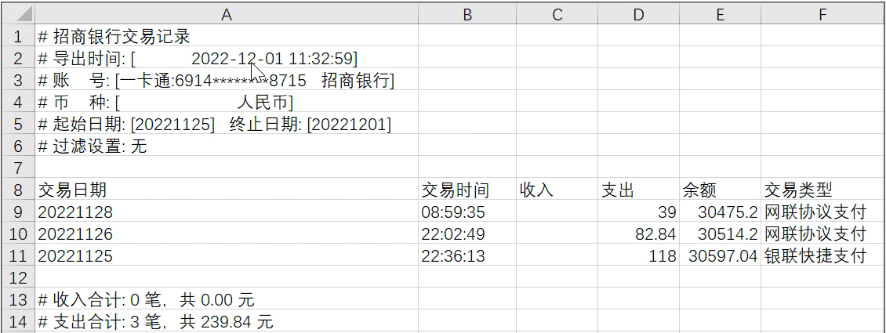
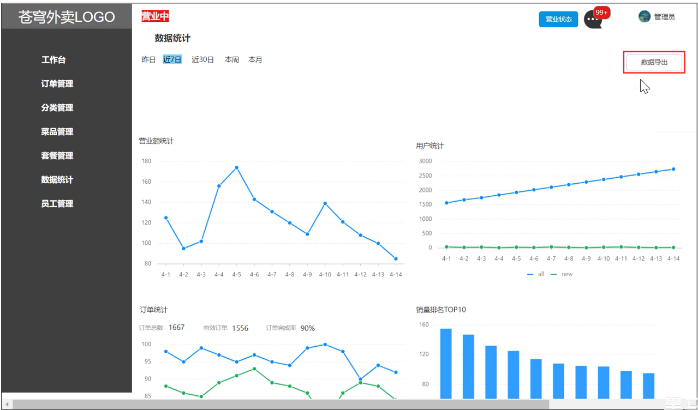
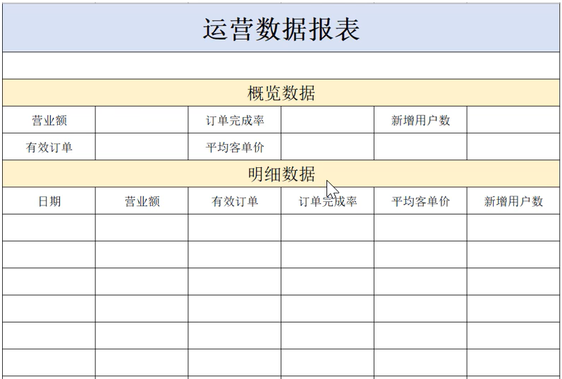

# 工作台

## 需求分析和设计

工作台是系统运营的数据看板，并提供快捷操作入口，可以有效提高商家的工作效率。

工作台展示的数据：

- 今日数据
- 订单管理
- 菜品总览
- 套餐总览
- 订单信息<!--more-->

名词解释

- 营业额：已完成订单的总金额
- 有效订单：已完成订单的数量
- 订单完成率：有效订单数/总订单数*100%
- 平均客单价：营业额/有效订单数
- 新增用户：新增用户的数量

接口设计：

- 今日数据接口
- 订单管理接口
- 菜品总览接口
- 套餐总览接口
- 订单搜索（已完成）
- 各个状态的订单数量统计(已完成)

## 代码开发

### 今日数据接口

```JAVA
WorkSapceController
    /**
     * 工作台今日数据查询
     * @return
     */
    @GetMapping("/businessData")
    @ApiOperation("工作台今日数据查询")
    public Result<BusinessDataVO> businessData(){
        //获得当天的开始时间
        LocalDateTime begin = LocalDateTime.now().with(LocalTime.MIN);
        //获得当天的结束时间
        LocalDateTime end = LocalDateTime.now().with(LocalTime.MAX);

        BusinessDataVO businessDataVO = workspaceService.getBusinessData(begin, end);
        return Result.success(businessDataVO);
    }
```

```JAVA
WorkSpaceServiceImpl
    /**
     * 根据时间段统计营业数据
     * @param begin
     * @param end
     * @return
     */
    public BusinessDataVO getBusinessData(LocalDateTime begin, LocalDateTime end) {
        /**
         * 营业额：当日已完成订单的总金额
         * 有效订单：当日已完成订单的数量
         * 订单完成率：有效订单数 / 总订单数
         * 平均客单价：营业额 / 有效订单数
         * 新增用户：当日新增用户的数量
         */

        Map map = new HashMap();
        map.put("begin",begin);
        map.put("end",end);

        //查询总订单数
        Integer totalOrderCount = orderMapper.getByMap(map);

        map.put("status", Orders.COMPLETED);
        //营业额
        Double turnover = orderMapper.sumByMap(map);
        turnover = turnover == null? 0.0 : turnover;

        //有效订单数
        Integer validOrderCount = orderMapper.getByMap(map);

        Double unitPrice = 0.0;

        Double orderCompletionRate = 0.0;
        if(totalOrderCount != 0 && validOrderCount != 0){
            //订单完成率
            orderCompletionRate = validOrderCount.doubleValue() / totalOrderCount;
            //平均客单价
            unitPrice = turnover / validOrderCount;
        }

        //新增用户数
        Integer newUsers = userMapper.countByMap(map);

        return BusinessDataVO.builder()
                .turnover(turnover)
                .validOrderCount(validOrderCount)
                .orderCompletionRate(orderCompletionRate)
                .unitPrice(unitPrice)
                .newUsers(newUsers)
                .build();
    }
```

```OrderMapper.xml
<select id="getByMap" resultType="java.lang.Integer">
        select count(id) from orders
        <where>
            <if test="begin != null">
                and order_time &gt;= #{begin}
            </if>
            <if test="end != null">
                and order_time &lt;= #{end}
            </if>
            <if test="status != null">
                and status = #{status}
            </if>
        </where>
    </select>
```

```UserMapper.xml
<!--根据动态条件查询用户数量-->
    <select id="countByMap" resultType="java.lang.Integer">
        select count(id)
        from user
        <where>
            <if test="begin">
                and create_time &gt; #{begin}
            </if>
            <if test="end">
                and create_time &lt; #{end}
            </if>
        </where>
    </select>
```

### 订单管理数据

```JAVA
WorkSpaceController
    /**
     * 查询订单管理数据
     * @return
     */
    @GetMapping("/overviewOrders")
    @ApiOperation("查询订单管理数据")
    public Result<OrderOverViewVO> orderOverView(){
        return Result.success(workspaceService.getOrderOverView());
    }
```

```JAVA
WorkSapceServiceImpl
    /**
     * 查询订单管理数据
     *
     * @return
     */
    public OrderOverViewVO getOrderOverView() {
        Map map = new HashMap();
        map.put("begin", LocalDateTime.now().with(LocalTime.MIN));
        map.put("status", Orders.TO_BE_CONFIRMED);

        //待接单
        Integer waitingOrders = orderMapper.getByMap(map);

        //待派送
        map.put("status", Orders.CONFIRMED);
        Integer deliveredOrders = orderMapper.getByMap(map);

        //已完成
        map.put("status", Orders.COMPLETED);
        Integer completedOrders = orderMapper.getByMap(map);

        //已取消
        map.put("status", Orders.CANCELLED);
        Integer cancelledOrders = orderMapper.getByMap(map);

        //全部订单
        map.put("status", null);
        Integer allOrders = orderMapper.getByMap(map);

        return OrderOverViewVO.builder()
                .waitingOrders(waitingOrders)
                .deliveredOrders(deliveredOrders)
                .completedOrders(completedOrders)
                .cancelledOrders(cancelledOrders)
                .allOrders(allOrders)
                .build();
    }
```

### 查询菜品总览

```JAVA
WorkspaceController
    /**
     * 查询菜品总览
     * @return
     */
    @GetMapping("/overviewDishes")
    @ApiOperation("查询菜品总览")
    public Result<DishOverViewVO> dishOverView(){
        return Result.success(workspaceService.getDishOverView());
    }
```

```JAVA
WorkspaceServiceImpl
    /**
     * 查询菜品总览
     *
     * @return
     */
    public DishOverViewVO getDishOverView() {
        Map map = new HashMap();
        map.put("status", StatusConstant.ENABLE);
        Integer sold = dishMapper.countByMap(map);

        map.put("status", StatusConstant.DISABLE);
        Integer discontinued = dishMapper.countByMap(map);

        return DishOverViewVO.builder()
                .sold(sold)
                .discontinued(discontinued)
                .build();
    }
```

### 查询套餐总览

```JAVA
WorkspaceController
    /**
     * 查询套餐总览
     * @return
     */
    @GetMapping("/overviewSetmeals")
    @ApiOperation("查询套餐总览")
    public Result<SetmealOverViewVO> setmealOverView(){
        return Result.success(workspaceService.getSetmealOverView());
    }
```

```JAVA
WorkspaceServiceImpl
    /**
     * 查询套餐总览
     *
     * @return
     */
    public SetmealOverViewVO getSetmealOverView() {
        Map map = new HashMap();
        map.put("status", StatusConstant.ENABLE);
        Integer sold = setmealMapper.countByMap(map);

        map.put("status", StatusConstant.DISABLE);
        Integer discontinued = setmealMapper.countByMap(map);

        return SetmealOverViewVO.builder()
                .sold(sold)
                .discontinued(discontinued)
                .build();
    }
```

# Apache POI

## 介绍

Apache POI是一个处理Miscrosoft Office各种文件格式的开源项目。简单来说就是，我们可以使用POI在JAVA程序中对Miscrosoft Office各种文件进行读写操作。

一般情况下，POI都是用于操作Excel文件。

Apache POI的应用场景：

- 银行网银系统导出交易明细
- 各种业务系统导出Excel报表
- 批量导入业务数据

## 入门案例

maven坐标

```MAVEN
        <!-- poi -->
        <dependency>
            <groupId>org.apache.poi</groupId>
            <artifactId>poi</artifactId>
        </dependency>
        <dependency>
            <groupId>org.apache.poi</groupId>
            <artifactId>poi-ooxml</artifactId>
        </dependency>
```


# 导出运营数据Excel报表

## 需求分析和设计

### 产品原型：



业务规则：

- 导出Excel形式的报表文件
- 导出最近30天的运营数据

## 代码开发

实现步骤：

- 设计Excel模板文件
- 查询近30天的运营数据
- 将查询到的运营数据写入模板文件
- 通过输出流将Excel文件下载到客户端浏览器

```JAVA
ReportController
    /**
     * 导出运营数据报表
     *
     * @param response
     */
    @GetMapping("/export")
    @ApiOperation("导出运营数据报表")
    public void export(HttpServletResponse response){
        reportService.exportBusinessData(response);
    }
```

```JAVA
ReportServiceImpl
    /**
     * 导出运营数据报表
     *
     * @param response
     */
    @Override
    public void exportBusinessData(HttpServletResponse response) {
        //1.查询数据库 ，获取营业数据---查询最后30天的运营数据
        LocalDate dateBegin = LocalDate.now().minusDays(30);
        LocalDate dateEnd = LocalDate.now().minusDays(1);

        LocalDateTime beginTime = LocalDateTime.of(dateBegin, LocalTime.MIN);
        LocalDateTime endTime = LocalDateTime.of(dateEnd, LocalTime.MAX);
        //查询概览数据
        BusinessDataVO businessDataVO = workspaceService.getBusinessData(beginTime, endTime);

        //2.通过POI将数据写入到Excel文件中
        InputStream in = this.getClass().getClassLoader().getResourceAsStream("template/运营数据报表模板.xlsx");
        try {
            XSSFWorkbook excel = new XSSFWorkbook(in);
            //获取表格文件的Sheet页
            XSSFSheet sheet = excel.getSheet("Sheet1");

            //填充数据---时间
            sheet.getRow(1).getCell(1).setCellValue(dateBegin + "至" + dateEnd);

            //填充数据---营业数据
            XSSFRow row = sheet.getRow(3);
            row.getCell(2).setCellValue(businessDataVO.getTurnover());

            //填充数据---订单完成率
            row.getCell(4).setCellValue(businessDataVO.getOrderCompletionRate());

            //填充数据---新增用户数
            row.getCell(6).setCellValue(businessDataVO.getNewUsers());

            //填充数据---有效订单数
            row = sheet.getRow(4);
            row.getCell(2).setCellValue(businessDataVO.getValidOrderCount());

            //填充数据---平均客单价
            row.getCell(4).setCellValue(businessDataVO.getUnitPrice());

            //填充明细数据
            for (int i = 0; i < 30; i++) {
                LocalDate date = dateBegin.plusDays(i);
                //查询某一天的营业数据
                BusinessDataVO businessData = workspaceService.getBusinessData(LocalDateTime.of(date, LocalTime.MIN), LocalDateTime.of(date, LocalTime.MAX));

                row = sheet.getRow(i + 7);
                row.getCell(1).setCellValue(date.toString());
                row.getCell(2).setCellValue(businessData.getTurnover());
                row.getCell(3).setCellValue(businessData.getValidOrderCount());
                row.getCell(4).setCellValue(businessData.getOrderCompletionRate());
                row.getCell(5).setCellValue(businessData.getUnitPrice());
                row.getCell(6).setCellValue(businessData.getNewUsers());
            }

            //3.通过输出流将Excel文件下载到客户端浏览器
            ServletOutputStream out = response.getOutputStream();
            excel.write(out);

            //关闭资源
            excel.close();
            out.close();
        } catch (IOException e) {
            throw new RuntimeException(e);
        }
    }
```

### 代码分析

```JAVA
//1.查询数据库 ，获取营业数据---查询最后30天的运营数据
LocalDate dateBegin = LocalDate.now().minusDays(30);
LocalDate dateEnd = LocalDate.now().minusDays(1);

LocalDateTime beginTime = LocalDateTime.of(dateBegin, LocalTime.MIN);
LocalDateTime endTime = LocalDateTime.of(dateEnd, LocalTime.MAX);
//查询概览数据
BusinessDataVO businessDataVO = workspaceService.getBusinessData(beginTime, endTime);
```

`LocalDate.now().minusDays(30)`:这是为了减去30天用来得到查询30天运营数据的开始时间dateBegin。

`LocalDate.now().minusDays(1)`：与上同理获取到介绍时间dateEnd。

然后通过`LocalDateTime.of`来转换时间格式为年月日时分秒根据开始时间和结束时间来查询概览数据。

```JAVA
//2.通过POI将数据写入到Excel文件中
InputStream in = this.getClass().getClassLoader().getResourceAsStream("template/运营数据报表模板.xlsx");
try {
  XSSFWorkbook excel = new XSSFWorkbook(in);
  //获取表格文件的Sheet页
  XSSFSheet sheet = excel.getSheet("Sheet1");
  //填充数据---时间
  sheet.getRow(1).getCell(1).setCellValue(dateBegin + "至" + dateEnd);
  //填充数据---营业数据
  XSSFRow row = sheet.getRow(3);
  row.getCell(2).setCellValue(businessDataVO.getTurnover());
  //填充数据---订单完成率
  row.getCell(4).setCellValue(businessDataVO.getOrderCompletionRate());
  //填充数据---新增用户数
  row.getCell(6).setCellValue(businessDataVO.getNewUsers());
  //填充数据---有效订单数
  row = sheet.getRow(4);
  row.getCell(2).setCellValue(businessDataVO.getValidOrderCount());
  //填充数据---平均客单价
  row.getCell(4).setCellValue(businessDataVO.getUnitPrice());
  //填充明细数据
  for (int i = 0; i < 30; i++) {
       LocalDate date = dateBegin.plusDays(i);
       //查询某一天的营业数据
       BusinessDataVO businessData = workspaceService.getBusinessData(LocalDateTime.of(date, LocalTime.MIN), LocalDateTime.of(date, LocalTime.MAX));
       row = sheet.getRow(i + 7);
       row.getCell(1).setCellValue(date.toString());
       row.getCell(2).setCellValue(businessData.getTurnover());
       row.getCell(3).setCellValue(businessData.getValidOrderCount());
       row.getCell(4).setCellValue(businessData.getOrderCompletionRate());
       row.getCell(5).setCellValue(businessData.getUnitPrice());
       row.getCell(6).setCellValue(businessData.getNewUsers());
}
```

`InputStream in = this.getClass().getClassLoader().getResourceAsStream("template/运营数据报表模板.xlsx")`:由于运营数据报表模板在resource包下面，通过`this.getClass().getClassLoader()`获取当前类的加载器。

`XSSFWorkbook excel = new XSSFWorkbook(in)`:是Apache POI库中的用于处理Excel文件的类。

` XSSFSheet sheet = excel.getSheet("Sheet1")`:通过返回的处理Excel的对象，获取到对应的sheet页。

`sheet.createRow(i)`:根据sheet页获取到对应的行数，行数下标从0开始。

`row.createCell(i)`:与上同理，这里是通过行数获取到对应的列数，列数下标从0开始。然后我们通过`getCellValue()和setCellValue()`来获取和设置相应的值。


完结撒花！！！！
