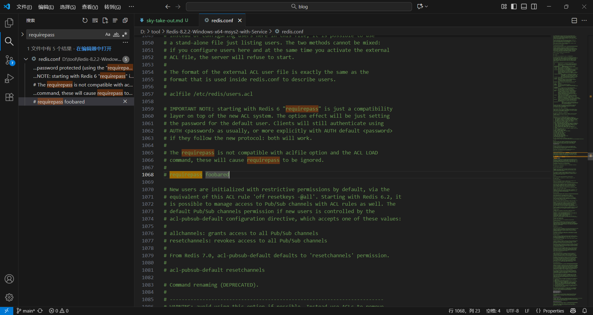

# 苍穹外卖学习笔记----redis

## redis入门

### 简介

Redis是一个<span style="color:red">基于内存</span>的key-value结构数据库，因此Redis是一个基于内存存储，读写性能高的数据库，适合存储热点数据(热点商品、资讯、新闻等)

<!--more-->

#### 网站链接

官网:https://redis.io

中文网:https://www.redis.net.cn

#### Redis下载与安装

Windows版下载地址:https://github.com/microsoftarchive/redis/releases

Linux版下载地址:https://download.redis.io/releases/

<span style="color:red">我这里下载的是Redis-8.2.2-Windows-x64-msys2-with-Service版本</span>

直接使用redis-server.exe redis.conf(有的版本是redis-server.exe redis.windows.conf)命令启动redis

接下来我们需要在redis.conf(有的版本是redis.window.conf)文件中修改redis命令<span style="color:red">（练习并不建议设置密码）</span>，然后搜索requirepass进行修改(将注释删除，修改foobared)

设置密码后，我们可以通过redis的redis-cli.exe -h localhost -p 6379 - a [密码]进入端口，**注意**：1、如果设置了密码不适用密码登录讲无法看见所有keys，没有设置密码的直接redis-cli.exe -h localhost -p 6379登录即可2、在使用端口之前<span style = "color:red">一定一定需要将redis启动否则将报错：Could not connect to Redis at localhost:6379: Connection refused</span>

### Redis图形界面

#### Redis DeskTop Manager 桌面端

Redis DeskTop Manager 工具应该是现在使用率最广的可视化工具了，也不用多说什么了。运营时间很久。经过了数次迭代。跨平台支持。现在虽然收费了。但是也不贵，一年才百来块，而且旧版本是免费的(建议直接使用黑马那个图形化界面)，界面看着比较简洁，功能很全。除了基本的五大数据类型之外，还支持Stream数据类型，在value的显示方面。基本支持所有数据类型的显示。

### Redis数据类型

#### 5种常用数据类型介绍

Redis存储的是key-value结构的数据，其中key是字符串类型，value有5种常用的数据类型:

- 字符串 String：最简单最常用的
- 哈希 hash：也叫散列,类似于Java中的HashMap结构（field：value），<span style ="color:red">适合用于存储对象</span>
- 列表 list:：队列，按照插入顺序排序，可以**有重复元素**，类似于Java中的LinkedList
- 集合 set：无序集合，**没有重复元素**，类似于Java中的HashSet
- 有序集合 sorted set/zset：集合中每个元素关联一个分数(score)，根据分数升序排序，没有重复元素

### Redis常用命令

#### 字符串操作命令

- SET key value：设置指定key的 值
- GET key：获取指定key的值
- SETEX key seconds value：设置指定key的值，并将key的过期时间设为sconds秒，到时间后自动被redis清理，常见于短信验证码等短时间有效的数据
- SETNX key value：只有在key不存在时设置key的值，不存在key的时候返回0并创建key-value，反之为1并不创建key-value，应用场景：分布式锁

#### 哈希操作命令

- HSET key field value：设置哈希表中key中的field的value，类似于表名-属性-值
- HGET key field：获取指定字段的值
- HDEL key field：删除指定的field字段
- HKEYS key：获取所有字段
- HVALS key：获取所有值

#### 列表操作命令

Redis列表按照插入顺序排序<span style = "color : red">（双向队列）</span>

- LPUSH key value[value2]：头插法插入数据（左边插入），先进先出
- LRANGE key start stop：查询数据从start下标到stop下标
- RPOP key：移除并获取列表最后一个元素，也可以LPOP从左边删除
- LLEN key：获取列表长度

#### 集合操作命令

是String类型的<span style="color:red">无序集合</span>。集合成员是<span style = "color : red">唯一的，集合中不能出现重复的数据</span>

- SADD key member1[member2]:向集合添加一个或多个成员
- SMEMBERS key：返回集合中的所有成员
- SCARD key：获取集合的成员数
- SINTER key1[key2]：返回给定所有集合的<span style="color:red">交集</span>
- SUNION key1[key2]：返回所有给定集合的<span style="color:red">并集</span>
- SREM key member1[member2]：删除集合中的元素

#### 有序集合操作命令

是string类型元素的集合，且<span style = "color : red">不允许有重复成员</span>。每个元素都会<span style = "color : red">关联一个double类型的分数</span>。

- ZADD key score1 member1 [score2 member2]：有序集合添加一个或多个成员<span style = "color : red">分数越高越靠前</span>

- ZRANGE key start stop [WITHSCORES]：通过索引区间返回有序集合中指定区间内的成员
- ZINCRBY key increment member：有序集合中对指定成员的分数加上增量increment
- ZREM key member [member ...]：移除有序集合中的一个或多个成员

#### 通用操作命令

- KEYS patter ：查找所有符合给定模式（pattern）的key
- EXISTS key：检查给定key是否存在
- TYPE key：返回key所储存的值的类型
- DEL key：删除该key

## 在JAVA中操作Redis

### Redis的JAVA客户端

#### Spring Data Redis使用方式

操作步骤：

- 导入maven

  - ```java
    <!--redis依赖导入-->
    <dependency>
         <groupId>org.springframework.boot</groupId>
         <artifactId>spring-boot-starter-data-redis</artifactId>
    </dependency>
    ```

- 配置Redis数据源

  - ```JAVA
      redis:
        host: ${sky.redis.host}
        post: ${sky.redis.post}
        password: ${sky.redis.password}
        database: ${sky.redis.database}
    ```
    
    ```JAVA
      redis:
        host: localhost
        post: 6379
        password:设置了密码的时候才需要配置该项
        database: 10
    ```

- 编写配置类，创建RedisTemplate对象

  - ```JAVA
    /**
     * redis配置类
     */
    @Configuration
    @Slf4j
    public class RedisConfiguration {
    
        /**
         * redisConnectionFactory是redis连接工厂
         * @param redisConnectionFactory
         * @return
         */
        @Bean
        public RedisTemplate redisTemplate(RedisConnectionFactory redisConnectionFactory){
            log.info("开始创建redis模板对象...");
            RedisTemplate redisTemplate = new RedisTemplate();
            //设置redis的连接对象----关联上redis连接工厂
            redisTemplate.setConnectionFactory(redisConnectionFactory);
    
            //设置redis key的序列化器
            redisTemplate.setKeySerializer(new StringRedisSerializer());
            return redisTemplate;
        }
    }
    ```
  
  - 为什么要进行序列化
  
    - 核心目的是解决 “Java 对象” 与 “Redis 存储的字节数据” 之间的转换问题。即使在调用redisTemplate.setConnectionFactory(redisConnectionFactory) 配置连接工厂后，序列化仍然是必须的。
  
- 通过RedisTemplate对象操作Redis

  - 操作字符串类型的数据

    - ```JAVA
      /**
           * 操作字符串类型的数据
           */
          @Test
          public void testString(){
              //set get setex setnx
              redisTemplate.opsForValue().set("city","北京");
              String city =(String) redisTemplate.opsForValue().get("city");
              System.out.println(city);
              redisTemplate.opsForValue().set("code","1234",3, TimeUnit.SECONDS);
              redisTemplate.opsForValue().setIfAbsent("lock","1");
              redisTemplate.opsForValue().setIfAbsent("lock","2");
          }
      ```

  - 操作哈希类型的数据

    - ```JAVA
      /**
           * 操作哈希类型的数据
           */
          @Test
          public void testHash(){
              //hset  hget hdel hkeys hvals
              HashOperations hashOperations = redisTemplate.opsForHash();
      
              hashOperations.put("100","name","tom");
              hashOperations.put("100","age","20");
      
              String name =(String)hashOperations.get("100", "name");
              System.out.println(name);
      
              Set keys = hashOperations.keys("100");
              System.out.println(keys);
      
              List values = hashOperations.values("100");
              System.out.println(values);
      
              hashOperations.delete("100","age");
          }
      ```
  
  - 操作集合类型的数据
  
    - ```JAVA
      /**
           * 操作列表类型的数据
           */
          @Test
          public void testList(){
              //lpush lrange rpop llen
              ListOperations listOperations = redisTemplate.opsForList();
      
              //lpush
              /**
               * leftPushAll添加多个数据
               * leftPush添加单个数据
               */
              listOperations.leftPushAll("mylist","a","b","c");
              listOperations.leftPush("mylist","d");
      
              //lrang
              List mylist = listOperations.range("mylist", 0, -1);
              System.out.println(mylist);
              //rpop
              listOperations.rightPop("mylist");
              //llen
              Long size = listOperations.size("mylist");
              System.out.println(size);
          }
      ```
  
  - 操作集合类型的数据
  
    - ```JAVA
      /**
           * 操作集合类型的数据
           */
          @Test
          public void testSet(){
              //sadd smembers scard  sinter sunion srem
              SetOperations setOperations = redisTemplate.opsForSet();
      
              //sadd
              setOperations.add("set1","a","b","c","d");
              setOperations.add("set2","a","b","x","y");
      
              //smembers
              Set members = setOperations.members("set1");
              System.out.println(members);
      
              //scard
              Long size = setOperations.size("set1");
              System.out.println(size);
      
              //sinter
              Set intersect = setOperations.intersect("set1", "set2");
              System.out.println(intersect);
      
              //sunion
              Set union = setOperations.union("set1", "set2");
              System.out.println(union);
      
              //srem
              setOperations.remove("set1","a","b");
          }
      ```
  
  - 操作有序集合类型的数据
  
    - ```Java
      /**
           * 操作有序集合类型的数据
           */
          @Test
          public void testZset(){
              //zadd zrange zincrby zrem
              ZSetOperations zSetOperations = redisTemplate.opsForZSet();
      
              //添加有序集合元素
              zSetOperations.add("zset1","a",10);
              zSetOperations.add("zset1","b",12);
              zSetOperations.add("zset1","c",9);
      
              //获取下标为0到-1（获取所有）的集合
              Set zset1 = zSetOperations.range("zset1", 0, -1);
              System.out.println(zset1);
      
              //为file为c的score+10
              zSetOperations.incrementScore("zset1","c",10);
      
              //删除file为a和b的数据
              zSetOperations.remove("zset1","a","b");
          }
      ```
  
  - 通用命令操作
  
    - ```JAVA
      /**
           * 通用命令操作
           */
          @Test
          public void testCommon(){
              //keys exists type del
              //显示所有的key
              Set keys = redisTemplate.keys("*");
              System.out.println(keys);
      
              //判断是否还存在这个key
              Boolean name = redisTemplate.hasKey("name");
              Boolean set1 = redisTemplate.hasKey("set1");
      
              //遍历keys查看各个key的类型
              for (Object key : keys) {
                  DataType type = redisTemplate.type(key);
                  System.out.println(type.name());
              }
      
              //删除
              redisTemplate.delete("mylist");
          }
      ```
  

## 实战---营业状态数据存储方式

由于需要存储营业状态这个数据，如果存入在一张表中只有一列只有0和1的值，并不方便，因此建议通过redis的字符串进行存储。

```JAVA
//管理端redis业务逻辑
@RestController("adminShopController")
@RequestMapping("/admin/shop")
@Api(tags = "店铺相关接口")
@Slf4j
public class ShopController {


    public static final String KEY = "SHOP_STATUS";
    @Autowired
    private RedisTemplate redisTemplate;

    /**
     * 设置店铺的营业状态
     * @param status
     * @return
     */
    @PutMapping("/{status}")
    @ApiOperation("设置店铺的营业状态")
    public Result setStatus(@PathVariable Integer status){
        log.info("设置店铺的营业状态为：{}",status == 1?"营业中":"打烊中");
        redisTemplate.opsForValue().set(KEY,status);
        return Result.success();
    }

    /**
     * 获取店铺的营业状态
     * @return
     */
    @GetMapping("/status")
    @ApiOperation("获取店铺的营业状态")
    public Result<Integer> getStatus(){
        Integer status =(Integer) redisTemplate.opsForValue().get(KEY);
        log.info("获取到店铺的营业状态为：{}",status == 1 ? "营业中":"打烊中");
        return Result.success(status);
    }
}

```

```JAVA
// 用户端业务逻辑
@RestController("userShopController")
@RequestMapping("/user/shop")
@Api(tags = "店铺相关接口")
@Slf4j
public class ShopController {

    public static final String KEY = "SHOP_STATUS";

    @Autowired
    private RedisTemplate redisTemplate;

    /**
     * 获取店铺的营业状态
     * @return
     */
    @GetMapping("/status")
    @ApiOperation("获取店铺的营业状态")
    public Result<Integer> getStatus(){
        Integer status =(Integer) redisTemplate.opsForValue().get(KEY);
        log.info("获取到店铺的营业状态为：{}",status == 1 ? "营业中":"打烊中");
        return Result.success(status);
    }
}
```

## HttpClient

### 介绍

一个客户端编程工具包

#### 代码

```JAVA
<!--HttpClient-->
<dependency>
     <groupId>org.apache.httpcomponents</groupId>
     <artifactId>httpclient</artifactId>
     <version>4.5.13</version>
</dependency>
```

#### 核心API

HttpClient

HttpClients

CloseableHttpClient

HttpGet

HttpPost

#### 发送请求步骤

创建HttpClient对象

```JAVA
 CloseableHttpClient httpClient = HttpClients.createDefault();
```

创建Http请求对象

```JAVA
//获取店铺营业状态
HttpGet httpGet = new HttpGet("http://localhost:8080/user/shop/status");
```

调用HttpClient得execute方法发送请求

```JAVA
CloseableHttpResponse response = httpClient.execute(httpGet);
```

获取状态码和响应体

```JAVA
//获取服务端返回的状态码
int statusCode = response.getStatusLine().getStatusCode();
System.out.println("服务端返回的状态码为:"+statusCode);

//获取响应体
HttpEntity entity = response.getEntity();
String body = EntityUtils.toString(entity);
System.out.println("服务端返回的数据为："+body);
```

### 案例

POST对象

```JAVA
/**
     * 测试通过httpclient发送POST方式得请求
     */
    @Test
    public void testPost() throws Exception {
        //创建HttpClient对象
        CloseableHttpClient httpClient = HttpClients.createDefault();

        //创建请求对象
        HttpPost httpPost = new HttpPost("http://localhost:8080/admin/employee/login");

        JSONObject jsonObject = new JSONObject();
        jsonObject.put("username","admin");
        jsonObject.put("password","123456");
        //StringEntity需要传递的是json的数据
        StringEntity stringEntity = new StringEntity(jsonObject.toString());
        //指定请求编码方式
        stringEntity.setContentEncoding("utf-8");
        stringEntity.setContentType("application/json");
        httpPost.setEntity(stringEntity);


        //发送请求
        CloseableHttpResponse response = httpClient.execute(httpPost);

        //解析返回结果
        int statusCode = response.getStatusLine().getStatusCode();
        System.out.println(statusCode);

        HttpEntity entity = response.getEntity();
        String string = EntityUtils.toString(entity);
        System.out.println(string);
        //关闭资源
        response.close();
        httpClient.close();

    }
```
