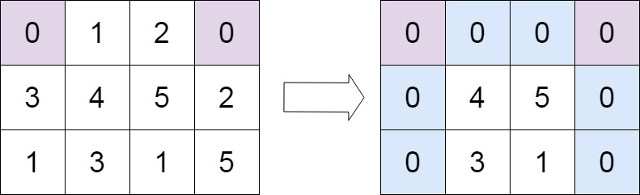
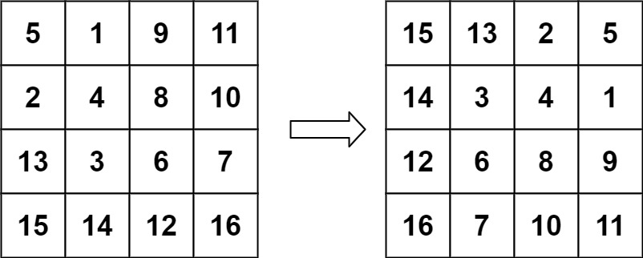
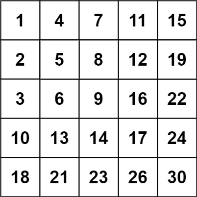
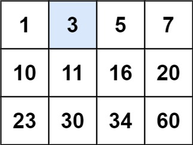
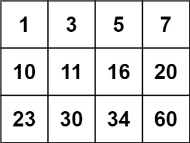
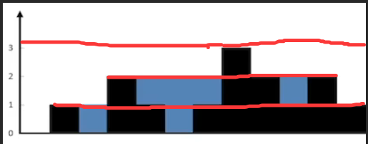
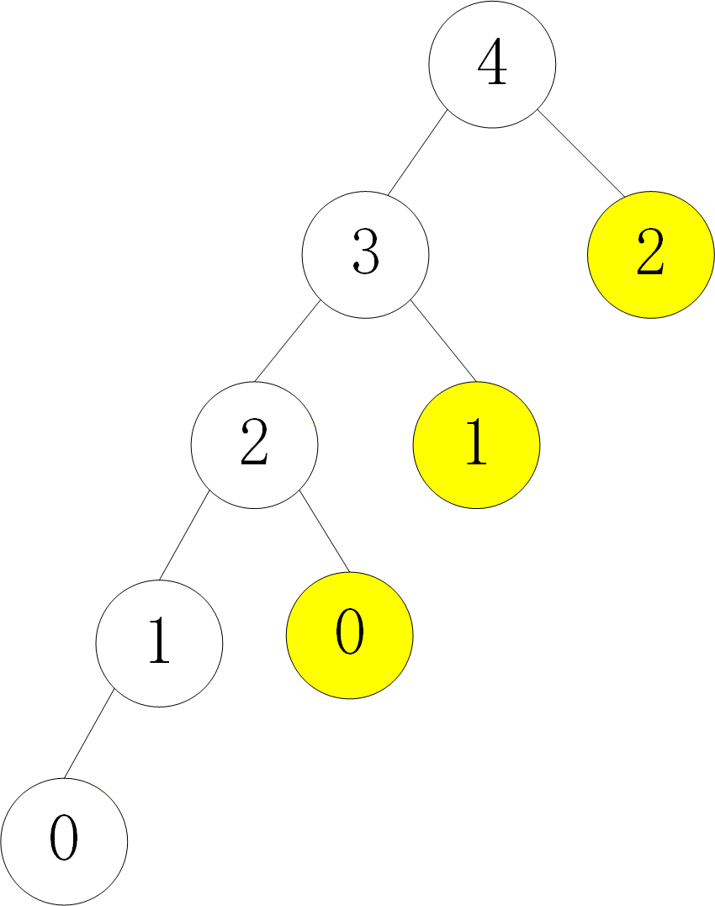
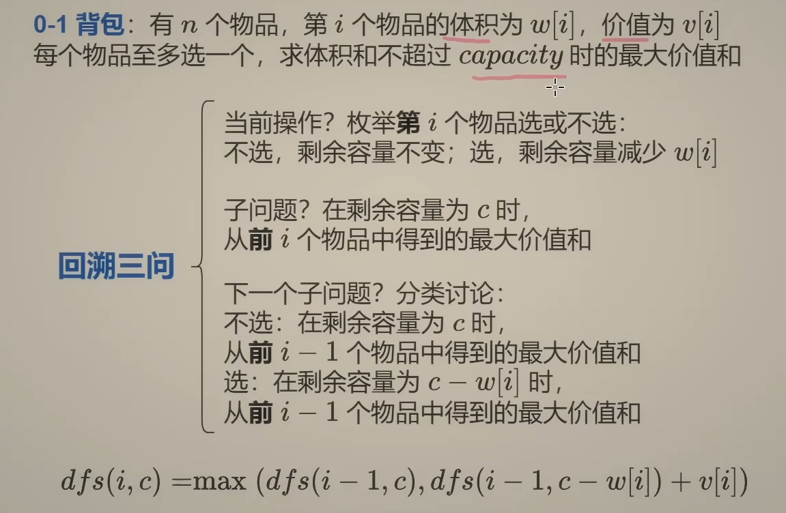
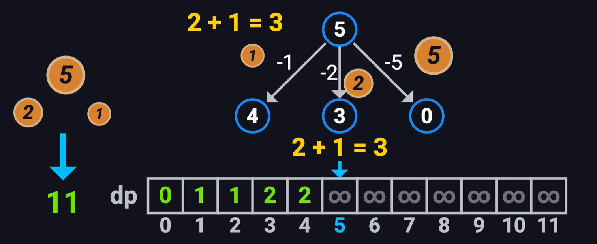

本文整理 LeetCode Hot 100 题目的解题思路、Java 代码和复杂度分析。<!--more-->
# 第一题-两数之和

给定一个整数数组 `nums` 和一个整数目标值 `target`，请你在该数组中找出 **和为目标值** *`target`* 的那 **两个** 整数，并返回它们的数组下标。

你可以假设每种输入只会对应一个答案，并且你不能使用两次相同的元素。

## 代码版本(一)

```java
class Solution {
    public int[] twoSum(int[] nums, int target) {
        int[] result = new int[2];
        for(int i=0;i<nums.length;i++){
            for(int j = i+1;j<nums.length;j++){
                if(nums[i]+nums[j] == target){
                    result[0] = i;
                    result[1] = j;
                }
            }
        }
        return result;
    }
}
```

## 代码版本（二）

```java
class Solution {
    public int[] twoSum(int[] nums, int target) {
        Map<Integer,Integer> result = new HashMap<>();
        for(int i = 0;i<nums.length;i++){
            if(result.containsKey(target-nums[i])){
                return new int[]{i,result.get(target-nums[i])};
            }
            //把nums放进hash
            result.put(nums[i],i);
        }
        return new int[0];
    } 
}
```

### 思路

1. 代码版本1使用的是暴力方法，使用两个for循环通过遍历获取两个值相加，时间复杂度O(n)
2. 使用hash自带的遍历来获取
   - 首先从hash表中获取看看有没有`target-nums[i]`的值获取他的索引(因此`key-value`的形式中，`value`是`index`，`key`是`nums`的值)
     - 找到就返回下标，反之继续把值放入hash表中
3. 注意事项：
   - 这里为什么`put`函数要放在后面
     - 如果我们把put放在前面那么我们在`target-nums[i]`的时候就很容易自身找自身，比如用例[3,2,4]，`target=6`，这里就会返回[0,0]

## 补充知识

### Java HashMap 方法

| 方法            | 描述                                                         | 返回值                                                       |
| --------------- | ------------------------------------------------------------ | ------------------------------------------------------------ |
| clear()         | 删除hashMap中所有键值对                                      | 无                                                           |
| clone()         | 复制一份hashMap                                              | 返回HashMap实例(对象)的副本                                  |
| isEmpty()       | 判断hashMap是否为空                                          | 如果 HashMap 中不包含任何键/值对的映射关系则返回 true，否则返回 false。 |
| size()          | 计算hashMap中键值对的数量                                    | 返回数量                                                     |
| put()           | 将键值对添加到hashMap中                                      | 如果插入的 key 对应的 value 已经存在，则执行 value 替换操作，返回旧的 value 值，如果不存在则执行插入，返回 null。 |
| putAll()        | 将所有键值对添加到hashMap中                                  | 不返回任何值                                                 |
| putIfAbsent()   | 如果 hashMap 中不存在指定的键，则将指定的键/值对插入到 hashMap 中。 | 如果所指定的 key 已经在 HashMap 中存在，返回和这个 key 值对应的 value, 如果所指定的 key 不在 HashMap 中存在，则返回 null。 |
| remove()        | 删除 hashMap 中指定键 key 的映射关系                         |                                                              |
| containsKey()   | 检查 hashMap 中是否存在指定的 key 对应的映射关系。           | 如果 hashMap 中存在指定的 key 对应的映射关系返回 true，否则返回 false。 |
| containsValue() | 检查 hashMap 中是否存在指定的 value 对应的映射关系。         | 如果 hashMap 中是否存在指定的 value 对应的映射关系返回 true，否则返回 false。 |
| get()           | 获取指定 key 对应对 value                                    | 回与指定 key 所关联的 value。                                |

# 第二题-字母异位词分组

给你一个字符串数组，请你将 字母异位词 组合在一起。可以按任意顺序返回结果列表。

**示例 1:**

**输入:** strs = ["eat", "tea", "tan", "ate", "nat", "bat"]

**输出:** [["bat"],["nat","tan"],["ate","eat","tea"]]

**解释：**

- 在 strs 中没有字符串可以通过重新排列来形成 `"bat"`。
- 字符串 `"nat"` 和 `"tan"` 是字母异位词，因为它们可以重新排列以形成彼此。
- 字符串 `"ate"` ，`"eat"` 和 `"tea"` 是字母异位词，因为它们可以重新排列以形成彼此。

## 方法一字母排序

```java
 class Solution {
    public List<List<String>> groupAnagrams(String[] strs) {
        //判断是否有值
        if (strs.length == 0){
            return new ArrayList<>();
        }
        //使用hashMap设置为{"key":{"value1","value2",....}}
        Map<String, List> map = new HashMap<String,List>();
        for (String str:strs){
            //把字符串进行排序作为key存储
            char[] chars = str.toCharArray();
            Arrays.sort(chars);
            String key = String.valueOf(chars);
            
            //如果没有找到对应的key，就创建新的key
            if (!map.containsKey(key)){
                map.put(key, new ArrayList());
            }
            //找到了对应的key就添加进对应的key的value中
            map.get(key).add(str);
        }
        return new ArrayList(map.values());
    }
    
}
```

## 思路

1. 如果传递的值为空，就需要进行判断，返回空数组
2. 传递了字符串数组
   - 通过遍历，把每一个字符串转换成字符数组进行排序
   - 将排序的字符数组转换为字符串作为hashMap的key使用
   - 通过遍历map的key找到对应的位置添加进value当中
   - 反之如果没有在map中找到对应的排序好的key就创建一个新的key-value

# 第三题-最长连续序列

给定一个未排序的整数数组 `nums` ，找出数字连续的最长序列（不要求序列元素在原数组中连续）的长度。

请你设计并实现时间复杂度为 `O(n)` 的算法解决此问题。

**示例 1：**

```shell
输入：nums = [100,4,200,1,3,2]
输出：4
解释：最长数字连续序列是 [1, 2, 3, 4]。它的长度为 4。
```

**示例 2：**

```shell
输入：nums = [0,3,7,2,5,8,4,6,0,1]
输出：9
```

**示例 3：**

```shell
输入：nums = [1,0,1,2]
输出：3
```

## 方法一-通过set集合判断是否为起点，从起点出发

```java
package cn.itcast.algorithm.leetCode.Question;

import java.util.HashSet;
import java.util.Set;

/*
最长连续序列
 */
public class Question003 {
    public int longestConsecutive(int[] nums) {
        //创建一个集合，并且把nums存入集合当中
        Set<Integer> set = new HashSet<Integer>();
        for (int num : nums){
            set.add(num);
        }
        //创建一个变量，记录最长的连续序列的长度
        int longestStreak = 0;

        //遍历集合
        for (int num : set){
            //关键点，判断num-1是否存在，如果不存在，说明是起点，可以开始计算
            if (!set.contains(num-1)){
                int currentNum = num;
                int currentStreak = 1;

                //判断num+1是否存在，如果存在，说明是连续的，可以开始计算
                while (set.contains(currentNum+1)){
                    currentNum++;
                    currentStreak++;
                }
                longestStreak = Math.max(longestStreak,currentStreak);
            }
        }
        return longestStreak;
    }
}

```

### 思路

1. 这里不再使用map集合，采用set集合，主要是为了通过`contains`遍历集合
2. 在进入二次循环之前，需要定义一个最大数，用于判断循环出来的连续序列长度
3. 当判断当前数是起点的时候通过while循环遍历set集合是否有进一位的数，有则更新最长序列长度
   - 这里有个时间复杂度的误区——并非循环嵌套就是O(n²)
   - 由于判断自己是否是起点，如果不是起点并不会执行if语句
   - 当前值为起点(没有上一个数)那么就会去遍历寻找下一个数直到找不到下一个数为止
   - 因此每个数的遍历只会遍历一次，因此总的时间复杂度=for循环遍历的n+（if+while判断的个数）n+2n，O(2n)=O(n)

### Set集合API整理

| 方法                                | 返回值        | 说明                                                    | 示例                                         |
| ----------------------------------- | ------------- | ------------------------------------------------------- | -------------------------------------------- |
| `add(E e)`                          | `boolean`     | 添加元素到集合，成功返回 `true`，重复元素返回 `false`。 | `set.add("Java");`                           |
| `remove(Object o)`                  | `boolean`     | 删除指定元素，成功返回 `true`，元素不存在返回 `false`。 | `set.remove("Python");`                      |
| `contains(Object o)`                | `boolean`     | 检查集合是否包含指定元素。                              | `if (set.contains("Java")) { ... }`          |
| `size()`                            | `int`         | 返回集合中的元素数量。                                  | `int count = set.size();`                    |
| `isEmpty()`                         | `boolean`     | 判断集合是否为空。                                      | `if (set.isEmpty()) { ... }`                 |
| `clear()`                           | `void`        | 清空集合中的所有元素。                                  | `set.clear();`                               |
| `iterator()`                        | `Iterator<E>` | 返回集合的迭代器，用于遍历元素。                        | `for (String s : set) { ... }`               |
| `toArray()`                         | `Object[]`    | 将集合转换为数组。                                      | `Object[] arr = set.toArray();`              |
| `toArray(T[] a)`                    | `T[]`         | 将集合转换为指定类型的数组。                            | `String[] arr = set.toArray(new String[0]);` |
| `addAll(Collection<? extends E> c)` | `boolean`     | 添加另一个集合的所有元素（并集操作）。                  | `set.addAll(Arrays.asList("A", "B"));`       |
| `retainAll(Collection<?> c)`        | `boolean`     | 仅保留与指定集合共有的元素（交集操作）。                | `set.retainAll(otherSet);`                   |
| `removeAll(Collection<?> c)`        | `boolean`     | 删除与指定集合共有的元素（差集操作）。                  | `set.removeAll(otherSet);`                   |

# 第四题-最大子数组和

给你一个整数数组 `nums` ，请你找出一个具有最大和的连续子数组（子数组最少包含一个元素），返回其最大和。

**子数组**是数组中的一个连续部分。

**示例 1：**

```shell
输入：nums = [-2,1,-3,4,-1,2,1,-5,4]
输出：6
解释：连续子数组 [4,-1,2,1] 的和最大，为 6 。
```

**示例 2：**

```shell
输入：nums = [1]
输出：1
```

**示例 3：**

```shell
输入：nums = [5,4,-1,7,8]
输出：23
```

## 方法一-暴力枚举(超时)

```java
class Solution {
    public int maxSubArray(int[] nums) {
        int maxSum = nums[0];
        for (int i=0;i<nums.length;i++){
            int sum = 0;
            for (int j=i;j<nums.length;j++) {
                sum += nums[j];
                maxSum = Math.max(sum, maxSum);
            }
        }
        return maxSum;
    }
}
```

## 方法二-Kadane算法 (最优解)

```java
class Solution {
    public int maxSubArray(int[] nums) {
        int current_sum = nums[0];
        int max_sum = nums[0];
        for(int i =1;i<nums.length;i++){
            current_sum = Math.max(nums[i],current_sum+nums[i]);
            max_sum = Math.max(current_sum,max_sum);
        }
        return max_sum;
    }
}
```

### 思路

1. 首先定义一个当前和`current_sum`来表示当前数组求和是否会小于该数，`max_sum`用来存储最大子数和
2. 如果小于当前数字，数字就赋值给`current_sum`

# 第五题：移动零

给定一个数组 `nums`，编写一个函数将所有 `0` 移动到数组的末尾，同时保持非零元素的相对顺序。

**请注意** ，必须在不复制数组的情况下原地对数组进行操作。

**示例 1:**

```shell
输入: nums = [0,1,0,3,12]
输出: [1,3,12,0,0]
```

**示例 2:**

```shell
输入: nums = [0]
输出: [0]
```

## 方法一-快慢指针

```java
package cn.itcast.algorithm.leetCode.Question;

/*
移动零
 */
public class Question005 {
    public void moveZeroes(int[] nums) {
        //指向下一个非零元素应该放置的位置
        int slow = 0;
        for (int fast = 0;fast<nums.length;fast++){
            if (nums[fast] != 0){
                nums[slow] = nums[fast];
                slow++;
            }
        }
        for (int i = slow;i<nums.length;i++)
            nums[i] = 0;
    }
}

```

### 思路

# 第六题-合并区间

以数组 `intervals` 表示若干个区间的集合，其中单个区间为 `intervals[i] = [starti, endi]` 。请你合并所有重叠的区间，并返回 *一个不重叠的区间数组，该数组需恰好覆盖输入中的所有区间* 。

 

**示例 1：**

```shell
输入：intervals = [[1,3],[2,6],[8,10],[15,18]]
输出：[[1,6],[8,10],[15,18]]
解释：区间 [1,3] 和 [2,6] 重叠, 将它们合并为 [1,6].
```

**示例 2：**

```shell
输入：intervals = [[1,4],[4,5]]
输出：[[1,5]]
解释：区间 [1,4] 和 [4,5] 可被视为重叠区间。
```

**示例 3：**

```shell
输入：intervals = [[4,7],[1,4]]
输出：[[1,7]]
解释：区间 [1,4] 和 [4,7] 可被视为重叠区间。
```

## 方法一

```java
package cn.itcast.algorithm.leetCode.Question;

import java.util.ArrayList;
import java.util.Arrays;
import java.util.List;

/*
合并区间
 */
public class Question006 {
    public int[][] merge(int[][] intervals) {
        if (intervals.length == 0 || intervals == null){
            return new int[0][2];
        }
        Arrays.sort(intervals,(a,b)->a[0]-b[0]);
        List<int[]> newIntervals = new ArrayList<>();
        int start = intervals[0][0];
        int end = intervals[0][1];
        for (int i = 1;i<intervals.length;i++)
            if (intervals[i][0] <= end){
                end = Math.max(end,intervals[i][1]);
            }else {
                newIntervals.add(new int[]{start,end});
                start = intervals[i][0];
                end = intervals[i][1];
            }
        newIntervals.add(new int[]{start,end});
        return newIntervals.toArray(new int[newIntervals.size()][]);
    }
}

```

### 思路

# 第七题-轮转数组

给定一个整数数组 `nums`，将数组中的元素向右轮转 `k` 个位置，其中 `k` 是非负数。

**示例 1:**

```
输入: nums = [1,2,3,4,5,6,7], k = 3
输出: [5,6,7,1,2,3,4]
解释:
向右轮转 1 步: [7,1,2,3,4,5,6]
向右轮转 2 步: [6,7,1,2,3,4,5]
向右轮转 3 步: [5,6,7,1,2,3,4]
```

**示例 2:**

```
输入：nums = [-1,-100,3,99], k = 2
输出：[3,99,-1,-100]
解释: 
向右轮转 1 步: [99,-1,-100,3]
向右轮转 2 步: [3,99,-1,-100]
```

## 方法一：反转数组

```java
package cn.itcast.algorithm.leetCode.Question;

/*
轮转指针
 */
public class Question007 {
    public void rotate(int[] nums, int k) {
        //过滤多余的论数[1,2], 3
        k %= nums.length;
        //整个反转
        reverse(nums,0,nums.length -1);
        //反转前k个数组
        reverse(nums,0,k-1);
        //反转k后面的数组
        reverse(nums,k,nums.length-1);
    }
    // 翻转数组
    public void reverse(int[] nums,int start,int end){
        while(start<end){
            int temp = nums[start];
            nums[start] = nums[end];
            nums[end] = temp;
            start++;
            end--;
        }
    }
}

```

# 第八题-除了自身以外数组的乘积

给你一个整数数组 `nums`，返回 数组 `answer` ，其中 `answer[i]` 等于 `nums` 中除了 `nums[i]` 之外其余各元素的乘积 。

题目数据 **保证** 数组 `nums`之中任意元素的全部前缀元素和后缀的乘积都在 **32 位** 整数范围内。

请 **不要使用除法，**且在 `O(n)` 时间复杂度内完成此题。

**示例 1:**

```
输入: nums = [1,2,3,4]
输出: [24,12,8,6]
```

**示例 2:**

```
输入: nums = [-1,1,0,-3,3]
输出: [0,0,9,0,0]
```

## 方法一:前缀积后缀积

```java
class Solution {
    public int[] productExceptSelf(int[] nums) {
        int n = nums.length;
        //pre前缀积，suf后缀积
        int pre = 1, suf = 1;
        int[] answer = new int[n];
        //前缀积运算
        for (int i = 0; i < n; i++) {
            answer[i] = pre;
            pre *= nums[i];
        }
        for (int j = n - 1; j >= 0; j--) {
            answer[j] *= suf;
            suf *= nums[j];
        }
        return answer;
    }
}
```

### 思路：

1. 使用前缀积后缀积
2. 使用一个临时数组，前缀积记录每个当前元素前面的乘积
3. 在当前的临时数组中使用后缀积把当前元素后面的乘积(不包括自己)

# 第九题-缺失的第一个正数

给你一个未排序的整数数组 `nums` ，请你找出其中没有出现的最小的正整数。

请你实现时间复杂度为 `O(n)` 并且只使用常数级别额外空间的解决方案。

 

**示例 1：**

```
输入：nums = [1,2,0]
输出：3
解释：范围 [1,2] 中的数字都在数组中。
```

**示例 2：**

```
输入：nums = [3,4,-1,1]
输出：2
解释：1 在数组中，但 2 没有。
```

**示例 3：**

```
输入：nums = [7,8,9,11,12]
输出：1
解释：最小的正数 1 没有出现。
```

## 方法一：使用HashMap

```java
public int firstMissingPositive(int[] nums) {
        HashMap<Integer, Integer> result = new HashMap<>();
        //对数组进行排序
        Arrays.sort(nums);
        //找到正整数的最小值
        int i =0;
        while (i < nums.length && nums[i] <= 0){
            i++;
        }
        //如果nums数组全部都小于等于0或者退出的当前位置大于1，返回1
        if (i == nums.length || nums[i] > 1)
            return 1;
        //从i开始遍历添加给hash表，并判断hash表中是否存在前一个的数
        result.put(0, 0);
        for (int j = i; j < nums.length; j++){
            if(result.containsKey(nums[j]-1)){
                result.put(nums[j], j-i+1);
            }
            else{
                return nums[j-1]+1;
            }
        }
        return nums[nums.length-1]+1;
    }
```

### 思路

1. 数组先排序，找到正整数得最小值，截取出正整数
2. 判断如果最小得正整数大于1或者没有找到正整数就返回1
3. 初始化HashMap得初始值为0(设置边界)
4. 遍历数组并且将判断当前正整数的前一个数字是否存在，如果不存在就返回前一个数字的后一个数字
5. 如果整个数组都是连续的，则返回最后一个元素的后一位

# 第十题-无重复字符的最长字串

给定一个字符串 `s` ，请你找出其中不含有重复字符的 **最长 子串** 的长度。

 

**示例 1:**

```
输入: s = "abcabcbb"
输出: 3 
解释: 因为无重复字符的最长子串是 "abc"，所以其长度为 3。注意 "bca" 和 "cab" 也是正确答案。
```

**示例 2:**

```
输入: s = "bbbbb"
输出: 1
解释: 因为无重复字符的最长子串是 "b"，所以其长度为 1。
```

**示例 3:**

```
输入: s = "pwwkew"
输出: 3
解释: 因为无重复字符的最长子串是 "wke"，所以其长度为 3。
     请注意，你的答案必须是 子串 的长度，"pwke" 是一个子序列，不是子串。
```

## 方法一：滑动窗口

```java
class Solution {
    public int lengthOfLongestSubstring(String s) {
        // 哈希集合，记录每个字符是否出现过
        Set<Character> occ = new HashSet<Character>();
        int n = s.length();
        // 右指针，初始值为 -1，相当于我们在字符串的左边界的左侧，还没有开始移动
        int rk = -1, ans = 0;
        for (int i = 0; i < n; ++i) {
            if (i != 0) {
                // 左指针向右移动一格，移除一个字符
                occ.remove(s.charAt(i - 1));
            }
            while (rk + 1 < n && !occ.contains(s.charAt(rk + 1))) {
                // 不断地移动右指针
                occ.add(s.charAt(rk + 1));
                ++rk;
            }
            // 第 i 到 rk 个字符是一个极长的无重复字符子串
            ans = Math.max(ans, rk - i + 1);
        }
        return ans;
    }
}
```

### 思想

1. 核心思想：滑动窗口
   - 把字符串看成一条路，你要在上面找一段**没有重复字符的最长连续区间**，这个区间就是我们的 “窗口”。
2. 右指针，初始值为 -1，相当于我们在字符串的左边界的左侧，还没有开始移动
3. 通过不断移动右指针来扩大Set集合(滑动窗口)
   - 遍历集合判断是否存在相同的字符。如果遇到相同的字符就比较ans，基于ans最大的长度，并且移动左指针(i)。

# 第十一题-找到字符串中所有字母异位词

给定两个字符串 `s` 和 `p`，找到 `s` 中所有 `p` 的 **异位词** 的子串，返回这些子串的起始索引。不考虑答案输出的顺序。

 

**示例 1:**

```
输入: s = "cbaebabacd", p = "abc"
输出: [0,6]
解释:
起始索引等于 0 的子串是 "cba", 它是 "abc" 的异位词。
起始索引等于 6 的子串是 "bac", 它是 "abc" 的异位词。
```

 **示例 2:**

```
输入: s = "abab", p = "ab"
输出: [0,1,2]
解释:
起始索引等于 0 的子串是 "ab", 它是 "ab" 的异位词。
起始索引等于 1 的子串是 "ba", 它是 "ab" 的异位词。
起始索引等于 2 的子串是 "ab", 它是 "ab" 的异位词。
```

## 方法一:滑动窗口+统计数字

```java
package cn.itcast.algorithm.leetCode.Question;

import java.util.*;

/*
找到字符串中所有字母异位词
 */
public class Question011 {
    public List<Integer> findAnagrams(String s, String p) {
        //安全校验
        int sLen = s.length();
        int pLen = p.length();
        if (sLen < pLen)
            return new ArrayList<>();
        List<Integer> ans = new ArrayList<>();
        int[] sCount = new int[26];
        int[] pCount = new int[26];
        for (int i = 0; i < pLen; ++i) {
            ++sCount[s.charAt(i) - 'a'];
            ++pCount[p.charAt(i) - 'a'];
        }

        if (Arrays.equals(sCount, pCount)) {
            ans.add(0);
        }

        for (int i = 0; i < sLen - pLen; ++i) {
            --sCount[s.charAt(i) - 'a'];
            ++sCount[s.charAt(i + pLen) - 'a'];

            if (Arrays.equals(sCount, pCount)) {
                ans.add(i + 1);
            }
        }
        return ans;


    }
}

```

### 思路

1. 首先安全校验(s<p)，返回空值
2. 使用`sCount`和`pCount`装字母
3. 假如`p="abc"`那么`pCount`的0~2元素都为1
   - 当`sCount`和`pCount`相同的时候，例如`pCount={1,1,1,0,0,0,0,0,0....},sCount = {1,1,1,0,0,0,0,0,0....}`就输添加当前i的位置

# 第十二题-和为k的子数组

给你一个整数数组 `nums` 和一个整数 `k` ，请你统计并返回 *该数组中和为 `k` 的子数组的个数* 。

子数组是数组中元素的连续非空序列。

 

**示例 1：**

```
输入：nums = [1,1,1], k = 2
输出：2
```

**示例 2：**

```
输入：nums = [1,2,3], k = 3
输出：2
```

## 方法一：前缀和+哈希表

```java
class Solution {
    public int subarraySum(int[] nums, int k) {
        if (nums == null || nums.length == 0){
            return 0;
        }

        int count = 0;
        int preSum = 0; // 前缀和

        // key：前缀和  value：出现次数
        Map<Integer, Integer> map = new HashMap<>();
        map.put(0, 1); // 初始化

        for (int num : nums) {
            preSum += num; // 计算前缀和

            // 核心公式：找 preSum - k 出现几次
            if (map.containsKey(preSum - k)) {
                count += map.get(preSum - k);
            }

            // 更新当前前缀和的次数
            map.put(preSum, map.getOrDefault(preSum, 0) + 1);
        }
        return count;
    }
}
```

### 思路

1. 安全校验，如果nums为null就返回为0
2. preSum作为前缀和计算，Map用来对对应的前缀和次数
3. 核心公式：preSum-k出现的次数
4. **前缀和定义**：`preSum[i]` = 数组下标 `0 ~ i` 所有元素的累加总和
5. **连续子数组和公式**：`j ~ i` 这段连续子数组和 = `preSum[i] - preSum[j-1]`
6. 题目要求子数组和 = k
7. `preSum[i]−preSum[j−1]=k`
   - 移项得核心等式：
     - `preSum[j−1]=preSum[i]−k`

### 补充知识点

`map.getOrDefault`:获取指定键对应的值，如果该键不存在，则返回一个默认值。

# 第十三题-矩阵置0

给定一个 `mxn` 的矩阵，如果一个元素为 **0** ，则将其所在行和列的所有元素都设为 **0** 。请使用 **[原地](http://baike.baidu.com/item/原地算法)** 算法。

**示例 1：**


```
输入：matrix = [[1,1,1],[1,0,1],[1,1,1]]
输出：[[1,0,1],[0,0,0],[1,0,1]]
```

**示例 2：**



```
输入：matrix = [[0,1,2,0],[3,4,5,2],[1,3,1,5]]
输出：[[0,0,0,0],[0,4,5,0],[0,3,1,0]]
```

## 方法一：两个set记录行列

```java
class Solution {
    public void setZeroes(int[][] matrix) {
        //定义2个set，x记录行，y记录列
        HashSet<Integer> setX = new HashSet<>();
        HashSet<Integer> setY = new HashSet<>();
        for (int i = 0; i < matrix.length; i++){
            for (int j = 0; j < matrix[i].length; j++){
                if (matrix[i][j] == 0){
                    setX.add(i);
                    setY.add(j);
                }
            }
        }

        for (int i = 0; i < matrix.length; i++){
            for (int j = 0; j < matrix[i].length; j++){
                if (setX.contains(i) || setY.contains(j)){
                    matrix[i][j] = 0;
                }
            }
        }
    }
}
```

### 思路

1. 设置两个set，一个setx记录行一个sety记录列
2. 先找到0的位置记录到set中
3. 再次循环遍历二维数组将对应的x和y的行列都改为0

## 方法二：使用标记数组

```java
class Solution {
    public void setZeroes(int[][] matrix) {
        int m = matrix.length, n = matrix[0].length;
        boolean[] row = new boolean[m];
        boolean[] col = new boolean[n];
        for (int i = 0; i < m; i++) {
            for (int j = 0; j < n; j++) {
                if (matrix[i][j] == 0) {
                    row[i] = col[j] = true;
                }
            }
        }
        for (int i = 0; i < m; i++) {
            for (int j = 0; j < n; j++) {
                if (row[i] || col[j]) {
                    matrix[i][j] = 0;
                }
            }
        }
    }
}
```

**思路同上**

# 第十四题-螺旋矩阵

给你一个 `m` 行 `n` 列的矩阵 `matrix` ，请按照 **顺时针螺旋顺序** ，返回矩阵中的所有元素。

 

**示例 1：**


```
输入：matrix = [[1,2,3],[4,5,6],[7,8,9]]
输出：[1,2,3,6,9,8,7,4,5]
```

**示例 2：**


```
输入：matrix = [[1,2,3,4],[5,6,7,8],[9,10,11,12]]
输出：[1,2,3,4,8,12,11,10,9,5,6,7]
```

## 方法一：收缩边界

```java
class Solution {
    public List<Integer> spiralOrder(int[][] matrix) {
        List<Integer> result = new ArrayList<>(matrix.length);
        if (matrix.length == 0) {
            return result;
        }
        //上边界、右边界、下边界、左边界
        int top = 0,right = matrix[0].length - 1,bottom = matrix.length - 1,left = 0;
        while (top <= bottom && left <= right){
            for(int i = top;i<=right;i++){
                result.add(matrix[top][i]);
            }
            for (int i = top+1;i<=bottom;i++){
                result.add(matrix[i][right]);
            }
            //收缩边界
            if(top < bottom && left < right){
                for (int i = right-1;i>=left;i--){
                    result.add(matrix[bottom][i]);
                }
                for (int i = bottom-1;i>top;i--){
                    result.add(matrix[i][left]);
                }
            }
            top++;
            right--;
            bottom--;
            left++;
        }
        return result;
    }
}
```

### 思路

1. 使用top、right、bottom、left上右下左的边界，模拟遍历的形式
2. 当然我们遍历的时候涉及到收缩的问题，因此需要进行判断(`top<bottom以及left<right`)

# 第十五题-旋转图像

给定一个 *n* × *n* 的二维矩阵 `matrix` 表示一个图像。请你将图像顺时针旋转 90 度。

你必须在**[ 原地](https://baike.baidu.com/item/原地算法)** 旋转图像，这意味着你需要直接修改输入的二维矩阵。**请不要** 使用另一个矩阵来旋转图像。

 

**示例 1：**


```
输入：matrix = [[1,2,3],[4,5,6],[7,8,9]]
输出：[[7,4,1],[8,5,2],[9,6,3]]
```

**示例 2：**



```
输入：matrix = [[5,1,9,11],[2,4,8,10],[13,3,6,7],[15,14,12,16]]
输出：[[15,13,2,5],[14,3,4,1],[12,6,8,9],[16,7,10,11]]
```

## 方法一：转置+镜像

```java
class Solution {
    public void rotate(int[][] matrix) {
        int n = matrix.length;
        int m = matrix[0].length;
        //转置
        for (int i = 0; i < n; i++){
            for (int j = i; j < m; j++){
                int temp = matrix[i][j];
                matrix[i][j] = matrix[j][i];
                matrix[j][i] = temp;
            }
        }
        //镜像
        for (int i = 0; i < n; i++){
            for (int j = 0; j < m/2; j++){
                int temp = matrix[i][j];
                matrix[i][j] = matrix[i][m-1-j];
                matrix[i][m-1-j] = temp;
            }
        }

    }
}
```

### 思路

先转置后镜像

# 第十六题-搜索二维矩阵

编写一个高效的算法来搜索 `m x n` 矩阵 `matrix` 中的一个目标值 `target` 。该矩阵具有以下特性：

- 每行的元素从左到右升序排列。
- 每列的元素从上到下升序排列。

 

**示例 1：**


```
输入：matrix = [[1,4,7,11,15],[2,5,8,12,19],[3,6,9,16,22],[10,13,14,17,24],[18,21,23,26,30]], target = 5
输出：true
```

**示例 2：**



```
输入：matrix = [[1,4,7,11,15],[2,5,8,12,19],[3,6,9,16,22],[10,13,14,17,24],[18,21,23,26,30]], target = 20
输出：false
```

## 方法一：双重for循环（不建议）

```java
class Solution {
    public boolean searchMatrix(int[][] matrix, int target) {
        for (int i = 0;i<matrix.length;i++){
            //左边遍历
            for (int j= 0;j<matrix[i].length;j++){
                if (matrix[i][j] == target){
                    return true;
                }
            }
        }
        return false;
    }
}
```

## 方法二：贪心

思路图解：

如下图所示，我们将矩阵逆时针旋转 45° ，并将其转化为图形式，发现其类似于 二叉搜索树 ，即对于每个元素，其左分支元素更小、右分支元素更大。因此，通过从 “根节点” 开始搜索，遇到比 target 大的元素就向左，反之向右，即可找到目标值 target 。


```java
class Solution {
    public boolean searchMatrix(int[][] matrix, int target) {
        int i = matrix.length - 1,j=0;
        while (i >= 0 && j < matrix[0].length){
            if (matrix[i][j] > target)
                i--;
            else if (matrix[i][j] < target)
                j++;
            else
                return true;
        }
        return false;
    }
}
```

# 第十七题-盛最多水得容器

给定一个长度为 `n` 的整数数组 `height` 。有 `n` 条垂线，第 `i` 条线的两个端点是 `(i, 0)` 和 `(i, height[i])` 。

找出其中的两条线，使得它们与 `x` 轴共同构成的容器可以容纳最多的水。

返回容器可以储存的最大水量。

**说明：**你不能倾斜容器。

 

**示例 1：**


```
输入：[1,8,6,2,5,4,8,3,7]
输出：49 
解释：图中垂直线代表输入数组 [1,8,6,2,5,4,8,3,7]。在此情况下，容器能够容纳水（表示为蓝色部分）的最大值为 49。
```

**示例 2：**

```
输入：height = [1,1]
输出：1
```

## 方法一：暴力

```java
class Solution {
    public int maxArea(int[] height) {
         if (height == null || height.length < 2)
            return 0;
        int max = 0;
        for (int i=0;i<height.length;i++){
            for (int j=i+1;j<height.length;j++){
                int area = Math.min(height[i],height[j])*(j-i);
                max = Math.max(max,area);
            }
        }
        return max;
    }
}
```

思路是：一个动一个不动，枚举遍历

## 方法二：双指针(头尾指针)

```java
class Solution {
    public int maxArea(int[] height) {
        if (height == null || height.length < 2)
            return 0;
        int max = 0;
        int left = 0,right = height.length - 1;
        while (left < right){
            int current = Math.max(max,Math.min(height[left],height[right]) * (right - left));
            if (current > max)
                max = current;
            if (height[left] < height[right]){
                left++;
            }else {
                right--;
            }
        }
        return max;
    }
}
```

用2个对向指针，最开始宽是最大的，通过调整高，记录最大的。【两个指针同时动，比较一次记录最值，然后缩短宽，动更矮的指针，维持高指针做边，以保持容量尽可能大。】这样，两个指针相遇时，即可确定最大值。

# 第十八题-三数字之和

给你一个整数数组 `nums` ，判断是否存在三元组 `[nums[i], nums[j], nums[k]]` 满足 `i != j`、`i != k` 且 `j != k` ，同时还满足 `nums[i] + nums[j] + nums[k] == 0` 。请你返回所有和为 `0` 且不重复的三元组。

**注意：**答案中不可以包含重复的三元组。

 

 

**示例 1：**

```
输入：nums = [-1,0,1,2,-1,-4]
输出：[[-1,-1,2],[-1,0,1]]
解释：
nums[0] + nums[1] + nums[2] = (-1) + 0 + 1 = 0 。
nums[1] + nums[2] + nums[4] = 0 + 1 + (-1) = 0 。
nums[0] + nums[3] + nums[4] = (-1) + 2 + (-1) = 0 。
不同的三元组是 [-1,0,1] 和 [-1,-1,2] 。
注意，输出的顺序和三元组的顺序并不重要。
```

**示例 2：**

```
输入：nums = [0,1,1]
输出：[]
解释：唯一可能的三元组和不为 0 。
```

**示例 3：**

```
输入：nums = [0,0,0]
输出：[[0,0,0]]
解释：唯一可能的三元组和为 0 。
```

## 方法一：排序+双指针

```java
class Solution {
    public List<List<Integer>> threeSum(int[] nums) {
        //用来存储数据
        List<List<Integer>> res = new ArrayList<>();
        //排序
        Arrays.sort(nums);
        for (int i = 0; i < nums.length; i++){
            int left = i + 1;
            int right = nums.length - 1;
            while (left < right){
                int sum = nums[i] + nums[left] + nums[right];
                if (sum == 0){
                    res.add(Arrays.asList(nums[i],nums[left],nums[right]));
                    left++;
                    right--;
                }else if (sum < 0){
                    left++;
                }else {
                    right--;
                }
            }
        }
        //去重
        res = new ArrayList<>(new HashSet<>(res));
        return res;
    }
}
```

### 思路

1. 首先我们需要对数组进行排序
2. 定位一个i然后找到i的后一个数字作为left，结尾作为right
3. 通过求和`nums[i] + nums[left] + nums[right]`
   - 如果sum刚好是0就添加进数组
   - 如果`sum<0`则说明左边太小了，需要进一位
   - 如果`sum>0`则说明右边太大了，需要减一位
   - 最后如果left>=right就退出while循环，进行新的循环
4. 最后需要去重

## 方法二：排序+双指针的优化

```java
class Solution {
    public List<List<Integer>> threeSum(int[] nums) {
        int n = nums.length;
        Arrays.sort(nums);
        List<List<Integer>> ans = new ArrayList<List<Integer>>();
        // 枚举 a
        for (int first = 0; first < n; ++first) {
            // 需要和上一次枚举的数不相同
            if (first > 0 && nums[first] == nums[first - 1]) {
                continue;
            }
            // c 对应的指针初始指向数组的最右端
            int third = n - 1;
            int target = -nums[first];
            // 枚举 b
            for (int second = first + 1; second < n; ++second) {
                // 需要和上一次枚举的数不相同
                if (second > first + 1 && nums[second] == nums[second - 1]) {
                    continue;
                }
                // 需要保证 b 的指针在 c 的指针的左侧
                while (second < third && nums[second] + nums[third] > target) {
                    --third;
                }
                // 如果指针重合，随着 b 后续的增加
                // 就不会有满足 a+b+c=0 并且 b<c 的 c 了，可以退出循环
                if (second == third) {
                    break;
                }
                if (nums[second] + nums[third] == target) {
                    List<Integer> list = new ArrayList<Integer>();
                    list.add(nums[first]);
                    list.add(nums[second]);
                    list.add(nums[third]);
                    ans.add(list);
                }
            }
        }
        return ans;
    }
}
```

### 思路

1. 首先排序数组
2. 然后遍历数组i(第一个循环)并且每一次枚举都要判断是否和前一位数字是否相同，相同就跳过(为了去重)
3. 设置从i开始到结束的前后指针和目标值
4. 如果头尾指针相加大于目标值，尾指针就需要减一位
5. 当头尾指针重叠就退出循环
6. 当头尾指针相加等于目标值的时候，就添加数据

# 第十九题-搜索插入位置

给定一个排序数组和一个目标值，在数组中找到目标值，并返回其索引。如果目标值不存在于数组中，返回它将会被按顺序插入的位置。

请必须使用时间复杂度为 `O(log n)` 的算法。

 

**示例 1:**

```
输入: nums = [1,3,5,6], target = 5
输出: 2
```

**示例 2:**

```
输入: nums = [1,3,5,6], target = 2
输出: 1
```

**示例 3:**

```
输入: nums = [1,3,5,6], target = 7
输出: 4
```

## 方法：二分查找法

```java
class Solution {
    public int searchInsert(int[] nums, int target) {
        int left = 0,right = nums.length - 1;
        while (left <= right){
            int mid = left + (right - left) / 2;
            if (nums[mid] == target)
                return mid;
            else if (nums[mid] > target)
                right = mid - 1;
            else
                left = mid + 1;
        }
        return left;
    }
}
```

# 第二十题-搜索二维矩阵

给你一个满足下述两条属性的 `m x n` 整数矩阵：

- 每行中的整数从左到右按非严格递增顺序排列。
- 每行的第一个整数大于前一行的最后一个整数。

给你一个整数 `target` ，如果 `target` 在矩阵中，返回 `true` ；否则，返回 `false` 。

 

**示例 1：**



```
输入：matrix = [[1,3,5,7],[10,11,16,20],[23,30,34,60]], target = 3
输出：true
```

**示例 2：**



```
输入：matrix = [[1,3,5,7],[10,11,16,20],[23,30,34,60]], target = 13
输出：false
```

## 方法一：二分查找

```java
class Solution {
    public boolean searchMatrix(int[][] matrix, int target) {
        boolean flag = false;
        for (int i = 0; i < matrix.length; i++) {
            int left = 0, right = matrix[i].length - 1;
            while (left <= right){
                int mid = left + (right - left) / 2;
                if (matrix[i][mid] == target){
                    flag = true;
                    break;
                }else if (matrix[i][mid] > target){
                    right = mid - 1;
                }else {
                    left = mid + 1;
                }
            }
        }
        return flag;
    }
}
```

### 思想

遍历行，然后一行作为一个二分查找的数组进行二分查找，这里有方法可能可以有技巧，设置一个上下指针(待定)

# 第二十一题-在排序数组中查找元素的第一个和最后一个位置

给你一个按照非递减顺序排列的整数数组 `nums`，和一个目标值 `target`。请你找出给定目标值在数组中的开始位置和结束位置。

如果数组中不存在目标值 `target`，返回 `[-1, -1]`。

你必须设计并实现时间复杂度为 `O(log n)` 的算法解决此问题。

 

**示例 1：**

```
输入：nums = [5,7,7,8,8,10], target = 8
输出：[3,4]
```

**示例 2：**

```
输入：nums = [5,7,7,8,8,10], target = 6
输出：[-1,-1]
```

**示例 3：**

```
输入：nums = [], target = 0
输出：[-1,-1]
```

## 方法：判断左右边界

```java
class Solution {
    public int[] searchRange(int[] nums, int target) {
        int[] res = new int[] {-1, -1};
        res[0] = binarySearch(nums, target, true);
        res[1] = binarySearch(nums, target, false);
        return res;
    }
    //leftOrRight为true找左边界 false找右边界
    public int binarySearch(int[] nums, int target, boolean leftOrRight) {
        int res = -1;
        int left = 0, right = nums.length - 1, mid;
        while(left <= right) {
            mid = left + (right - left) / 2;
            if(target < nums[mid])
                right = mid - 1;
            else if(target > nums[mid])
                left = mid + 1;
            else {
                res = mid;
                //处理target == nums[mid]
                if(leftOrRight)
                    right = mid - 1;
                else
                    left = mid + 1;
            }
        }
        return res;
    }
}
```

### 思路s

正常的二分查找思路，但是在传递参数的时候，`leftOrRight`为`true`找左边界` false`找右边界，当找到值得时候不确定是否是中间值，因此改变区间当`leftOrRight`为true时，往左边考找到最小的索引，当我们`leftOrRight`为false的时候，往右边靠，找到最大的索引直到`left > right`

# 第二十二题-搜索旋转排序数组

整数数组 `nums` 按升序排列，数组中的值 **互不相同** 。

在传递给函数之前，`nums` 在预先未知的某个下标 `k`（`0 <= k < nums.length`）上进行了 **向左旋转**，使数组变为 `[nums[k], nums[k+1], ..., nums[n-1], nums[0], nums[1], ..., nums[k-1]]`（下标 **从 0 开始** 计数）。例如， `[0,1,2,4,5,6,7]` 下标 `3` 上向左旋转后可能变为 `[4,5,6,7,0,1,2]` 。

给你 **旋转后** 的数组 `nums` 和一个整数 `target` ，如果 `nums` 中存在这个目标值 `target` ，则返回它的下标，否则返回 `-1` 。

你必须设计一个时间复杂度为 `O(log n)` 的算法解决此问题。

 

**示例 1：**

```shell
输入：nums = [4,5,6,7,0,1,2], target = 0
输出：4
```

**示例 2：**

```shell
输入：nums = [4,5,6,7,0,1,2], target = 3
输出：-1
```

**示例 3：**

```shell
输入：nums = [1], target = 0
输出：-1
```

## 方法一：二分查找，判断那个区间有序

```java
class Solution {
    public int search(int[] nums, int target) {
        // 边界条件处理
        if (nums == null || nums.length == 0) {
            return -1;
        }

        int left = 0;
        int right = nums.length - 1;

        // 注意这里的条件是 left <= right，因为我们要查找具体的元素
        while (left <= right) {
            // 防溢出的 mid 计算方式，等同于 (left + right) / 2
            int mid = left + (right - left) / 2;

            // 运气好，直接找到目标值
            if (nums[mid] == target) {
                return mid;
            }

            // 【步骤1】判断哪一部分是有序的
            // 注意这里必须是 <=，因为当 left 和 mid 指向同一个元素时（例如区间只有 2 个元素），
            // 我们需要将其视为左侧“有序”，从而推进指针。
            if (nums[left] <= nums[mid]) {
                // 当前左半部分 [left, mid] 是完全严格升序的
                
                // 【步骤2】判断 target 是否在这个有序的左半部分中
                if (nums[left] <= target && target < nums[mid]) {
                    // target 在左半部分，所以舍弃右半部分
                    right = mid - 1;
                } else {
                    // target 不在左半边，那只能去右半边找
                    left = mid + 1;
                }
            } 
            else {
                // 当前右半部分 [mid, right] 是完全严格升序的
                
                // 【步骤3】判断 target 是否在这个有序的右半部分中
                if (nums[mid] < target && target <= nums[right]) {
                    // target 在右半部分，所以舍弃左半部分
                    left = mid + 1;
                } else {
                    // target 不在右半边，那只能去左半边找
                    right = mid - 1;
                }
            }
        }

        // 遍历完都没找到，说明数组中不存在 target
        return -1;
    }
}
```

### 思想

1. 判断哪一部分是有序的
2. 判断 target 是否在这个有序的左半部分中或者右半部分
3. target 在右半部分，所以舍弃左半部分

# 第二十三题-寻找旋转排序数组中的最小值

已知一个长度为 `n` 的数组，预先按照升序排列，经由 `1` 到 `n` 次 **旋转** 后，得到输入数组。例如，原数组 `nums = [0,1,2,4,5,6,7]` 在变化后可能得到：

- 若旋转 `4` 次，则可以得到 `[4,5,6,7,0,1,2]`
- 若旋转 `7` 次，则可以得到 `[0,1,2,4,5,6,7]`

注意，数组 `[a[0], a[1], a[2], ..., a[n-1]]` **旋转一次** 的结果为数组 `[a[n-1], a[0], a[1], a[2], ..., a[n-2]]` 。

给你一个元素值 **互不相同** 的数组 `nums` ，它原来是一个升序排列的数组，并按上述情形进行了多次旋转。请你找出并返回数组中的 **最小元素** 。

你必须设计一个时间复杂度为 `O(log n)` 的算法解决此问题。

 

**示例 1：**

```shell
输入：nums = [3,4,5,1,2]
输出：1
解释：原数组为 [1,2,3,4,5] ，旋转 3 次得到输入数组。
```

**示例 2：**

```shell
输入：nums = [4,5,6,7,0,1,2]
输出：0
解释：原数组为 [0,1,2,4,5,6,7] ，旋转 4 次得到输入数组。
```

**示例 3：**

```shell
输入：nums = [11,13,15,17]
输出：11
解释：原数组为 [11,13,15,17] ，旋转 4 次得到输入数组。
```

## 方法：二分查找法

```java
class Solution {
    public int findMin(int[] nums) {
        int left = 0,right = nums.length - 1;
        while (left < right){
            int mid = left + (right - left) / 2;
            if(nums[mid] > nums[right])
                left = mid + 1;
            else
                right = mid;
        }
        return nums[left];
    }
}
```

# 第二十四题-寻找两个正序数组的中位数

给定两个大小分别为 `m` 和 `n` 的正序（从小到大）数组 `nums1` 和 `nums2`。请你找出并返回这两个正序数组的 **中位数** 。

算法的时间复杂度应该为 `O(log (m+n))` 。

 

**示例 1：**

```
输入：nums1 = [1,3], nums2 = [2]
输出：2.00000
解释：合并数组 = [1,2,3] ，中位数 2
```

**示例 2：**

```
输入：nums1 = [1,2], nums2 = [3,4]
输出：2.50000
解释：合并数组 = [1,2,3,4] ，中位数 (2 + 3) / 2 = 2.5
```

## 方法一：合并数组(暴力)

```java
class Solution {
    public double findMedianSortedArrays(int[] nums1, int[] nums2) {
        int[] nums = new int[nums1.length + nums2.length];
        int x=0,y=0;
        for (int i = 0; i < nums.length; i++){
            if ( x < nums1.length && (y >= nums2.length || nums1[x] <= nums2[y])){
                nums[i] = nums1[x];
                x++;
            }else if(y < nums2.length){
                nums[i] = nums2[y];
                y++;
            }
        }
        if (nums.length % 2 == 0){
            return (nums[nums.length/2-1] + nums[nums.length/2])/2.0;
        }else {
            return nums[nums.length/2];
        }
    }
}
```

### 思想

1. 创建一个2个数组长度相加的第三数组
2. 当`nums1`的数组下标没有超过长度时，并且`nums2`的数组下标已经越界或者2个下标的两个数组选择最小的一点一点填充给`nums`数组
3. 最后判断数组长度是否为偶数->需要把2个元素的中间值，反之，直接返回中间值

# 第二十五题-滑动窗口最大值

给你一个整数数组 `nums`，有一个大小为 `k` 的滑动窗口从数组的最左侧移动到数组的最右侧。你只可以看到在滑动窗口内的 `k` 个数字。滑动窗口每次只向右移动一位。

返回 *滑动窗口中的最大值* 。

 

**示例 1：**

```shell
输入：nums = [1,3,-1,-3,5,3,6,7], k = 3
输出：[3,3,5,5,6,7]
解释：
滑动窗口的位置                最大值
---------------               -----
[1  3  -1] -3  5  3  6  7       3
 1 [3  -1  -3] 5  3  6  7       3
 1  3 [-1  -3  5] 3  6  7       5
 1  3  -1 [-3  5  3] 6  7       5
 1  3  -1  -3 [5  3  6] 7       6
 1  3  -1  -3  5 [3  6  7]      7
```

**示例 2：**

```shell
输入：nums = [1], k = 1
输出：[1]
```

### 方法一：双端队列+单调性

```java
class Solution {
    public int[] maxSlidingWindow(int[] nums, int k) {
        int n = nums.length;
        int[] ans  = new int[n - k + 1];//窗口个数
        Deque<Integer> q = new ArrayDeque<>();
        for (int i = 0; i < n; i++){
            // 1.右入
            while (!q.isEmpty() && nums[q.getLast()] <= nums[i]) {
                q.removeLast(); // 维护 q 的单调性
            }
            q.addLast(i); // 注意保存的是下标，这样下面可以判断队首是否离开窗口
            // 2.左出
            int left = i - k + 1; // 窗口左端点
            if (q.getFirst() < left) { // 队首离开窗口
                q.removeFirst();
            }

            // 3.在窗口左端点处记录答案
            if (left >= 0){
                // 由于队首到队尾单调递减，所以窗口最大值就在队首
                ans[left] = nums[q.getFirst()];
            }
        }
        return ans;
    }
}
```

### 思想

采用单调队列套路

1. 右边入（元素进入**队尾**，同时维护队列**单调性**）
2. 左边出（元素离开**队首**）
3. 记录/维护答案（根据**队首**）

#### 比喻

这是一个降本增笑的故事：

如果新员工比老员工强（或者一样强），把老员工裁掉。（元素进入窗口）
如果老员工 35 岁了，也裁掉。（元素离开窗口）
裁员后，资历最老（最左边）的人就是最强的员工了。

#### 流程

首先判断队列是否为空，并且判断尾队列是否小于即将进来的元素，如果小于就删去尾元素，以此类推，队列就只会存在递减的元素，元素进入队尾；然后为了保持每次队列都应该是3位的元素，超出就移除队首，最后每次都将最大的元素(队首)放进数组当中。

# 第二十六题-最小覆盖字串

给定两个字符串 `s` 和 `t`，长度分别是 `m` 和 `n`，返回 s 中的 **最短窗口 子串**，使得该子串包含 `t` 中的每一个字符（**包括重复字符**）。如果没有这样的子串，返回空字符串 `""`。

测试用例保证答案唯一。

 

**示例 1：**

```
输入：s = "ADOBECODEBANC", t = "ABC"
输出："BANC"
解释：最小覆盖子串 "BANC" 包含来自字符串 t 的 'A'、'B' 和 'C'。
```

**示例 2：**

```
输入：s = "a", t = "a"
输出："a"
解释：整个字符串 s 是最小覆盖子串。
```

**示例 3:**

```
输入: s = "a", t = "aa"
输出: ""
解释: t 中两个字符 'a' 均应包含在 s 的子串中，
因此没有符合条件的子字符串，返回空字符串。
```

## 方法一：双指针+哈希表+字符串数组统计

```java
class Solution {
    public String minWindow(String S, String t) {
        int[] cntS = new int[128]; // s 子串字母的出现次数
        int[] cntT = new int[128]; // t 中字母的出现次数
        for (char c : t.toCharArray()) {
            cntT[c]++;
        }

        char[] s = S.toCharArray();
        int m = s.length;
        int ansLeft = -1;
        int ansRight = m;
        int left = 0;

        for (int right = 0; right < m; right++) { // 移动子串右端点
            cntS[s[right]]++; // 右端点字母移入子串
            while (isCovered(cntS, cntT)) { // 涵盖
                if (right - left < ansRight - ansLeft) { // 找到更短的子串
                    ansLeft = left; // 记录此时的左右端点
                    ansRight = right;
                }
                cntS[s[left]]--; // 左端点字母移出子串
                left++;
            }
        }

        return ansLeft < 0 ? "" : S.substring(ansLeft, ansRight + 1);
    }

    private boolean isCovered(int[] cntS, int[] cntT) {
        for (int i = 'A'; i <= 'Z'; i++) {
            if (cntS[i] < cntT[i]) {
                return false;
            }
        }
        for (int i = 'a'; i <= 'z'; i++) {
            if (cntS[i] < cntT[i]) {
                return false;
            }
        }
        return true;
    }
}
```

## 题目核心

给你一个字符串 `s`、一个字符串 `t`，返回 `s` 中**涵盖 `t` 所有字符的最小子串**；如果 `s` 中不存在涵盖 `t` 所有字符的子串，则返回空字符串 `""`。

------

## 解题思路：滑动窗口（双指针）+ 计数数组

这道题**最优解法是滑动窗口**，属于**同向双指针**经典应用，核心逻辑：**用右指针扩大窗口，用左指针缩小窗口，全程统计字符数量，找到满足条件的最小窗口**。

### 一、整体思想

1. **窗口定义**：`[left, right]` 表示当前在 `s` 中截取的子串窗口

2. **目标**：窗口包含 `t` 的所有字符，且窗口长度**最小**

3. 操作逻辑

   - 右指针一直向右移动，把字符加入窗口，直到窗口满足条件
   - 满足条件后，**左指针向右移动缩小窗口**，尝试找到更短的有效窗口
   - 全程记录最小窗口的起始和结束下标

   

------

### 二、关键工具：计数数组

代码中用两个**长度 128 的 int 数组**（对应 ASCII 码）统计字符出现次数，比 HashMap 更快：

- `cntS[]`：记录当前滑动窗口中，各字符的出现次数
- `cntT[]`：记录字符串 `t` 中，各字符的出现次数（固定不变）

> 为什么用 128？覆盖所有大小写字母、常用字符的 ASCII 码，直接用字符作为下标，查询 O (1)。

------

### 三、步骤拆解（逐段对应代码）

#### 步骤 1：初始化计数数组，统计 t 的字符数量

```java
int[] cntS = new int[128];
int[] cntT = new int[128];
for (char c : t.toCharArray()) {
    cntT[c]++; // 统计目标字符串t的字符频次
}
```

作用：提前固定好我们需要匹配的字符标准。

------

#### 步骤 2：初始化滑动窗口变量

```java
char[] s = S.toCharArray();
int m = s.length;
int ansLeft = -1;    // 最小窗口左边界（初始无效值）
int ansRight = m;    // 最小窗口右边界
int left = 0;        // 滑动窗口左指针
```

- `ansLeft`/`ansRight`：专门记录**最终最小窗口**的下标，方便最后截取字符串
- `left`：窗口左指针，只会向右移动，不会回退

------

#### 步骤 3：右指针遍历，扩展窗口

```java
for (int right = 0; right < m; right++) {
    cntS[s[right]]++; // 把当前字符加入窗口，计数+1
    
    // 核心：窗口满足条件时，尝试收缩左指针
    while (isCovered(cntS, cntT)) { 
        // 1. 更新最小窗口
        if (right - left < ansRight - ansLeft) {
            ansLeft = left;
            ansRight = right;
        }
        // 2. 收缩左指针：移出字符，计数-1，左指针右移
        cntS[s[left]]--;
        left++;
    }
}
```

这是算法**最核心逻辑**：

1. 右指针每走一步，都把字符加入窗口

2. **`isCovered` 判断窗口是否包含 t 的所有字符**

3. 一旦满足条件：

   - 对比并更新最小窗口
   - **移动左指针缩小窗口**，继续验证是否仍满足条件（追求更小窗口）

   

------

#### 步骤 4：判断窗口是否有效（isCovered 方法）

```java
private boolean isCovered(int[] cntS, int[] cntT) {
    // 检查所有大写字母
    for (int i = 'A'; i <= 'Z'; i++) {
        if (cntS[i] < cntT[i]) return false;
    }
    // 检查所有小写字母
    for (int i = 'a'; i <= 'z'; i++) {
        if (cntS[i] < cntT[i]) return false;
    }
    return true;
}
```

作用：**逐字符校验**：窗口中该字符的数量 ≥ t 中该字符的数量 → 全部满足才返回 true。

------

#### 步骤 5：返回结果

```java
return ansLeft < 0 ? "" : S.substring(ansLeft, ansRight + 1);
```

- `ansLeft=-1`：说明从未找到有效窗口 → 返回空串
- 否则：截取最小窗口子串（注意`substring`左闭右开，所以要 + 1）

------

## 四、算法复杂度

- 时间复杂度

  ：O(m + n)

  - 右指针遍历 s 一次，左指针也只遍历一次
  - 检查字符是固定 26*2=52 次，常数时间

  

- 空间复杂度

  ：O(1)

  - 两个固定长度 128 的数组，与输入规模无关

------

## 五、核心总结（记忆口诀）

1. **计数数组**存频次，比对标准不改变
2. **左右双指针**，右扩左缩滑窗口
3. **满足条件就收缩**，更新最小窗边界
4. **最后截取**得答案，无结果就返空串

# 第二十七题-接雨水

给定 `n` 个非负整数表示每个宽度为 `1` 的柱子的高度图，计算按此排列的柱子，下雨之后能接多少雨水。

 

**示例 1：**


```
输入：height = [0,1,0,2,1,0,1,3,2,1,2,1]
输出：6
解释：上面是由数组 [0,1,0,2,1,0,1,3,2,1,2,1] 表示的高度图，在这种情况下，可以接 6 个单位的雨水（蓝色部分表示雨水）。 
```

**示例 2：**

```
输入：height = [4,2,0,3,2,5]
输出：9
```

## 方法一：前后缀分解

```java
class Solution {
    public int trap(int[] height) {
        int n = height.length;
        int[] preMax = new int[n];//preMax[i]表示从height[0]到height[i]的最大值
        preMax[0] = height[0];
        for (int i = 1; i < n; i++) {
            preMax[i] = Math.max(preMax[i - 1], height[i]);
        }

        int[] sufMax = new int[n]; // sufMax[i] 表示从 height[i] 到 height[n-1] 的最大值
        sufMax[n - 1] = height[n - 1];
        for (int i = n - 2; i >= 0; i--) {
            sufMax[i] = Math.max(sufMax[i + 1], height[i]);
        }

        int ans = 0;
        for (int i = 0; i < n; i++) {
            ans += Math.min(preMax[i], sufMax[i]) - height[i]; // 累加每个水桶能接多少水
        }
        return ans;
    }
}
```

### 思路

🎯 核心思想
想象一下，这些柱子下雨后能接多少水。每个位置能接的水量取决于它左边最高的柱子和右边最高的柱子中较矮的那个。
📊 三步解题法
第一步：计算前缀最大值（从左到右）

```java
preMax[i] = 从 height[0] 到 height[i] 的最大值
```

- preMax[i] 表示位置 i 左边（包括自己）最高的柱子高度
- 例如：height = [0,1,0,2,1,0,1,3,2,1,2,1]
- 对应：preMax = [0,1,1,2,2,2,2,3,3,3,3,3]

第二步：计算后缀最大值（从右到左）

```java
sufMax[i] = 从 height[i] 到 height[n-1] 的最大值
```

- sufMax[i] 表示位置 i 右边（包括自己）最高的柱子高度
- 例如：上面的 height
- 对应：sufMax = [3,3,3,3,3,3,3,3,2,2,2,1]

第三步：计算每个位置能接的水量

```java
水量 = Math.min(preMax[i], sufMax[i]) - height[i]
```

💡 为什么这样计算？
木桶原理：一个位置能装多少水，取决于左右两边最高柱子中较矮的那个（就像木桶的短板）。
形象理解：

```java
位置 i 的水面高度 = min(左边最高, 右边最高)
位置 i 的水量 = 水面高度 - 地面高度(height[i])
```

🌰 具体例子
以 height = [0,1,0,2,1,0,1,3,2,1,2,1] 为例：

```java
索引:     0  1  2  3  4  5  6  7  8  9  10 11
高度:     0  1  0  2  1  0  1  3  2  1  2  1
preMax:   0  1  1  2  2  2  2  3  3  3  3  3
sufMax:   3  3  3  3  3  3  3  3  2  2  2  1
水面:     0  1  1  2  2  2  2  3  2  2  2  1  ← min(preMax, sufMax)
水量:     0  0  1  0  1  2  1  0  0  1  0  0  ← 水面 - 高度
```

🔑 关键理解点
为什么要取 min？
水会从较矮的一边流走，所以水位不能超过较矮的那边
为什么要减去 height[i]？
算的是水的体积，要减去柱子本身占的空间
边界情况：
最左边和最右边的位置不可能接到水（因为有一边没有阻挡）
⏱️ 复杂度分析
时间复杂度：O(n)，遍历三次数组
空间复杂度：O(n)，用了两个辅助数组

## 方法2：相向双指针

```java
class Solution {
    public int trap(int[] height) {
        int ans = 0;
        int preMax = 0; // 前缀最大值，随着左指针 left 的移动而更新
        int sufMax = 0; // 后缀最大值，随着右指针 right 的移动而更新
        int left = 0;
        int right = height.length - 1;

        while (left < right) {
            preMax = Math.max(preMax, height[left]);
            sufMax = Math.max(sufMax, height[right]);
            if (preMax < sufMax) {
                ans += preMax - height[left];
                left++;
            } else {
                ans += sufMax - height[right];
                right--;
            }
        }

        return ans;
    }
}
```

### 思路

我认为核心判断是`preMax < sufMax`，这样可以将左右的线保持一致，这样就可以进行判断，如下图所示



这样就可以通过最大值减去当前数组的值冰箱加得到差额。

**为什么 `preMax < sufMax` 时，左指针可以安全移动？**

这是整个算法最巧妙的地方，很多人都会卡在这一步：

- `preMax` 是 `left` 指针走过的路径上的**最大高度**。
- `sufMax` 是 `right` 指针走过的路径上的**最大高度**。
- 当 `preMax < sufMax` 时，意味着：**对于 `left` 指针当前指向的位置来说，它右侧一定存在一个比 `preMax` 更高的墙（就是 `sufMax`）**。
- 既然右侧的 “墙” 足够高，那么 `left` 位置能接到的水，就完全由它左侧的最高墙 `preMax` 决定了。
- 所以 `ans += preMax - height[left]` 是安全的，不会多算。

**反过来理解 `else` 分支**

当 `preMax >= sufMax` 时，说明**对于 `right` 指针当前指向的位置来说，它左侧一定存在一个比 `sufMax` 更高的墙（就是 `preMax`）**。

此时 `right` 位置的接水量就由右侧的最高墙 `sufMax` 决定，所以 `ans += sufMax - height[right]`。

**“保持一致” 更准确的说法**

更准确的说法是：**`preMax` 和 `sufMax` 谁小，谁就成为当前指针位置的 “短板”，我们就移动哪边的指针，并计算该位置的水量**。

双指针的移动过程，就是不断缩小范围，同时维护左右两侧的最大高度，直到两个指针相遇。

# 第二十八题-爬楼梯

假设你正在爬楼梯。需要 `n` 阶你才能到达楼顶。

每次你可以爬 `1` 或 `2` 个台阶。你有多少种不同的方法可以爬到楼顶呢？

 

**示例 1：**

```
输入：n = 2
输出：2
解释：有两种方法可以爬到楼顶。
1. 1 阶 + 1 阶
2. 2 阶
```

**示例 2：**

```
输入：n = 3
输出：3
解释：有三种方法可以爬到楼顶。
1. 1 阶 + 1 阶 + 1 阶
2. 1 阶 + 2 阶
3. 2 阶 + 1 阶
```

## 方法1：递归(超时)

```java
class Solution {
    public int climbStairs(int n) {
        if(n <= 1){
            return 1;
        }
        return climbStairs(n-1)+climbStairs(n-2);
    }
}
```

## 方法2：记忆化搜索(递归+记录返回值)

```java
class Solution {
    public int climbStairs(int n) {
        int[] memo = new int[n + 1];
        return dfs(n,memo);
    }

    private int dfs(int i, int[] memo){
        if(i <= 1){//递归边界
            return 1;
        }
        if(memo[i] != 0){//之前计算过
            return memo[i];
        }
        return memo[i] =dfs(i-1,memo) + dfs(i-2,memo);//记忆化
    }
}
```

### 思路

这里本质也是方法1的办法，但是省略了重复的步骤，由于在第一个递归`dfs(i-1,memo) `的时候依旧遍历了整个数组了，因此使用第二个递归`dfs(i-2,memo)`的时候，当递归到记忆数组存在的值的时候直接返回记忆化数组的值而不需要再次不断的递归，节约了时间复杂度

### 灵神的思路

注意到「先爬 1 个台阶，再爬 2 个台阶」和「先爬 2 个台阶，再爬 1 个台阶」，都相当于爬 3 个台阶，都会从 dfs(i) 递归到 dfs(i−3)。

一叶知秋，整个递归中有大量重复递归调用（递归入参相同）。由于递归函数没有副作用，同样的入参无论计算多少次，算出来的结果都是一样的，因此可以用记忆化搜索来优化：

如果一个状态（递归入参）是第一次遇到，那么可以**在返回前，把状态及其结果记到一个 memo 数组中**。
如果一个状态**不是第一次遇到**（memo 中保存的结果不等于 memo 的初始值），那么可以**直接返回 memo 中保存的结果**。
**注意**：memo 数组的初始值一定不能等于要记忆化的值！例如初始值设置为 0，并且要记忆化的 dfs(i) 也等于 0，那就没法判断 0 到底表示第一次遇到这个状态，还是表示之前遇到过了，从而导致记忆化失效。一般把初始值设置为 −1。本题由于方案数均为正数，所以可以初始化成 0。



黄色的标记就是记忆化数组的值，直接返回即可

# 第二十九题-杨辉三角

给定一个非负整数 *`numRows`，*生成「杨辉三角」的前 *`numRows`* 行。

在**「杨辉三角」**中，每个数是它左上方和右上方的数的和。


 

**示例 1:**

```
输入: numRows = 5
输出: [[1],[1,1],[1,2,1],[1,3,3,1],[1,4,6,4,1]]
```

**示例 2:**

```
输入: numRows = 1
输出: [[1]]
```

## 方法1：双循环规划

```java
class Solution {
    public List<List<Integer>> generate(int numRows) {
        if (numRows == 0){
            return new ArrayList<>();
        }
        List<List<Integer>> result = new ArrayList<>();
        for (int i = 0; i < numRows; i++){
            List<Integer> list = new ArrayList<>();
            for (int j = 0; j <= i; j++){
                if (j == 0 || j == i){
                    list.add(1);
                }
                else {
                    list.add(result.get(i - 1).get(j - 1) + result.get(i - 1).get(j));
                }
            }
            result.add(list);
        }
        return result;
    }
}
```

### 思路

首先需要确定，杨辉三角形的两边都是1，因此需要在`j==0 or j==i`的时候赋值为1，反之直接获取result的前一组数组的对应的`j-1`和`j`值之和

# 第三十题-打家劫舍

你是一个专业的小偷，计划偷窃沿街的房屋。每间房内都藏有一定的现金，影响你偷窃的唯一制约因素就是相邻的房屋装有相互连通的防盗系统，**如果两间相邻的房屋在同一晚上被小偷闯入，系统会自动报警**。

给定一个代表每个房屋存放金额的非负整数数组，计算你 **不触动警报装置的情况下** ，一夜之内能够偷窃到的最高金额。

 

**示例 1：**

```
输入：[1,2,3,1]
输出：4
解释：偷窃 1 号房屋 (金额 = 1) ，然后偷窃 3 号房屋 (金额 = 3)。
     偷窃到的最高金额 = 1 + 3 = 4 。
```

**示例 2：**

```
输入：[2,7,9,3,1]
输出：12
解释：偷窃 1 号房屋 (金额 = 2), 偷窃 3 号房屋 (金额 = 9)，接着偷窃 5 号房屋 (金额 = 1)。
     偷窃到的最高金额 = 2 + 9 + 1 = 12 。
```

## 方法1：递归+保留结果 = 记忆化搜索

```java
class Solution {
    public int rob(int[] nums) {
        int n = nums.length;
        int[] memo = new int[n];
        Arrays.fill(memo,-1);
        return dfs(n - 1,memo,nums);
    }

    public int dfs(int i, int[] memo,int[] nums){
        if(i < 0){
            return 0;
        }
        if(memo[i] != -1){
            return memo[i];
        }
        return memo[i] = Math.max(dfs(i - 1,memo,nums),dfs(i - 2,memo,nums) + nums[i]);
    }
}
```

### 1. 递归定义

`dfs(i)`：**从第 0 号房间～第 i 号房间，能偷窃的最大总钱数**

#### 两种选择（核心公式）

1. **不偷第 i 间**：最大值 = `dfs(i-1)`（只考虑前面 i-1 个房间）

2. 偷第 i 间

   ：不能偷 i-1，最大值 = `dfs(i-2)+nums[i]`

   `dfs(i)=max(dfs(i-1),dfs(i-2)+nums[i])`

### 2. 边界条件

- `i<0`：没有房间了，收益 = 0（递归终止）

### 3. memo 数组（记忆化，解决重复递归）

- `memo[i]`：缓存已经算过的`dfs(i)`结果
- 初始化全部填`-1`：`-1`代表**还没计算过**
- 每次调用`dfs(i)`
  - 如果`memo[i]≠-1` → 直接返回缓存值，不再重复递归计算（去重、剪枝，优化时间复杂度）
  - 算出结果后存入`memo[i]`，方便后续复用

### 4. 入口逻辑

`rob`函数从最后一个房间`i = n-1`开始调用`dfs(n-1)`，也就是求**全部房间的最大偷窃值**。

### 5. 复杂度

- 时间：\(O(n)\)，每个下标只算 1 次
- 空间：\(O(n)\)，memo 数组 + 递归栈

## 方法2：递推

```java
class Solution {
    public int rob(int[] nums) {
        int n = nums.length;
        int[] dp = new int[n+2];
        for (int i = 0;i<n;i++){
            dp[i+2] = Math.max(dp[i]+nums[i],dp[i+1]);
        }
        return dp[n+1];
    }
}
```

### 核心思想：

- dp[i+2] 表示考虑前 i 个房屋时能偷到的最大金额
- 对于每个房屋 i，有两种选择：
  - 偷第 i 个房屋：dp[i] + nums[i]（前 i-2 个房屋的最大值 + 当前房屋金额）
  - 不偷第 i 个房屋：dp[i+1]（前 i-1 个房屋的最大值）
  - 取两者的最大值：Math.max(dp[i]+nums[i], dp[i+1])
- 为什么数组大小是 n+2？
  - 多出来的 2 个位置是为了处理边界情况
  - dp[0] 和 dp[1] 初始化为 0（没有房屋或只有虚拟房屋时金额为 0）
  - 这样可以避免判断数组越界，代码更简洁

状态转移过程示例：

```shell
假设 nums = [2, 7, 9, 3, 1]
dp[0] = 0, dp[1] = 0 (初始化)
i=0: dp[2] = max(dp[0]+2, dp[1]) = max(2, 0) = 2
i=1: dp[3] = max(dp[1]+7, dp[2]) = max(7, 2) = 7
i=2: dp[4] = max(dp[2]+9, dp[3]) = max(11, 7) = 11
i=3: dp[5] = max(dp[3]+3, dp[4]) = max(10, 11) = 11
i=4: dp[6] = max(dp[4]+1, dp[5]) = max(12, 11) = 12
返回 dp[6] = 12
```

对比两种方法：

- 上面的记忆化搜索：自顶向下的递归方式
- 这个 DP 解法：自底向上的迭代方式
- 两者时间复杂度都是 O(n)，但 DP 迭代方式避免了递归调用的开销

## 方法3：空间优化

```java
class Solution {
    public int rob(int[] nums) {
        int f0 = 0;
        int f1 = 0;
        for (int x : nums){
            int temp = Math.max(f1,f0+x);
            f0 = f1;
            f1 = temp;
        }
        return f1;
    }
}
```

简化了方法2的对策，直接使用中间值temp记录最大值，最后通过f1返回

# 第三十一题-完全平方数

给你一个整数 `n` ，返回 *和为 `n` 的完全平方数的最少数量* 。

**完全平方数** 是一个整数，其值等于另一个整数的平方；换句话说，其值等于一个整数自乘的积。例如，`1`、`4`、`9` 和 `16` 都是完全平方数，而 `3` 和 `11` 不是。

 

**示例 1：**

```
输入：n = 12
输出：3 
解释：12 = 4 + 4 + 4
```

**示例 2：**

```
输入：n = 13
输出：2
解释：13 = 4 + 9
```

## 方法1：记忆化搜索

```java
class Solution {
    private static final int[][] memo = new int[101][10001];

    static {
        for (int[] row : memo) {
            Arrays.fill(row, -1);
        }
    }

    private static int dfs(int i, int j) {
        if (i == 0) {
            return j == 0 ? 0 : Integer.MAX_VALUE;
        }
        if (memo[i][j] != -1) {
            return memo[i][j];
        }
        if (j < i * i) {
            return memo[i][j] = dfs(i - 1, j);
        }
        return memo[i][j] = Math.min(dfs(i - 1, j), dfs(i, j - i * i) + 1);
    }

    public int numSquares(int n) {
        return dfs((int) Math.sqrt(n), n);
    }
}
```

<span style = "color:red">还不太懂</span>

## 方法2：递推

```java
class Solution {
    private static final int N = 10000;
    private static final int[][] f = new int[101][N + 1];

    static {
        Arrays.fill(f[0], Integer.MAX_VALUE);
        f[0][0] = 0;
        for (int i = 1; i * i <= N; i++) {
            for (int j = 0; j <= N; j++) {
                if (j < i * i) {
                    f[i][j] = f[i - 1][j]; // 只能不选
                } else {
                    f[i][j] = Math.min(f[i - 1][j], f[i][j - i * i] + 1); // 不选 vs 选
                }
            }
        }
    }

    public int numSquares(int n) {
        return f[(int) Math.sqrt(n)][n]; // 也可以写 f[100][n]
    }
}
```


## 知识补充

### 0-1背包




### 完全背包

# 第三十二题-零钱兑换

给你一个整数数组 `coins` ，表示不同面额的硬币；以及一个整数 `amount` ，表示总金额。

计算并返回可以凑成总金额所需的 **最少的硬币个数** 。如果没有任何一种硬币组合能组成总金额，返回 `-1` 。

你可以认为每种硬币的数量是无限的。

 

**示例 1：**

```
输入：coins = [1, 2, 5], amount = 11
输出：3 
解释：11 = 5 + 5 + 1
```

**示例 2：**

```
输入：coins = [2], amount = 3
输出：-1
```

**示例 3：**

```
输入：coins = [1], amount = 0
输出：0
```

## 方法一：dp背包算法

```java
class Solution {
public int coinChange(int[] coins, int amount) {
        if (amount < 1){
            return 0;
        }
        int n = coins.length;
        //dp算法
        int[] dp = new int[amount+1];
        // 初始化：所有金额都设为"无穷大"（amount + 1 表示无法凑出）
        Arrays.fill(dp, amount + 1);
        dp[0] = 0;

        // 遍历每个金额
        for (int i = 1; i <= amount; i++) {
            // 遍历每种硬币
            for (int coin : coins) {
                // 如果当前硬币面值 <= 当前金额，就可以考虑使用它
                if (i >= coin) {
                    // 状态转移：用一枚 coin，剩余金额 i-coin 的最优解 + 1
                    dp[i] = Math.min(dp[i], dp[i - coin] + 1);
                }
            }
        }
        // 如果 dp[amount] 还是初始值，说明无法凑出
        return dp[amount] > amount ? -1 : dp[amount];
    }
}
```

### 思想

这里的dp背包算法又相当于记忆化搜索，通过前面的每一次获得的结果通过获得对应的下标，得到这个金额需要几个硬币，如下图所示：



#### 一、题目回顾

 

```
给定不同面额的硬币 coins 和一个总金额 amount，
返回凑成总金额所需的最少硬币数。
如果没有任何一种硬币组合能组成该金额，返回 -1。
```


**示例：**

 

```
输入: coins = [1, 2, 5], amount = 11
输出: 3
解释: 11 = 5 + 5 + 1

输入: coins = [2], amount = 3
输出: -1
```


------

#### 二、DP 核心四步走

| 步骤           | 内容                                                    |
| :------------- | :------------------------------------------------------ |
| **① 状态定义** | `dp[i]` = 凑出金额 `i` 所需的最少硬币数                 |
| **② 初始化**   | `dp[0] = 0`，其余 `dp[i] = amount + 1`（视为无穷大）    |
| **③ 转移方程** | `dp[i] = min(dp[i], dp[i - coin] + 1)`，其中 `coin ≤ i` |
| **④ 返回结果** | `dp[amount] > amount ? -1 : dp[amount]`                 |

------

#### 三、状态转移图解（以 coins = [1,2,5]，amount = 11 为例）

##### 逐步推导表

| 金额 i | 可选硬币 | 计算过程                         | dp[i] | 最优组合 |
| :----- | :------- | :------------------------------- | :---- | :------- |
| 0      | —        | 初始值                           | **0** | ∅        |
| 1      | 1        | dp[0]+1 = 1                      | **1** | 1        |
| 2      | 1, 2     | dp[1]+1=2, dp[0]+1=1             | **1** | 2        |
| 3      | 1, 2     | dp[2]+1=2, dp[1]+1=2             | **2** | 2+1      |
| 4      | 1, 2     | dp[3]+1=3, dp[2]+1=2             | **2** | 2+2      |
| 5      | 1, 2, 5  | dp[4]+1=3, dp[3]+1=3, dp[0]+1=1  | **1** | 5        |
| 6      | 1, 2, 5  | dp[5]+1=2, dp[4]+1=3, dp[1]+1=2  | **2** | 5+1      |
| 7      | 1, 2, 5  | dp[6]+1=3, dp[5]+1=2, dp[2]+1=2  | **2** | 5+2      |
| 8      | 1, 2, 5  | dp[7]+1=3, dp[6]+1=3, dp[3]+1=3  | **3** | 5+2+1    |
| 9      | 1, 2, 5  | dp[8]+1=4, dp[7]+1=3, dp[4]+1=3  | **3** | 5+2+2    |
| 10     | 1, 2, 5  | dp[9]+1=4, dp[8]+1=4, dp[5]+1=2  | **2** | 5+5      |
| 11     | 1, 2, 5  | dp[10]+1=3, dp[9]+1=4, dp[6]+1=3 | **3** | 5+5+1    |

##### 最优子结构可视化（以 dp[11] 为例）

 

```
           dp[11]
          /   |   \
    coin=1  coin=2  coin=5
       |       |       |
    dp[10]  dp[9]   dp[6]
    (2枚)   (3枚)   (2枚)
       |       |       |
     5+5     5+2+2   5+1
       |       |       |
      +1      +1      +1
       ↓       ↓       ↓
     5+5+1   5+2+2+1  5+1+?
    = 3枚    = 4枚   不成立
```

**最优解：** `11 = 5 + 5 + 1`，共 **3** 枚硬币 ✅

------

#### 四、复杂度分析

| 维度           | 复杂度        | 说明                       |
| :------------- | :------------ | :------------------------- |
| **时间复杂度** | O(amount × n) | 两层循环，n = coins 的长度 |
| **空间复杂度** | O(amount)     | 只用了一个一维 DP 数组     |

------

#### 五、常见易错点 ⚠️

| 易错点                                        | 正确做法                          |
| :-------------------------------------------- | :-------------------------------- |
| ❌ 初始化用 `Integer.MAX_VALUE`                | ✅ 用 `amount + 1`，防止 `+1` 溢出 |
| ❌ 忘记处理 `amount = 0`                       | ✅ 单独判断，直接返回 `0`          |
| ❌ 内层循环硬币顺序不对                        | ✅ 硬币顺序不影响结果（完全背包）  |
| ❌ 把 `dp[i - coin] + 1` 写成 `dp[i - coin]++` | ✅ 注意是"用一枚硬币，总数 +1"     |

------

#### 六、与其它解法对比

| 解法                 | 时间复杂度    | 空间复杂度 | 适用场景                                     |
| :------------------- | :------------ | :--------- | :------------------------------------------- |
| **动态规划（本题）** | O(amount × n) | O(amount)  | 通用，推荐 ✅                                 |
| BFS（广度优先搜索）  | O(amount × n) | O(amount)  | 求最少步数时也适用                           |
| 贪心算法             | O(n log n)    | O(1)       | ❌ 不保证最优解（如 coins=[1,3,4], amount=6） |

------

#### 七、举一反三 · 变形题

| 变形                     | 变化点                                              |
| :----------------------- | :-------------------------------------------------- |
| **组合总数**             | 求凑成 amount 有多少种组合（LeetCode 518）          |
| **最少硬币数（带顺序）** | 硬币顺序不同算不同方案（排列问题）                  |
| **完全平方数**           | 类似思路，coins = [1², 2², 3², ...]（LeetCode 279） |

------

#### 八、一句话总结 🎯

> **从小到大填表，每格看所有硬币，取"不用它"和"用它一次"的最小值。**

## 方法二：记忆化搜索

```java
class Solution {
        public int coinChange(int[] coins, int amount) {
        int n = coins.length;
        int[][] memo = new int[n][amount + 1];
        for (int[] row: memo){
            Arrays.fill(row,-1);//-1 表示没有计算过
        }

        int ans = dfs(n-1,amount,coins,memo);
        return ans < Integer.MAX_VALUE/2 ? ans : -1;
    }
    private int dfs(int i, int c, int[] coins, int[][] memo) {
        if (i < 0) {
            return c == 0 ? 0 : Integer.MAX_VALUE / 2; // 除 2 防止下面 + 1 溢出
        }
        if (memo[i][c] != -1) { // 之前计算过
            return memo[i][c];
        }
        if (c < coins[i]) { // 只能不选
            return memo[i][c] = dfs(i - 1, c, coins, memo);
        }
        // 不选 vs 继续选
        return memo[i][c] = Math.min(dfs(i - 1, c, coins, memo), dfs(i, c - coins[i], coins, memo) + 1);
    }
}
```

# 第三十三题-单词拆分

给你一个字符串 `s` 和一个字符串列表 `wordDict` 作为字典。如果可以利用字典中出现的一个或多个单词拼接出 `s` 则返回 `true`。

**注意：**不要求字典中出现的单词全部都使用，并且字典中的单词可以重复使用。

 

**示例 1：**

```
输入: s = "leetcode", wordDict = ["leet", "code"]
输出: true
解释: 返回 true 因为 "leetcode" 可以由 "leet" 和 "code" 拼接成。
```

**示例 2：**

```
输入: s = "applepenapple", wordDict = ["apple", "pen"]
输出: true
解释: 返回 true 因为 "applepenapple" 可以由 "apple" "pen" "apple" 拼接成。
     注意，你可以重复使用字典中的单词。
```

**示例 3：**

```
输入: s = "catsandog", wordDict = ["cats", "dog", "sand", "and", "cat"]
输出: false
```

## 方法一：使用dp算法

```java
class Solution {
        public boolean wordBreak(String s, List<String> wordDict) {

        //将dp的第一个除外的所有值全部设置成false
        boolean[] dp = new boolean[s.length() + 1];
        Arrays.fill(dp,false);
        dp[0] = true;

        //遍历s
        for (int i = 0; i < s.length() ; i++){
            for (String word : wordDict){
                if (dp[i] && (i+word.length()) <= s.length() && word .equals(s.substring(i,i + word.length()))){
                    dp[i + word.length()] = true;
                }
            }
        }
        return dp[s.length() ];
    }
}
```

### 1. 问题描述

给定一个字符串 `s` 和一个字符串列表 `wordDict`，判断 `s` 是否可以被拆分成一个或多个在 `wordDict` 中出现的单词。

------

### 2. 核心思路：动态规划（DP）

- **定义状态**
  `dp[i]` 表示字符串 `s` 的前 `i` 个字符（即 `s[0:i]`）能否被成功拆分。

- **状态转移方程**
  如果存在一个单词 `word`，使得：

  - `dp[i] == true`（前 `i` 个字符可拆分）
  - 且 `s[i:i+len] == word`（从 `i` 开始的子串匹配该单词）

  那么：

   

  ```
  dp[i + word.length()] = true
  ```

  

- **初始条件**
  `dp[0] = true`，表示空字符串可以被拆分。

- **最终答案**
  `dp[s.length()]` 是否为 `true`。

------

### 3. 代码逐行注释版

```java
class Solution {
    public boolean wordBreak(String s, List<String> wordDict) {

        // 1. 初始化 dp 数组，长度为 s.length() + 1
        //    dp[i] 表示前 i 个字符能否被拆分
        boolean[] dp = new boolean[s.length() + 1];
        Arrays.fill(dp, false);   // 默认全部为 false（其实默认就是 false，可省略）
        dp[0] = true;             // 空字符串一定可以拆分

        // 2. 遍历 s 的每个位置 i（作为拆分起点）
        for (int i = 0; i < s.length(); i++) {
            // 3. 如果当前位置 i 本身不可拆分，则跳过（后续所有以 i 为起点的匹配都无效）
            if (!dp[i]) continue;

            // 4. 尝试用字典中的每个单词去匹配从 i 开始的子串
            for (String word : wordDict) {
                int end = i + word.length();
                // 检查：是否越界 && 子串是否等于该单词
                if (end <= s.length() && s.substring(i, end).equals(word)) {
                    dp[end] = true;   // 标记 end 位置可拆分
                }
            }
        }

        // 5. 返回整个字符串是否可拆分
        return dp[s.length()];
    }
}
```


------

### 4. 示例演示

**输入**：
`s = "leetcode"`，`wordDict = ["leet", "code"]`

**执行过程**（简化）：

- `i=0`，`dp[0]=true`
  - 匹配 `"leet"` → `dp[4]=true`
- `i=4`，`dp[4]=true`
  - 匹配 `"code"` → `dp[8]=true`
- 最终 `dp[8]=true` → 返回 `true`

------

### 5. 复杂度分析

| 指标       | 复杂度                                                       |
| :--------- | :----------------------------------------------------------- |
| 时间复杂度 | **O(n × m × L)** n = s长度，m = 字典单词数，L = 单词平均长度（主要是 `substring` 和 `equals` 的比较开销） |
| 空间复杂度 | **O(n)** 只用了一个一维 DP 数组                              |

> **优化建议**：可用 `startsWith` 替代 `substring + equals`，减少子串创建开销。

------

### 6. 易错点与注意事项

1. **遍历顺序**：外层循环是 `i`，内层是字典单词，这种写法没问题，但要注意 `dp[i]` 必须为 `true` 才进行匹配。
2. **越界检查**：`end = i + word.length()` 必须 `<= s.length()`，否则 `substring` 会抛异常。
3. **重复匹配**：同一个 `dp[i]` 可能被多次设置为 `true`，但不影响结果。
4. **空字符串**：`wordDict` 中不会包含空串（题目一般默认），但 `dp[0]` 手动设为 `true` 是必须的。

------

### 7. 变种与扩展

- **输出所有拆分方案**（LeetCode 140）→ 使用 DFS + 记忆化搜索。
- **如果字典很大** → 使用 Trie 树加速前缀匹配。
- **如果字符串很长** → 考虑 BFS 或剪枝优化。

------

### 8. 总结一句话

> **这是一个“前缀匹配 + 状态传递”的 DP 问题**：从可拆分的位置出发，尝试匹配字典中的单词，将匹配到的终点标记为可拆分，最终判断终点是否可达。

# 第三十四题-最长递增子序列

给你一个整数数组 `nums` ，找到其中最长严格递增子序列的长度。

**子序列** 是由数组派生而来的序列，删除（或不删除）数组中的元素而不改变其余元素的顺序。例如，`[3,6,2,7]` 是数组 `[0,3,1,6,2,2,7]` 的子序列。

 

**示例 1：**

```
输入：nums = [10,9,2,5,3,7,101,18]
输出：4
解释：最长递增子序列是 [2,3,7,101]，因此长度为 4 。
```

**示例 2：**

```
输入：nums = [0,1,0,3,2,3]
输出：4
```

**示例 3：**

```
输入：nums = [7,7,7,7,7,7,7]
输出：1
```

## 方法一：线性dp

```java
class Solution {
    public int lengthOfLIS(int[] nums) {
        /*
        首先自己的思想：通过从头至尾判断前面的数组是否存在连续的序列然后累加，并且记录出最大的连续子序列
         */
        int max = 1;
        int[] dp = new int[nums.length];
        Arrays.fill(dp,1);
        for (int i = 0; i < nums.length; i++) {
            for (int j = 0; j < i; j++)
                if (nums[i] > nums[j]) {
                    dp[i] = Math.max(dp[i], dp[j]+1);
                }
            max  = Math.max(max,dp[i]);
        }

        return max;
    }
}
```

### 1. 问题描述

给定一个整数数组 `nums`，找到其中**最长严格递增子序列**的长度。

**子序列**：不要求连续，但保持相对顺序。

**示例**：

- 输入：`nums = [10,9,2,5,3,7,101,18]`
- 输出：`4`
- 解释：最长递增子序列是 `[2,3,7,101]`，长度为 4

------

### 2. 核心思路：动态规划（DP）

#### 状态定义

`dp[i]` 表示**以 `nums[i]` 结尾**的最长递增子序列的长度。

> ⚠️ 注意：不是前 `i` 个元素的最长长度，而是**必须包含 `nums[i]` 作为最后一个元素**。

#### 状态转移方程

对于每个 `i`，往前看所有 `j < i`：

- 如果 `nums[i] > nums[j]`，说明可以把 `nums[i]` 接在以 `nums[j]` 结尾的递增子序列后面
- 则 `dp[i] = max(dp[i], dp[j] + 1)`

 

```
dp[i] = max(dp[i], dp[j] + 1)  for all j < i and nums[j] < nums[i]
```


#### 初始条件

每个元素自身可以构成一个长度为 1 的递增子序列：

 

```
Arrays.fill(dp, 1)
```


#### 最终答案

所有 `dp[i]` 中的最大值：

 

```
max = max(dp[0], dp[1], ..., dp[n-1])
```


------

### 3. 代码逐行注释版

```java
class Solution {
    public int lengthOfLIS(int[] nums) {
        // 边界情况：空数组直接返回 0
        if (nums == null || nums.length == 0) return 0;

        // 1. 初始化 dp 数组，每个元素至少为 1（自身构成子序列）
        int[] dp = new int[nums.length];
        Arrays.fill(dp, 1);

        // 2. 记录全局最大值
        int max = 1;

        // 3. 遍历每个位置 i（作为子序列的结尾）
        for (int i = 0; i < nums.length; i++) {
            // 4. 检查所有 j < i 的位置
            for (int j = 0; j < i; j++) {
                // 如果 nums[i] 能接在 nums[j] 后面
                if (nums[i] > nums[j]) {
                    // 更新 dp[i]：取所有可能中的最大值
                    dp[i] = Math.max(dp[i], dp[j] + 1);
                }
            }
            // 5. 更新全局最大值
            max = Math.max(max, dp[i]);
        }

        return max;
    }
}
```


------

### 4. 图解示例

**输入**：`nums = [10, 9, 2, 5, 3, 7, 101, 18]`

| i    | nums[i] | 可接的 j (nums[j] < nums[i]) | dp[i] 计算过程 | dp[i] |
| :--- | :------ | :--------------------------- | :------------- | :---- |
| 0    | 10      | 无                           | 1              | 1     |
| 1    | 9       | 无                           | 1              | 1     |
| 2    | 2       | 无                           | 1              | 1     |
| 3    | 5       | j=2 (2<5)                    | dp[2]+1=2      | **2** |
| 4    | 3       | j=2 (2<3)                    | dp[2]+1=2      | **2** |
| 5    | 7       | j=2(2), j=3(5), j=4(3)       | 2, 3, 3        | **3** |
| 6    | 101     | 前面所有小于它的             | 1,1,1,2,2,3    | **4** |
| 7    | 18      | 前面小于它的（不包括101）    | 1,1,1,2,2,3    | **3** |

最终 `max = 4` ✅

------

### 5. 复杂度分析

| 指标       | 复杂度                                     |
| :--------- | :----------------------------------------- |
| 时间复杂度 | **O(n²)** 外层循环 n 次，内层循环最多 i 次 |
| 空间复杂度 | **O(n)** 一个长度为 n 的 dp 数组           |

> ⚠️ 这是经典解法，但不是最优解。如果要求 O(n log n)，需要用**贪心 + 二分查找**（耐心排序算法）。

------

### 6. 易错点与注意事项

1. **dp[i] 的含义**
   必须是**以 nums[i] 结尾**，不是前 i 个元素的最大值。这是很多初学者容易混淆的地方。
2. **初始化必须为 1**
   因为每个元素本身就是一个长度为 1 的递增子序列。
3. **内层循环方向**
   `j` 从 0 到 `i-1` 遍历，不能反过来，因为需要用到已经计算好的 `dp[j]`。
4. **严格递增**
   条件是 `nums[i] > nums[j]`，不是 `>=`。如果允许相等，需要根据题目要求调整。

------

### 7. 优化解法（O(n log n)）

如果面试官要求更优解，可以用**耐心排序（Patience Sorting）**：

```java
class Solution {
    public int lengthOfLIS(int[] nums) {
        int[] tails = new int[nums.length];
        int size = 0;
        for (int num : nums) {
            int left = 0, right = size;
            while (left < right) {
                int mid = left + (right - left) / 2;
                if (tails[mid] < num) left = mid + 1;
                else right = mid;
            }
            tails[left] = num;
            if (left == size) size++;
        }
        return size;
    }
}
```


**核心思想**：维护一个递增数组 `tails`，`tails[k]` 表示长度为 `k+1` 的递增子序列的最小末尾值。

------

### 8. 变种与扩展

| 变种                 | 说明                            |
| :------------------- | :------------------------------ |
| 最长递减子序列       | 将条件改为 `nums[i] < nums[j]`  |
| 最长非递减子序列     | 将条件改为 `nums[i] >= nums[j]` |
| 最长连续递增子序列   | 贪心即可，O(n) 解决             |
| 二维 LIS（信封嵌套） | 先排序一维，再对另一维做 LIS    |

------

### 9. 总结一句话

> **这是一道"以每个元素结尾"的 DP 问题**：对于每个 `i`，往前找所有可以接在后面的 `j`，取最大值 + 1，最终在所有 `dp[i]` 中取最大。

# 第三十五题-乘积最大子数组

给你一个整数数组 `nums` ，请你找出数组中乘积最大的非空连续 子数组（该子数组中至少包含一个数字），并返回该子数组所对应的乘积。

测试用例的答案是一个 **32-位** 整数。

**请注意**，一个只包含一个元素的数组的乘积是这个元素的值。

 

**示例 1:**

```
输入: nums = [2,3,-2,4]
输出: 6
解释: 子数组 [2,3] 有最大乘积 6。
```

**示例 2:**

```
输入: nums = [-2,0,-1]
输出: 0
解释: 结果不能为 2, 因为 [-2,-1] 不是子数组。
```

## 代码

```java
    public int maxProduct(int[] nums) {
        int n = nums.length;
        int[] max_dp = new int[n];
        int[] min_dp = new int[n];
        int max = nums[0];
        max_dp[0] = min_dp[0] = nums[0];

        for (int i = 1; i < n; i++) {
            max_dp[i] = Math.max(nums[i], Math.max(min_dp[i - 1] * nums[i], max_dp[i - 1] * nums[i]));
            min_dp[i] = Math.min(nums[i], Math.min(min_dp[i - 1] * nums[i], max_dp[i - 1] * nums[i]));
            max = Math.max(max, max_dp[i]);
        }

        return max;
    }
```

### 1. 问题描述

给定一个整数数组 `nums`，找出数组中**乘积最大的连续子数组**（至少包含一个元素），并返回该乘积。

**示例**：

- 输入：`nums = [2,3,-2,4]`
- 输出：`6`
- 解释：子数组 `[2,3]` 的乘积为 6

**特殊之处**：

- 数组可能包含**负数** → 负负得正，需要同时追踪最小值
- 数组可能包含 **0** → 乘积会归零，需要重新开始

------

### 2. 为什么需要两个 DP 数组？

这是本题的**核心难点**！

#### 问题场景

```
nums = [2, 3, -2, 4]
```

如果只记录最大乘积：

- i=0: max=2
- i=1: max=max(3, 2×3)=6 ✅
- i=2: max=max(-2, 6×(-2))=-2 → **丢失了可能性！**

但实际最优解是 `[2,3]` 的乘积 6，已经在之前记录过了。

再看更复杂的例子：

 

```
nums = [2, 3, -2, -4]
```

- 到 i=2 时，最大 = -2，最小 = -12
- 到 i=3 时，(-2) × (-4) = 8，得到新的最大值

**结论**：

> 负数会让最大变最小，最小变最大。因此必须同时维护**最大乘积**和**最小乘积**。

------

### 3. 核心思路：双状态 DP

#### 状态定义

- `max_dp[i]`：以 `nums[i]` **结尾**的子数组的最大乘积
- `min_dp[i]`：以 `nums[i]` **结尾**的子数组的最小乘积

#### 状态转移方程

对于每个 `nums[i]`，有三种选择：

1. **从当前元素重新开始**（放弃之前的结果）：`nums[i]`
2. **接在最大乘积后面**：`max_dp[i-1] × nums[i]`
3. **接在最小乘积后面**（处理负数变正数）：`min_dp[i-1] × nums[i]`

 

```
max_dp[i] = max(nums[i], max_dp[i-1] × nums[i], min_dp[i-1] × nums[i])
min_dp[i] = min(nums[i], max_dp[i-1] × nums[i], min_dp[i-1] × nums[i])
```


#### 初始条件

```
max_dp[0] = min_dp[0] = nums[0]
```

#### 最终答案

```
max = max(max_dp[0], max_dp[1], ..., max_dp[n-1])
```

------

### 4. 代码逐行注释版

```java
public int maxProduct(int[] nums) {
    int n = nums.length;
    
    // 1. 创建两个 DP 数组
    int[] max_dp = new int[n];  // 以 i 结尾的最大乘积
    int[] min_dp = new int[n];  // 以 i 结尾的最小乘积
    
    // 2. 初始化：第一个元素
    max_dp[0] = min_dp[0] = nums[0];
    int max = nums[0];  // 全局最大乘积
    
    // 3. 从第二个元素开始遍历
    for (int i = 1; i < n; i++) {
        // 4. 计算当前最大乘积：三种选择取最大
        max_dp[i] = Math.max(nums[i], 
                     Math.max(min_dp[i - 1] * nums[i], 
                              max_dp[i - 1] * nums[i]));
        
        // 5. 计算当前最小乘积：三种选择取最小
        min_dp[i] = Math.min(nums[i], 
                     Math.min(min_dp[i - 1] * nums[i], 
                              max_dp[i - 1] * nums[i]));
        
        // 6. 更新全局最大值
        max = Math.max(max, max_dp[i]);
    }
    
    return max;
}
```

------

### 5. 图解示例

#### 示例 1：`nums = [2, 3, -2, 4]`

| i    | nums[i] | max_dp[i] 计算           | min_dp[i] 计算            | max  | min  |
| :--- | :------ | :----------------------- | :------------------------ | :--- | :--- |
| 0    | 2       | 2                        | 2                         | 2    | 2    |
| 1    | 3       | max(3,2×3)=6             | min(3,2×3)=3              | 6    | 3    |
| 2    | -2      | max(-2,3×-2,6×-2)=**-2** | min(-2,3×-2,6×-2)=**-12** | 6    | -12  |
| 3    | 4       | max(4,-12×4,-2×4)=4      | min(4,-12×4,-2×4)=-48     | 6    | -48  |

最终结果：`max = 6` ✅

#### 示例 2：`nums = [-2, 3, -4]`（体现最小值的重要性）

| i    | nums[i] | max_dp | min_dp | 说明                           |
| :--- | :------ | :----- | :----- | :----------------------------- |
| 0    | -2      | -2     | -2     | 初始                           |
| 1    | 3       | **3**  | -6     | 最大值从 -2 变成 3（重新开始） |
| 2    | -4      | **24** | -12    | -6 × (-4) = 24，负负得正！     |

最终结果：`max = 24`（子数组 `[-2, 3, -4]`）

------

### 6. 空间优化版本

由于只需要前一个状态，可以压缩为 O(1) 空间：

java

```
public int maxProduct(int[] nums) {
    int max_so_far = nums[0];
    int min_so_far = nums[0];
    int result = nums[0];
    
    for (int i = 1; i < nums.length; i++) {
        int curr = nums[i];
        // 注意：必须先保存旧值，因为 max_so_far 会被更新
        int temp_max = Math.max(curr, Math.max(max_so_far * curr, min_so_far * curr));
        int temp_min = Math.min(curr, Math.min(max_so_far * curr, min_so_far * curr));
        
        max_so_far = temp_max;
        min_so_far = temp_min;
        result = Math.max(result, max_so_far);
    }
    return result;
}
```

------

### 7. 复杂度分析

| 指标       | 复杂度                                |
| :--------- | :------------------------------------ |
| 时间复杂度 | **O(n)** 一次遍历即可                 |
| 空间复杂度 | **O(n)** 或 **O(1)** 可优化为常数空间 |

------

### 8. 易错点与注意事项

1. **为什么要同时维护最小乘积？**
   因为负数会让最大变最小，最小变最大。必须同时追踪两者。
2. **nums[i] 本身作为选项**
   当遇到 0 或负数时，重新开始可能是最优选择。
3. **更新顺序**
   计算 `max_dp[i]` 和 `min_dp[i]` 时，必须使用 `max_dp[i-1]` 和 `min_dp[i-1]` 的**旧值**。如果用空间压缩版本，要特别注意不能先更新其中一个再用于另一个。
4. **边界情况**
   - 数组只有一个元素：直接返回该元素
   - 数组中包含 0：乘积重置，需要重新开始

------

### 9. 与 LIS 问题的对比

| 对比项     | 最长递增子序列 (LIS) | 乘积最大子数组           |
| :--------- | :------------------- | :----------------------- |
| DP 含义    | 以 i 结尾的 LIS 长度 | 以 i 结尾的最大/最小乘积 |
| 状态数量   | 1 个                 | **2 个**（正负分别追踪） |
| 转移条件   | 比较数值大小         | 乘法运算                 |
| 是否连续   | ❌ 子序列（不连续）   | ✅ 子数组（必须连续）     |
| 时间复杂度 | O(n²)                | **O(n)**                 |

------

### 10. 变种与扩展

| 变种                         | 解法               |
| :--------------------------- | :----------------- |
| 最大子数组和（Kadane 算法）  | 单状态 DP，O(n)    |
| 乘积最大子数组（含负数）     | 双状态 DP，O(n)    |
| 乘积最大子序列（不要求连续） | 排序后处理，更复杂 |
| 最大子矩阵乘积               | 二维 DP 扩展       |

------

### 11. 总结一句话

> **这是"Kadane 算法"的乘法版本**：因为负数的存在，必须同时追踪最大和最小乘积，让每个元素都有"重新开始、接最大、接最小"三种选择。

# 第三十六题-分割等和子集

## 题目描述

给你一个 **只包含正整数** 的 **非空** 数组 `nums` 。请你判断是否可以将这个数组分割成两个子集，使得两个子集的元素和相等。

 

**示例 1：**

```
输入：nums = [1,5,11,5]
输出：true
解释：数组可以分割成 [1, 5, 5] 和 [11] 。
```

**示例 2：**

```
输入：nums = [1,2,3,5]
输出：false
解释：数组不能分割成两个元素和相等的子集。
```

## 方法一：dp01背包问题

```java
class Solution {
    public boolean canPartition(int[] nums) {
        int sum = 0,max = 0;
        for (int i = 0; i < nums.length; i++) {
            sum += nums[i];
            max = Math.max(nums[i],max);
        }

        if (sum % 2 != 0) return false;

        int target = sum / 2;
        boolean[] dp = new boolean[target + 1];
        dp[0] = true;

        for(int i = 0;i<nums.length;i++){
            int num = nums[i];
            for (int j = target ; j >= num ; j--){
                dp[j] |= dp[j-num];
            }
        }

        return dp[target];
    }
}
```

### 一、题目理解

**核心问题**：给定一个数组，判断能否将其分成两个子集，使得两个子集的元素和相等。

**等价转化**：是否存在一个子集，其和等于 `sum / 2`。

------

### 二、算法思路

#### 1. 前置条件检查

```java
int sum = 0, max = 0;
for (int i = 0; i < nums.length; i++) {
    sum += nums[i];
    max = Math.max(nums[i], max);
}
if (sum % 2 != 0) return false;
```

- **求和**：计算所有元素总和
- **奇偶判断**：如果总和是奇数，不可能平分，直接返回 `false`
- **注意**：虽然代码中计算了 `max`，但并未使用（实际上这里的 `max` 是多余的，可以删除）

#### 2. 动态规划定义

```java
int target = sum / 2;
boolean[] dp = new boolean[target + 1];
dp[0] = true;
```

- **dp[j]**：表示能否从数组中选择一些元素，使得它们的和恰好为 `j`
- **dp[0] = true**：空集的和为 0，所以可以达到

#### 3. 状态转移（核心）

```java
for(int i = 0; i < nums.length; i++){
    int num = nums[i];
    for (int j = target; j >= num; j--){
        dp[j] |= dp[j - num];
    }
}
```

**关键点解析**：

- **外层循环（i）**：遍历每个数字，考虑是否将其加入子集

- **内层循环（j）**：**从大到小**倒序遍历

  - 为什么要倒序？因为每个数字只能使用一次（0-1背包）
  - 如果正序遍历，一个数字会被重复使用（完全背包）

- **状态转移方程**：

  ```java
  dp[j] = dp[j] || dp[j - num]
  ```

  含义：对于目标和 `j`，要么不使用当前数字（保持 `dp[j]` 不变），要么使用当前数字（看 `dp[j-num]` 是否可达）

- **|= 操作符**：等价于 `dp[j] = dp[j] || dp[j - num]`

#### 4. 返回结果

java

```java
return dp[target];
```


最终判断是否能凑出 `target` 和。

------

### 三、代码优化建议

原代码中的 `max` 变量未被使用，可以移除：

```java
class Solution {
    public boolean canPartition(int[] nums) {
        int sum = 0;
        for (int num : nums) {
            sum += num;
        }
        
        if (sum % 2 != 0) return false;
        
        int target = sum / 2;
        boolean[] dp = new boolean[target + 1];
        dp[0] = true;
        
        for (int num : nums) {
            for (int j = target; j >= num; j--) {
                dp[j] = dp[j] || dp[j - num];
            }
            // 剪枝优化（可选）
            if (dp[target]) return true;
        }
        
        return dp[target];
    }
}
```


------

### 四、复杂度分析

| 维度       | 复杂度                                           |
| :--------- | :----------------------------------------------- |
| 时间复杂度 | O(n × target)，其中 n 是数组长度，target = sum/2 |
| 空间复杂度 | O(target)，使用一维 DP 数组                      |

------

### 五、执行示例

**输入**：`nums = [1, 5, 11, 5]`

- sum = 22, target = 11
- dp 数组变化过程：

 

```text
初始：dp[0]=true
处理 1：dp[1]=true
处理 5：dp[5]=true, dp[6]=true
处理 11：dp[11]=true → 直接返回 true
处理 5：...
```

**输入**：`nums = [1, 2, 3, 5]`

- sum = 11, 奇数 → 直接返回 false

------

### 六、易错点提醒

1. **忘记奇偶判断**：如果 sum 是奇数，一定不能平分
2. **内层循环方向错误**：必须倒序遍历，否则一个数字会被多次使用
3. **数组越界**：内层循环条件 `j >= num`，避免访问负数索引
4. **dp 数组大小**：长度为 `target + 1`，而不是 `sum + 1`

------

### 七、与题目 "最大乘积子数组" 的对比

| 对比项   | 最大乘积子数组                   | 分割等和子集        |
| :------- | :------------------------------- | :------------------ |
| DP 含义  | 以 i 结尾的子数组的最大/最小乘积 | 能否凑出目标和 j    |
| 状态维度 | 一维（两个变量）                 | 一维（布尔数组）    |
| 遍历方向 | 正序遍历                         | 倒序遍历（0-1背包） |
| 核心思路 | 维护最大最小值处理负数           | 背包问题的可达性    |

------

### 总结

这道题是经典的 **0-1背包问题** 变体，核心思想是将"分割等和"转化为"能否凑出目标和"。通过一维布尔数组和倒序遍历，巧妙地避免了重复使用元素的问题。代码简洁但需要深刻理解背包问题的本质。

# 第三十七题-最长有效括号

给你一个只包含 `'('` 和 `')'` 的字符串，找出最长有效（格式正确且连续）括号 子串 的长度。

左右括号匹配，即每个左括号都有对应的右括号将其闭合的字符串是格式正确的，比如 `"(()())"`。

**示例 1：**

```
输入：s = "(()"
输出：2
解释：最长有效括号子串是 "()"
```

**示例 2：**

```
输入：s = ")()())"
输出：4
解释：最长有效括号子串是 "()()"
```

**示例 3：**

```
输入：s = ""
输出：0
```

## 方法一：dp

```java
class Solution {
    public int longestValidParentheses(String s) {
        int n = s.length();
        int[] dp = new int[n];
        Arrays.fill(dp,0);
        int ans = 0;
        for (int i = 1 ; i < n; i++ ){
            if (s.charAt(i) == ')'){
                if (s.charAt(i-1) == '('){
                    dp[i] = (i >= 2 ? dp[i-2] : 0) + 2;
                }
                else if (i - dp[i-1] > 0 && s.charAt(i-dp[i-1] -1) == '('){
                    dp[i] = dp[i - 1] + ((i - dp[i - 1]) >= 2 ? dp[i - dp[i - 1] - 2] : 0) + 2;
                }
                ans = Math.max(ans,dp[i]);
            }
        }
        return ans;
    }
}
```

### 思想

#### 一、题目理解

给定一个只包含 '(' 和 ')' 的字符串，找出最长有效（格式正确且连续）括号子串的长度。有效括号子串是指每个左括号都能在右侧找到对应的右括号，且括号之间正确匹配。

#### 二、算法思路

使用动态规划，定义 `dp[i]` 表示以索引 i 结尾的最长有效括号子串的长度。只需要在遇到右括号时进行状态转移，因为左括号不可能作为有效子串的结尾。

#### 三、状态转移方程详解

**基本情况**：

- `dp[0] = 0`，第一个字符不可能构成有效括号
- 只处理 `s.charAt(i) == ')'` 的情况

**情况一：形如 "...()"**
当 `s.charAt(i) == ')'` 且 `s.charAt(i-1) == '('` 时：

```text
dp[i] = (i >= 2 ? dp[i-2] : 0) + 2
```

这表示当前这对 `()` 长度为 2，再加上它前面紧邻的有效子串长度 `dp[i-2]`。例如：`"()()"` 中，当 i=3 时，dp[3] = dp[1] + 2 = 4。

**情况二：形如 "...))"**（嵌套或连续右括号）
当 `s.charAt(i) == ')'` 且 `s.charAt(i-1) == ')'` 时，需要检查内层有效子串的前一个字符是否是 '('：

```text
dp[i] = dp[i-1] + (i - dp[i-1] >= 2 ? dp[i - dp[i-1] - 2] : 0) + 2
```

**详细拆解这个复杂表达式**：

1. **dp[i-1]**：以 i-1 结尾的有效子串长度，即内层有效部分
2. **i - dp[i-1]**：内层有效子串的起始索引
3. **s.charAt(i - dp[i-1] - 1)**：内层有效子串前面的那个字符
   - 条件 `i - dp[i-1] > 0` 确保索引不越界
   - 这个字符必须是 `'('`，才能与当前位置的 `')'` 匹配
4. **dp[i - dp[i-1] - 2]**：外层匹配括号前面的有效子串长度
   - `i - dp[i-1] - 2` 是外层匹配括号对的前一个位置
   - 条件 `i - dp[i-1] >= 2` 确保存在这个位置
5. **最后的 +2**：代表外层匹配的这对 `()`

**举例说明**：`s = "(())"`

- i=1：`s[1]=')'`, `s[0]='('` → 情况一，dp[1] = 2
- i=2：`s[2]=')'`, `s[1]=')'` → 情况二
  - dp[1] = 2，i - dp[1] = 0
  - i - dp[1] > 0 为 false，不执行外层匹配
  - dp[2] 保持 0（实际上这个位置无法形成有效括号，因为 "(()" 不完整）
- i=3：`s[3]=')'`, `s[2]=')'` → 情况二
  - dp[2] = 0，i - dp[2] = 3
  - s[3-0-1] = s[2] = ')'，不是 '('，不匹配
  - 但等等，这个例子有问题，让我们换个例子

**正确示例**：`s = "()(())"`

- i=1：dp[1] = 2
- i=2：`s[2]='('` 跳过
- i=3：`s[3]='('` 跳过
- i=4：`s[4]=')'`, `s[3]='('` → dp[4] = dp[2] + 2 = 0 + 2 = 2
- i=5：`s[5]=')'`, `s[4]=')'` → 情况二
  - dp[4] = 2，i - dp[4] = 3
  - s[5-2-1] = s[2] = '('，匹配成功
  - i - dp[4] = 3 >= 2，所以 dp[3-2] = dp[1] = 2
  - dp[5] = dp[4] + dp[1] + 2 = 2 + 2 + 2 = 6
  - 得到整个字符串 "()(())" 全部有效，长度为 6

#### 四、完整代码

```java
class Solution {
    public int longestValidParentheses(String s) {
        int n = s.length();
        int[] dp = new int[n];
        int ans = 0;
        
        for (int i = 1; i < n; i++) {
            if (s.charAt(i) == ')') {
                if (s.charAt(i - 1) == '(') {
                    dp[i] = (i >= 2 ? dp[i - 2] : 0) + 2;
                } else if (i - dp[i - 1] > 0 && 
                           s.charAt(i - dp[i - 1] - 1) == '(') {
                    dp[i] = dp[i - 1] + 
                            (i - dp[i - 1] >= 2 ? dp[i - dp[i - 1] - 2] : 0) + 2;
                }
                ans = Math.max(ans, dp[i]);
            }
        }
        return ans;
    }
}
```

#### 五、复杂度分析

- **时间复杂度**：O(n)，只需一次遍历
- **空间复杂度**：O(n)，dp 数组存储每个位置的状态

#### 六、易错点提醒

1. **数组越界**：访问 `dp[i-2]` 或 `dp[i - dp[i-1] - 2]` 时，确保索引非负
2. **条件判断顺序**：先判断 `i - dp[i-1] > 0`，再访问字符，避免负数索引
3. **dp 数组默认值**：Java 中 int 数组默认为 0，无需显式填充
4. **只处理右括号**：左括号位置 dp 值保持 0，这是正确的

#### 七、与其他算法的对比

- **栈解法**：时间复杂度 O(n)，空间复杂度 O(n)，更直观但需要额外数据结构
- **双向遍历法**：时间复杂度 O(n)，空间复杂度 O(1)，不需要数组，但代码稍复杂
- **动态规划**：适合理解括号匹配的结构特性，转移方程较抽象但效率高

## 方法二：栈

### 思想

#### 一、题目理解

给定一个只包含 '(' 和 ')' 的字符串，找出最长有效（格式正确且连续）括号子串的长度。本题使用栈数据结构来追踪括号匹配的索引位置。

#### 二、算法核心思想

栈中存储的是**尚未匹配的括号的索引**，通过计算当前右括号与栈顶元素之间的距离来更新最长有效长度。关键在于栈底始终保留一个"基准索引"，用于计算有效子串的起始位置。

#### 三、算法步骤详解

**初始化**：

```text
stack.push(-1)
```

在栈底放入 -1 作为哨兵，方便计算长度。这个 -1 代表有效子串开始前的位置。

**遍历每个字符**：

**情况一：遇到左括号 '('**

```text
stack.push(i)
```

将当前索引压入栈，等待后续匹配。

**情况二：遇到右括号 ')'**

```text
stack.pop()  // 弹出栈顶元素
```

尝试与之前的左括号匹配。弹出后分两种情况：

1. **如果栈为空**：

   ```text
   stack.push(i)
   ```

   说明这个右括号没有匹配的左括号，它成为了新的"基准"。将当前索引入栈作为新的分界点。

2. **如果栈不为空**：

   ```text
   maxans = Math.max(maxans, i - stack.peek())
   ```

   说明匹配成功，当前右括号与栈顶元素之间的子串是有效的。计算长度 = 当前索引 - 栈顶索引。

#### 四、执行过程示例

以 `s = "()(()"` 为例：

| 索引 | 字符 | 操作    | 栈状态     | 计算     | maxans |
| :--- | :--- | :------ | :--------- | :------- | :----- |
| 初始 | -    | 初始化  | [-1]       | -        | 0      |
| 0    | '('  | push(0) | [-1, 0]    | -        | 0      |
| 1    | ')'  | pop()   | [-1]       | 1-(-1)=2 | 2      |
| 2    | '('  | push(2) | [-1, 2]    | -        | 2      |
| 3    | '('  | push(3) | [-1, 2, 3] | -        | 2      |
| 4    | ')'  | pop()   | [-1, 2]    | 4-2=2    | 2      |

最终结果为 2，正确（最长的有效子串是 "()"）。

再以 `s = ")()())"` 为例：

| 索引 | 字符 | 操作    | 栈状态 | 计算  | maxans |
| :--- | :--- | :------ | :----- | :---- | :----- |
| 初始 | -    | 初始化  | [-1]   | -     | 0      |
| 0    | ')'  | pop()   | []     | -     | 0      |
|      |      | push(0) | [0]    | -     | -      |
| 1    | '('  | push(1) | [0, 1] | -     | 0      |
| 2    | ')'  | pop()   | [0]    | 2-0=2 | 2      |
| 3    | '('  | push(3) | [0, 3] | -     | 2      |
| 4    | ')'  | pop()   | [0]    | 4-0=4 | 4      |
| 5    | ')'  | pop()   | []     | -     | 4      |
|      |      | push(5) | [5]    | -     | -      |

最终结果为 4，正确（有效子串是 "()()"）。

#### 五、完整代码

```java
public int longestValidParentheses(String s) {
    int maxans = 0;
    LinkedList<Integer> stack = new LinkedList<>();
    stack.push(-1);
    
    for (int i = 0; i < s.length(); i++) {
        if (s.charAt(i) == '(') {
            stack.push(i);
        } else {
            stack.pop();
            if (stack.isEmpty()) {
                stack.push(i);
            } else {
                maxans = Math.max(maxans, i - stack.peek());
            }
        }
    }
    return maxans;
}
```

#### 六、关键点解析

**1. 为什么初始栈中放 -1？**

- -1 代表有效子串开始前的位置索引
- 当第一个字符是 '(' 时，栈底有 -1，为后续计算提供基准
- 示例：`s = "()"`，i=1 时，栈为 [-1, 0]，pop 后为 [-1]，计算 1-(-1)=2

**2. 为什么右括号匹配失败时要 push(i)？**

- 这个右括号无法匹配，成为新的"屏障"
- 它之后的有效子串不可能跨越这个位置
- 将索引入栈作为新的基准点

**3. 为什么使用栈而不是直接计数？**

- 栈能处理嵌套结构如 "(())"
- 栈能准确记录每个左括号的位置
- 直接计数无法处理 "()()" 这种并列结构

**4. 长度计算的本质**

- `i - stack.peek()` 中的 stack.peek() 是**匹配成功后栈顶元素的索引**
- 这个索引代表有效子串起始位置的前一个位置
- 差值就是有效子串的长度

#### 七、复杂度分析

| 维度       | 复杂度                           |
| :--------- | :------------------------------- |
| 时间复杂度 | O(n)，一次遍历                   |
| 空间复杂度 | O(n)，最坏情况栈中存储所有左括号 |

#### 八、与动态规划解法对比

| 对比项     | 栈解法                   | 动态规划解法                        |
| :--------- | :----------------------- | :---------------------------------- |
| 思路       | 利用栈记录索引，计算距离 | 利用 dp 数组记录以 i 结尾的最长长度 |
| 空间复杂度 | O(n)                     | O(n)                                |
| 代码可读性 | 直观易懂                 | 转移方程较抽象                      |
| 适用场景   | 括号匹配通用             | 需要推导状态关系                    |

#### 九、易错点提醒

1. **pop() 后忘记检查空栈**：直接访问 stack.peek() 会抛出异常
2. **初始化时忘记 push(-1)**：导致第一个有效子串长度计算错误
3. **使用 LinkedList 而非 Stack**：LinkedList 性能更好，但需要注意导入正确包
4. **匹配失败时压入当前索引**：而不是压入 -1 或其他固定值
5. **只更新 maxans 在匹配成功时**：注意更新时机

# 第三十八题-数组中第K个最大元素

给定整数数组 `nums` 和整数 `k`，请返回数组中第 `**k**` 个最大的元素。

请注意，你需要找的是数组排序后的第 `k` 个最大的元素，而不是第 `k` 个不同的元素。

你必须设计并实现时间复杂度为 `O(n)` 的算法解决此问题。

 

**示例 1:**

```tex
输入: [3,2,1,5,6,4], k = 2
输出: 5
```

**示例 2:**

```tex
输入: [3,2,3,1,2,4,5,5,6], k = 4
输出: 4
```

## 方法一：快速算法

```java
class Solution {
    public int findKthLargest(int[] nums, int k) {
        int n = nums.length;
        return quickselect(nums,0,n-1,n-k);
    }

    private int quickselect(int[] nums, int l, int r, int k) {
        if (l == r) return nums[k];
        int x = nums[l],i = l -1,j = r + 1;
        while (i<j){
            do {
                i++;
            }while (nums[i]<x);
            do {
                j--;
            }while (nums[j]>x);
            if (i<j){
                int tmp = nums[i];
                nums[i] = nums[j];
                nums[j] = tmp;
            }
        }
        if (k<=j) return quickselect(nums,l,j,k);
        else return quickselect(nums,j+1,r,k);
    }
}
```

### 思想

#### 一、题目理解

给定整数数组 `nums` 和整数 `k`，返回数组中第 `k` 个最大的元素。例如 `[3,2,1,5,6,4]`，k=2，返回 5（第2大元素是5）。

**等价转化**：第 k 个最大元素 = 排序后第 `n-k` 个最小元素（0索引）。

#### 二、算法思路

使用**快速选择（Quick Select）**算法，基于快速排序的分区思想，但不完全排序，只递归处理包含目标的那一侧。

**核心思想**：

1. 每次选择一个基准值（pivot），将数组分成两部分：左边都小于基准，右边都大于基准
2. 确定基准值在排序后的最终位置
3. 如果目标索引 `k` 等于基准位置，直接返回
4. 如果 `k` 在左侧，递归处理左半部分；如果在右侧，递归处理右半部分

#### 三、代码逐行解析

```
public int findKthLargest(int[] nums, int k) {
    int n = nums.length;
    return quickselect(nums, 0, n - 1, n - k);
}
```

**转换**：第 k 大 → 排序后第 `n-k` 小的元素（0索引）。例如 n=6，k=2，找第2大 = 找第4小（索引为4）。

```
private int quickselect(int[] nums, int l, int r, int k) {
    if (l == r) return nums[k];
    // ...
}
```

**递归终止条件**：当左右指针相遇时，区间只有一个元素，该元素就是目标。

```tex
int x = nums[l], i = l - 1, j = r + 1;
```

**初始化**：

- `x` = 基准值，选择最左边的元素
- `i` = 左指针，从 l-1 开始（先移动后判断）
- `j` = 右指针，从 r+1 开始（先移动后判断）

```
while (i < j) {
    do { i++; } while (nums[i] < x);
    do { j--; } while (nums[j] > x);
    if (i < j) {
        int tmp = nums[i];
        nums[i] = nums[j];
        nums[j] = tmp;
    }
}
```

**分区过程（双指针）**：

这是快速排序的经典分区写法：

1. **左指针右移**：找到第一个 >= x 的元素
2. **右指针左移**：找到第一个 <= x 的元素
3. **交换**：如果 i < j，交换这两个元素
4. **循环**：直到 i >= j，此时 j 是基准值的最终位置

**执行示例**：`nums = [3,2,1,5,6,4]`，x=3

| 步骤 | i    | j    | 操作                 | 数组状态             |
| :--- | :--- | :--- | :------------------- | :------------------- |
| 初始 | -1   | 6    | -                    | [3,2,1,5,6,4]        |
| 1    | 0    | 5    | i右移到3，j左移到5   | nums[0]=3, nums[5]=4 |
|      |      |      | i<j，交换            | [4,2,1,5,6,3]        |
| 2    | 1    | 4    | i右移到2，j左移到4   | nums[2]=1, nums[4]=6 |
|      |      |      | i<j，交换            | [4,2,6,5,1,3]        |
| 3    | 3    | 3    | 继续，i=3，j=3，退出 | [4,2,6,5,1,3]        |

最终 `j = 3`，基准值 3 在索引 3 的位置（左边都是 >=3，右边都是 <=3）。

```tex
if (k <= j) return quickselect(nums, l, j, k);
else return quickselect(nums, j + 1, r, k);
```

**递归选择**：

- 如果目标索引 `k` 在 `[l, j]` 范围内，递归左半部分
- 否则递归右半部分 `[j+1, r]`

**注意**：分区后，基准值在索引 `j` 的位置，但 `nums[j]` 不一定是原来的基准值，因为分区过程中发生了交换。`j` 的含义是**分界点**：左侧元素都小于等于右侧元素。

#### 四、完整执行示例

`nums = [3,2,1,5,6,4]`，k=2，n=6，目标索引 = 4

**第一次分区**：

- [3,2,1,5,6,4]，x=3，分区后 j=3
- 数组变为 [4,2,6,5,1,3]（分界点索引3）
- k=4 > j=3，递归右半部分 [4, 5]（索引 4-5）

**第二次分区**（区间 [4,5]）：

- 数组 [4,2,6,5,1,3]，l=4，r=5
- x=5，分区后 j=4
- k=4 <= j=4，递归左半部分 [4, 4]

**终止**：l=4，r=4，返回 nums[4] = 5

#### 五、时间复杂度分析

| 维度       | 平均情况 | 最坏情况 |
| :--------- | :------- | :------- |
| 时间复杂度 | O(n)     | O(n²)    |
| 空间复杂度 | O(logn)  | O(n)     |

**平均 O(n)**：每次递归平均减少一半规模，n + n/2 + n/4 + ... = 2n

**最坏 O(n²)**：当数组已经有序，且每次选择最左元素作为基准，分区严重不平衡

**优化方案**：随机选择基准值，避免最坏情况

#### 六、与其他解法对比

| 解法           | 时间复杂度 | 空间复杂度 | 适用场景             |
| :------------- | :--------- | :--------- | :------------------- |
| 快速选择       | 平均 O(n)  | O(logn)    | 适合大数据量单次查找 |
| 堆（优先队列） | O(nlogk)   | O(k)       | k 较小或需要流式处理 |
| 完整排序       | O(nlogn)   | O(1)       | 数据量小，代码最简单 |

#### 七、重要细节提醒

**1. 区间边界理解**

```tex
if (k <= j) return quickselect(nums, l, j, k);
```

注意这里递归传入 `j` 而不是 `j-1`，因为 `j` 位置的元素是分界点，但目标可能在左半部分的任何位置（包括 j 位置本身）。

**2. 与快速排序的区别**

- 快速排序：递归处理左右两部分
- 快速选择：只递归处理包含目标的那一部分

**3. 为什么返回 nums[k] 而不是 nums[l]？**

- `k` 是全局目标索引（相对原数组），在整个递归过程中保持不变
- 当 `l == r` 时，`nums[k]` 就是目标值

#### 八、代码优化建议

**1. 随机选择基准，避免最坏情况**

```tex
int randomIndex = l + (int)(Math.random() * (r - l + 1));
int x = nums[randomIndex];
// 将随机基准交换到最左边
swap(nums, l, randomIndex);
```

**2. 迭代版本（避免递归栈溢出）**

```tex
private int quickselect(int[] nums, int l, int r, int k) {
    while (l < r) {
        int j = partition(nums, l, r);
        if (k <= j) r = j;
        else l = j + 1;
    }
    return nums[k];
}
```

#### 九、总结

快速选择是解决第 K 大/小元素问题的经典算法，核心是利用快速排序的分区思想，每次排除一半数据，达到平均 O(n) 的时间复杂度。理解分区过程（尤其是双指针移动细节）是掌握该算法的关键。

## 方法二：堆

### 思想

#### 一、代码完整版

```java
// 最小堆
public int findKthLargest(int[] nums, int k) {
    PriorityQueue<Object> minHeap = new PriorityQueue<>(k);

    for (int num : nums) {
        if (minHeap.size() < k) {
            // 堆未满，直接添加
            minHeap.offer(num);
        } else if ((int) minHeap.peek() < num) {
            // 当前元素比堆顶大，替换
            minHeap.poll();
            minHeap.offer(num);
        }
        // 否则忽略当前元素
    }

    // 堆顶就是第K大元素
    return (int) minHeap.peek();
}
```

#### 二、代码执行流程

**核心逻辑**：维护一个大小为 k 的最小堆，堆中存储当前遍历过的元素中最大的 k 个。

**遍历每个元素时的三种情况**：

| 情况   | 条件            | 操作     | 原因                                    |
| :----- | :-------------- | :------- | :-------------------------------------- |
| 情况一 | 堆大小 < k      | 直接添加 | 堆还没满，先收集够 k 个元素             |
| 情况二 | 当前元素 > 堆顶 | 替换堆顶 | 当前元素比堆中最小的大，应该进入前 k 大 |
| 情况三 | 当前元素 ≤ 堆顶 | 忽略     | 比堆中最小还小或相等，不可能是前 k 大   |

#### 三、执行过程图解

**示例**：`nums = [3, 2, 1, 5, 6, 4]`，`k = 3`（找第3大）

| 步骤 | 遍历元素 | 堆状态（最小堆） | 操作     | 说明                |
| :--- | :------- | :--------------- | :------- | :------------------ |
| 初始 | -        | []               | -        | 空堆                |
| 1    | 3        | [3]              | 直接添加 | 堆未满（1<3）       |
| 2    | 2        | [2, 3]           | 直接添加 | 堆未满（2<3）       |
| 3    | 1        | [1, 2, 3]        | 直接添加 | 堆已满（3=3）       |
| 4    | 5        | [2, 3, 5]        | 替换堆顶 | 5 > 1，删除1，添加5 |
| 5    | 6        | [3, 5, 6]        | 替换堆顶 | 6 > 2，删除2，添加6 |
| 6    | 4        | [4, 5, 6]        | 替换堆顶 | 4 > 3，删除3，添加4 |

**最终堆顶 = 4（第3大元素）** ✅

#### 四、关键操作说明

**1. PriorityQueue<Object> minHeap = new PriorityQueue<>(k)**

- 创建大小为 k 的最小堆
- `PriorityQueue` 默认是**最小堆**（堆顶是最小元素）
- 泛型 `<Object>` 需要强制类型转换

**优化建议**：使用泛型 `<Integer>` 避免类型转换

```tex
PriorityQueue<Integer> minHeap = new PriorityQueue<>(k);
```

**2. minHeap.offer(num)**

- 将元素插入堆中
- 自动调整堆结构（上浮操作）
- 时间复杂度 O(logk)

**3. minHeap.poll()**

- 移除并返回堆顶元素（最小值）
- 自动调整堆结构（下沉操作）
- 时间复杂度 O(logk)

**4. minHeap.peek()**

- 查看堆顶元素，但不移除
- 时间复杂度 O(1)

#### 五、代码优化版本

**版本一：避免类型转换**

```java
public int findKthLargest(int[] nums, int k) {
    PriorityQueue<Integer> minHeap = new PriorityQueue<>(k);
    
    for (int num : nums) {
        if (minHeap.size() < k) {
            minHeap.offer(num);
        } else if (minHeap.peek() < num) {
            minHeap.poll();
            minHeap.offer(num);
        }
    }
    
    return minHeap.peek();
}
```

**版本二：更简洁的写法**

```java
public int findKthLargest(int[] nums, int k) {
    PriorityQueue<Integer> minHeap = new PriorityQueue<>();
    
    for (int num : nums) {
        minHeap.offer(num);
        if (minHeap.size() > k) {
            minHeap.poll();
        }
    }
    
    return minHeap.peek();
}
```

**优势**：不需要判断堆是否已满，每次插入后自动维护大小。

#### 六、为什么选择最小堆？

**核心原理**：

- 要找到第 k 大元素，只需要保留**最大的 k 个元素**
- 在最大的 k 个元素中，**最小**的那个就是第 k 大
- 最小堆的堆顶恰好是堆中最小元素

**内存优势**：

- 空间复杂度 O(k)，只需要存储 k 个元素
- 如果 k 远小于 n，内存占用极小

**流程图解**：

```tex
数组：[3, 2, 1, 5, 6, 4]，k=3

保留最大的3个元素：[4, 5, 6]
        ↓
        第3大 = 4（三者中的最小值）
```

#### 七、与最大堆的对比

| 对比项   | 最小堆（本题使用） | 最大堆（找第K小） |
| :------- | :----------------- | :---------------- |
| 堆类型   | 最小堆             | 最大堆            |
| 堆大小   | k                  | k                 |
| 堆顶含义 | 第k大元素          | 第k小元素         |
| 比较逻辑 | 当前 > 堆顶才替换  | 当前 < 堆顶才替换 |
| 示例     | 找第3大 → 堆顶是4  | 找第3小 → 堆顶是3 |

#### 八、时间复杂度分析

| 操作     | 时间复杂度   | 说明                           |
| :------- | :----------- | :----------------------------- |
| 插入元素 | O(logk)      | 堆调整（上浮）                 |
| 删除堆顶 | O(logk)      | 堆调整（下沉）                 |
| 查看堆顶 | O(1)         | 直接访问                       |
| **总体** | **O(nlogk)** | 遍历n个元素，每个元素插入/替换 |

**空间复杂度**：O(k)（堆存储k个元素）

#### 九、边界情况处理

| 情况              | 处理方式           | 说明                     |
| :---------------- | :----------------- | :----------------------- |
| `nums = null`     | 抛异常或返回特殊值 | 数组为空                 |
| `k = 0`           | 无效参数           | k必须是正整数            |
| `k > nums.length` | 无效参数           | 第k大不存在              |
| `k = 1`           | 堆大小1            | 找最大值，堆顶就是最大值 |
| `k = n`           | 堆大小n            | 找最小值，堆顶就是最小值 |

**增强版代码**：

```java
public int findKthLargest(int[] nums, int k) {
    if (nums == null || nums.length == 0 || k <= 0 || k > nums.length) {
        throw new IllegalArgumentException("参数不合法");
    }
    
    PriorityQueue<Integer> minHeap = new PriorityQueue<>();
    for (int num : nums) {
        minHeap.offer(num);
        if (minHeap.size() > k) {
            minHeap.poll();
        }
    }
    return minHeap.peek();
}
```

#### 十、适用场景分析

**堆解法最适合的场景**：

1. **k 很小**：如找第2大、第3大
2. **数据流场景**：实时维护第k大元素
3. **内存受限**：无法存储完整数组
4. **要求不修改原数组**

**不适合的场景**：

1. k 接近 n：时间复杂度 O(nlogn)，接近排序
2. 需要原地操作：堆需要额外空间

#### 十一、常见面试追问

**Q1：为什么不用最大堆？**

- 最大堆需要存储所有元素，空间 O(n)
- 最小堆只存储 k 个元素，空间 O(k)

**Q2：如果 k = n/2 怎么办？**

- 可以找第 n-k+1 小元素
- 或者用快速选择 O(n)

**Q3：数据流中如何实时更新？**

- 每次新元素到来，执行相同逻辑
- 堆始终保持最新的前 k 大元素

**Q4：PriorityQueue 内部实现？**

- 基于数组的**二叉堆**（完全二叉树）
- 默认最小堆，可通过 Comparator 定制

#### 十二、代码要点总结

1. **堆类型**：最小堆（默认 PriorityQueue）
2. **堆大小**：固定为 k
3. **替换条件**：当前元素 > 堆顶（最小值）
4. **返回值**：堆顶元素
5. **时间复杂度**：O(nlogk)
6. **空间复杂度**：O(k)

#### 十三、完整的测试用例

```java
public static void main(String[] args) {
    Solution solution = new Solution();
    
    // 测试1：正常情况
    int[] nums1 = {3, 2, 1, 5, 6, 4};
    System.out.println(solution.findKthLargest(nums1, 2)); // 输出: 5
    
    // 测试2：有重复元素
    int[] nums2 = {3, 3, 3, 3, 4, 4};
    System.out.println(solution.findKthLargest(nums2, 3)); // 输出: 3
    
    // 测试3：k=1（最大值）
    int[] nums3 = {1, 2, 3, 4, 5};
    System.out.println(solution.findKthLargest(nums3, 1)); // 输出: 5
    
    // 测试4：k=n（最小值）
    int[] nums4 = {1, 2, 3, 4, 5};
    System.out.println(solution.findKthLargest(nums4, 5)); // 输出: 1
}
```

#### 十四、总结

堆解法是解决"第K大/小元素"问题的最直观方法之一。核心思想是**用小堆存大数**，用最小堆维护最大的k个元素。代码简洁（8-10行），易于理解和记忆，是面试中的安全选择。虽然时间复杂度 O(nlogk) 略逊于快速选择的平均 O(n)，但胜在稳定且不修改原数组。

# 第三十九题-前K个高频元素

给你一个整数数组 `nums` 和一个整数 `k` ，请你返回其中出现频率前 `k` 高的元素。你可以按 **任意顺序** 返回答案。

 

**示例 1：**

**输入：**nums = [1,1,1,2,2,3], k = 2

**输出：**[1,2]

**示例 2：**

**输入：**nums = [1], k = 1

**输出：**[1]

**示例 3：**

**输入：**nums = [1,2,1,2,1,2,3,1,3,2], k = 2

**输出：**[1,2]

## 思想

### 一、题目理解

给定一个整数数组 nums 和一个整数 k，返回出现频率前 k 高的元素。例如 nums = [1,1,1,2,2,3]，k = 2，返回 [1,2]（1出现3次，2出现2次）。

核心任务：

1. 统计每个元素的出现频率
2. 找出频率最高的 k 个元素

### 二、算法思路

使用最小堆维护频率最高的 k 个元素。

整体流程：

1. 用 HashMap 统计每个数字的出现次数
2. 遍历 HashMap，用最小堆维护出现次数最多的 k 个元素
3. 堆中存储 [元素值, 出现次数]
4. 最终堆中的 k 个元素就是答案

### 三、代码逐行解析

第一步：统计频率

```java
HashMap<Integer, Integer> result = new HashMap<>();
for (int num : nums) {
    result.put(num, result.getOrDefault(num, 0) + 1);
}
```

getOrDefault(num, 0)：如果 key 存在返回对应值，不存在返回默认值 0
每次遇到相同数字，计数 +1

第二步：创建最小堆

```java
PriorityQueue<int[]> queue = new PriorityQueue<int[]>(new Comparator<int[]>() {
    @Override
    public int compare(int[] m, int[] n) {
        return m[1] - n[1];  // 按出现次数升序排列
    }
});
```

泛型 int[]：数组第一个元素存数字值，第二个元素存出现次数
比较器：m[1] - n[1] 表示按出现次数从小到大排列（最小堆）
堆顶是出现次数最少的元素

第三步：维护大小为 k 的堆

```java
for (Map.Entry<Integer, Integer> entry : result.entrySet()) {
    int num = entry.getKey(), count = entry.getValue();
    if (queue.size() == k) {
        if (queue.peek()[1] < count) {
            queue.poll();
            queue.offer(new int[]{num, count});
        }
    } else {
        queue.offer(new int[]{num, count});
    }
}
```

遍历 HashMap 的每个键值对
如果堆未满，直接添加
如果堆已满，比较当前频率是否大于堆顶（堆中最小频率）
如果大于，移除堆顶，添加当前元素

第四步：取出结果

```java
int[] ret = new int[k];
for (int i = 0; i < k; i++) {
    ret[i] = queue.poll()[0];  // 取数组的第一个元素（数字值）
}
return ret;
```

从堆中依次取出元素
注意：queue.poll()[0] 取的是数字值，不是频率

### 四、执行过程图解

示例：nums = [1,1,1,2,2,3]，k = 2

步骤1：统计频率
1 出现 3 次
2 出现 2 次
3 出现 1 次

步骤2：构建最小堆（k=2）

| 步骤 | 当前元素 | 堆状态           | 操作                |
| :--- | :------- | :--------------- | :------------------ |
| 1    | (1, 3)   | [[1, 3]]         | 堆未满，直接添加    |
| 2    | (2, 2)   | [[2, 2], [1, 3]] | 堆未满，直接添加    |
| 3    | (3, 1)   | [[2, 2], [1, 3]] | 1 < 2（堆顶），忽略 |

步骤3：取出结果
堆顶取出 2
堆顶取出 1
返回 [2, 1]

### 五、为什么使用最小堆？

| 堆类型 | 堆大小 | 堆顶含义                  | 操作逻辑                 |
| :----- | :----- | :------------------------ | :----------------------- |
| 最小堆 | k      | 当前 k 个元素中最小的频率 | 新元素更大时才替换       |
| 最大堆 | n      | 所有元素中最大的频率      | 需要存储所有元素，空间大 |

最小堆优势：

- 空间 O(k)，只存储 k 个元素
- 新元素只需与堆顶（最小值）比较
- 小于堆顶的直接丢弃

### 六、复杂度分析

| 维度       | 复杂度   | 说明                         |
| :--------- | :------- | :--------------------------- |
| 时间复杂度 | O(nlogk) | n 次插入，每次堆调整 O(logk) |
| 空间复杂度 | O(n)     | HashMap 存储所有元素频率     |

特殊情况：

- k = 1：找最高频元素，O(n)
- k = n：找所有元素，堆大小等于 n

### 七、代码优化版本

版本一：使用 Lambda 表达式简化比较器

```java
PriorityQueue<int[]> queue = new PriorityQueue<>(
    (a, b) -> a[1] - b[1]
);
```

版本二：更简洁的写法

```java
public int[] topKFrequent(int[] nums, int k) {
    Map<Integer, Integer> freq = new HashMap<>();
    for (int num : nums) {
        freq.put(num, freq.getOrDefault(num, 0) + 1);
    }
    
    PriorityQueue<int[]> heap = new PriorityQueue<>(
        (a, b) -> a[1] - b[1]
    );
    
    for (Map.Entry<Integer, Integer> entry : freq.entrySet()) {
        heap.offer(new int[]{entry.getKey(), entry.getValue()});
        if (heap.size() > k) {
            heap.poll();
        }
    }
    
    int[] result = new int[k];
    for (int i = 0; i < k; i++) {
        result[i] = heap.poll()[0];
    }
    return result;
}
```

版本三：使用桶排序（最优解，O(n)）

```java
public int[] topKFrequent(int[] nums, int k) {
    Map<Integer, Integer> freq = new HashMap<>();
    for (int num : nums) {
        freq.put(num, freq.getOrDefault(num, 0) + 1);
    }
    
    // 桶排序：索引是频率，值是数字列表
    List<Integer>[] bucket = new List[nums.length + 1];
    for (int key : freq.keySet()) {
        int f = freq.get(key);
        if (bucket[f] == null) {
            bucket[f] = new ArrayList<>();
        }
        bucket[f].add(key);
    }
    
    int[] result = new int[k];
    int index = 0;
    for (int i = bucket.length - 1; i >= 0 && index < k; i--) {
        if (bucket[i] != null) {
            for (int num : bucket[i]) {
                result[index++] = num;
                if (index == k) break;
            }
        }
    }
    return result;
}
```

### 八、关键细节说明

1. 为什么数组用 int[] 而不是自定义类？
   使用数组更轻量，内存占用小，方便索引访问 [0] 和 [1]
2. 比较器 m[1] - n[1] 的含义
   返回负数：m 排在 n 前面（m 更小）
   返回正数：n 排在 m 前面（n 更小）
   按频率升序 = 最小堆
3. poll() 与 peek() 的区别
   peek()：查看堆顶不删除
   poll()：移除并返回堆顶
4. 结果顺序要求
   题目通常不要求特定顺序，可以任意顺序返回前 k 个高频元素

### 九、常见错误

| 错误         | 正确做法           | 说明                             |
| :----------- | :----------------- | :------------------------------- |
| 比较器写反   | m[1] - n[1]        | 别写成 n[1] - m[1]（那是最大堆） |
| 取错数组元素 | poll()[0]          | 取数字值，不是频率               |
| 忘记检查空堆 | 先判断 size() == k | 避免 peek() 返回 null            |
| 比较时用频率 | 堆中存 [值, 频率]  | 比较时用 m[1] 而不是 m[0]        |

十、与其他解法对比

| 解法       | 时间复杂度 | 空间复杂度 | 适用场景               |
| :--------- | :--------- | :--------- | :--------------------- |
| 堆（本题） | O(nlogk)   | O(n)       | k 较小，通用           |
| 桶排序     | O(n)       | O(n)       | 追求最优性能           |
| 快速选择   | O(n) 平均  | O(n)       | 单次查询，需要修改数组 |
| 排序后取   | O(nlogn)   | O(1)       | 代码最简单，数据量小   |

### 十一、应用场景

1. 搜索引擎：找出搜索次数最多的关键词
2. 社交网络：找出最活跃的用户
3. 日志分析：找出出现频率最高的错误类型
4. 电商系统：找出最畅销的商品

### 十二、完整测试用例

```java
public static void main(String[] args) {
    Solution solution = new Solution();
    
    // 测试1：正常情况
    int[] nums1 = {1, 1, 1, 2, 2, 3};
    System.out.println(Arrays.toString(solution.topKFrequent(nums1, 2)));
    // 输出：[2, 1] 或 [1, 2]
    
    // 测试2：只有一个元素
    int[] nums2 = {1};
    System.out.println(Arrays.toString(solution.topKFrequent(nums2, 1)));
    // 输出：[1]
    
    // 测试3：所有元素频率相同
    int[] nums3 = {1, 2, 3, 4};
    System.out.println(Arrays.toString(solution.topKFrequent(nums3, 2)));
    // 输出：[1, 2]（任意两个）
}
```

### 十三、总结

堆解法是解决"前 K 高频元素"问题的经典方法，核心三步走：

1. 统计频率：HashMap 统计每个元素出现次数
2. 维护堆：最小堆保留频率最高的 k 个元素
3. 提取结果：从堆中取出 k 个元素

# 第四十题-数据流的中位数

## 方法一：双堆

### 思想

#### 一、题目理解

设计一个数据结构，支持动态添加整数，并能快速返回当前所有数字的中位数。

中位数定义：

- 如果元素个数是奇数，中位数是排序后中间的那个数
- 如果元素个数是偶数，中位数是中间两个数的平均值

示例：

```
addNum(1)  → 数据流 [1]      → 中位数 1
addNum(2)  → 数据流 [1,2]    → 中位数 1.5
addNum(3)  → 数据流 [1,2,3]  → 中位数 2
```

#### 二、算法核心思想

使用**两个堆**来维护数据流：

- **最大堆（queMin）**：存储较小的一半元素，堆顶是这部分的最大值
- **最小堆（queMax）**：存储较大的一半元素，堆顶是这部分的最小值

**关键性质**：

1. queMin 中的所有元素 ≤ queMax 中的所有元素
2. queMin 的大小要么等于 queMax，要么比 queMax 大 1

**中位数计算**：

- 总数为奇数：queMin 的堆顶就是中位数
- 总数为偶数：(queMin 堆顶 + queMax 堆顶) / 2

#### 三、代码逐行解析

**初始化**

```java
public MedianFinder() {
    queMin = new PriorityQueue<Integer>((a,b) -> (b-a));  // 最大堆
    queMax = new PriorityQueue<Integer>((a,b) -> (a-b));  // 最小堆
}
```

- queMin：最大堆，堆顶是最大值（用降序比较器 b-a）
- queMax：最小堆，堆顶是最小值（默认升序 a-b）

**添加元素 - addNum**

```java
public void addNum(int num) {
    if (queMin.isEmpty() || num <= queMin.peek()) {
        queMin.offer(num);
        if (queMax.size() + 1 < queMin.size()) {
            queMax.offer(queMin.poll());
        }
    } else {
        queMax.offer(num);
        if (queMax.size() > queMin.size()) {
            queMin.offer(queMax.poll());
        }
    }
}
```

**情况一：元素属于较小的一半**

```java
if (queMin.isEmpty() || num <= queMin.peek()) {
    queMin.offer(num);  // 添加到最大堆
    if (queMax.size() + 1 < queMin.size()) {
        queMax.offer(queMin.poll());  // 平衡两个堆的大小
    }
}
```

- 条件：queMin 为空 或 num ≤ queMin 堆顶（即 num 属于较小的一半）
- 先加入 queMin
- 检查是否需要平衡：如果 queMin 比 queMax 大超过 1
- 将 queMin 的最大值移到 queMax

**情况二：元素属于较大的一半**

```java
else {
    queMax.offer(num);  // 添加到最小堆
    if (queMax.size() > queMin.size()) {
        queMin.offer(queMax.poll());  // 平衡两个堆的大小
    }
}
```

- 条件：num > queMin 堆顶（num 属于较大的一半）
- 先加入 queMax
- 检查是否需要平衡：如果 queMax 比 queMin 大（超过）
- 将 queMax 的最小值移到 queMin

**查找中位数 - findMedian**

```java
public double findMedian() {
    if (queMin.size() > queMax.size()) {
        return queMin.peek();  // 奇数个元素
    }
    return (queMin.peek() + queMax.peek()) / 2.0;  // 偶数个元素
}
```

- 如果 queMin 更大：返回 queMin 堆顶（中位数）
- 如果两个堆大小相等：返回两个堆顶的平均值

#### 四、执行过程图解

示例：依次添加 [1, 2, 3, 4]

**添加 1**

- queMin 为空 → 添加到 queMin
- queMin: [1], queMax: []
- 平衡：queMax.size() + 1 < queMin.size() → 0+1 < 1 → false
- 结果：queMin [1], queMax []

**添加 2**

- 2 > queMin.peek() (1) → 添加到 queMax
- queMin: [1], queMax: [2]
- 平衡：queMax.size() > queMin.size() → 1 > 1 → false
- 结果：queMin [1], queMax [2]
- 中位数：(1+2)/2 = 1.5

**添加 3**

- 3 > queMin.peek() (1) → 添加到 queMax
- queMin: [1], queMax: [2, 3]
- 平衡：queMax.size() > queMin.size() → 2 > 1 → true
  - 将 queMax 的最小值 2 移到 queMin
- 结果：queMin [1, 2], queMax [3]
- 中位数：queMin.peek() = 2

**添加 4**

- 4 > queMin.peek() (2) → 添加到 queMax
- queMin: [1, 2], queMax: [3, 4]
- 平衡：queMax.size() > queMin.size() → 2 > 2 → false
- 结果：queMin [1, 2], queMax [3, 4]
- 中位数：(2+3)/2 = 2.5

#### 五、两个堆的角色

| 属性     | queMin（最大堆）   | queMax（最小堆）   |
| :------- | :----------------- | :----------------- |
| 存储内容 | 较小的一半元素     | 较大的一半元素     |
| 堆顶含义 | 较小一半中的最大值 | 较大一半中的最小值 |
| 比较器   | (a,b) -> b-a       | (a,b) -> a-b       |
| 大小关系 | 等于 queMax 或 +1  | 等于 queMin 或 -1  |

**可视化**

```
数据流排序后：[1, 2, 3, 4, 5, 6]
                ↑        ↑
            queMin堆顶  queMax堆顶
            (较小一半的最大值) (较大一半的最小值)
```

#### 六、复杂度分析

| 操作       | 时间复杂度 | 说明                     |
| :--------- | :--------- | :----------------------- |
| addNum     | O(logn)    | 堆插入和删除都是 O(logn) |
| findMedian | O(1)       | 直接返回堆顶             |

空间复杂度：O(n)，存储所有元素

#### 七、关键设计细节

**1. 为什么 queMin 用最大堆？**

- 需要快速获取较小一半的最大值（中位数的候选）
- 最大堆的堆顶恰好是最大值

**2. 为什么 queMax 用最小堆？**

- 需要快速获取较大一半的最小值（中位数的候选）
- 最小堆的堆顶恰好是最小值

**3. 为什么保持 queMin 比 queMax 大 0 或 1？**

- 确保中位数永远在堆顶
- 奇数个元素时，queMin 多一个，堆顶就是中位数
- 偶数个元素时，两个堆顶就是中间两个数

**4. 元素分配逻辑**

- 新元素先判断属于哪一半
- 通过平衡操作保持两个堆的大小关系

#### 八、代码优化版本

**使用双优先队列的简化版**

```java
class MedianFinder {
    private PriorityQueue<Integer> small; // 最大堆
    private PriorityQueue<Integer> large; // 最小堆

    public MedianFinder() {
        small = new PriorityQueue<>((a, b) -> b - a);
        large = new PriorityQueue<>();
    }
    
    public void addNum(int num) {
        small.offer(num);
        large.offer(small.poll());  // 保证 small 中所有元素 ≤ large 中所有元素
        
        if (small.size() < large.size()) {
            small.offer(large.poll());  // 保持 small.size() ≥ large.size()
        }
    }
    
    public double findMedian() {
        return small.size() > large.size() 
            ? small.peek() 
            : (small.peek() + large.peek()) / 2.0;
    }
}
```

**优化版的执行逻辑**

1. 先将元素加到 small（最大堆）
2. 将 small 的最大值移到 large（最小堆）
3. 如果 small 太小，从 large 移回一个
4. 保证两个堆的元素有序且大小平衡

#### 九、常见错误

| 错误           | 正确做法       | 说明                           |
| :------------- | :------------- | :----------------------------- |
| 比较器写反     | queMax 用 a-b  | 确保一个是最大堆，一个是最小堆 |
| 忘记平衡堆大小 | 每次插入后检查 | 破坏中位数计算的前提           |
| 整数除法       | (a+b)/2.0      | 除以 2.0 避免整数除法          |
| 空堆访问       | 先判断大小     | findMedian 前确保堆非空        |

#### 十、与其他解法对比

| 解法            | 添加复杂度 | 查找复杂度 | 空间 | 特点                |
| :-------------- | :--------- | :--------- | :--- | :------------------ |
| 双堆（本题）    | O(logn)    | O(1)       | O(n) | 最通用，性能好      |
| 排序数组        | O(n)       | O(1)       | O(n) | 插入慢，查找快      |
| 链表 + 插入排序 | O(n)       | O(1)       | O(n) | 同排序数组          |
| 平衡二叉树      | O(logn)    | O(1)       | O(n) | Java 中没有现成实现 |

#### 十一、应用场景

1. 实时统计系统：数据流中实时获取中位数
2. 金融系统：股票价格的移动中位数
3. 信号处理：去除噪声的滑动窗口
4. 数据库查询：分位数查询优化

#### 十二、扩展思考

**1. 如果数据流很大，如何处理？**

- 可以使用分治策略
- 或使用近似算法（如 T-Digest）

**2. 如果要找第 K 个百分位数？**

- 可以用 K 个堆的分层结构
- 或用计数排序（如果数据范围已知）

**3. 如何处理负数？**

- 完全兼容，堆比较器基于值，不依赖正负

#### 十三、总结

双堆法是处理动态中位数的最经典解法，核心思想：

1. 用最大堆存较小的一半
2. 用最小堆存较大的一半
3. 保持两个堆平衡（大小差不超过 1）
4. 中位数就在两个堆顶

时间 O(logn) 添加，O(1) 查找，空间 O(n)。这是最优的通用解法。关键是理解两个堆的角色：queMin 是较小一半的最大值，queMax 是较大一半的最小值。

# 第四十一题-买卖股票的最佳时机

给定一个数组 `prices` ，它的第 `i` 个元素 `prices[i]` 表示一支给定股票第 `i` 天的价格。

你只能选择 **某一天** 买入这只股票，并选择在 **未来的某一个不同的日子** 卖出该股票。设计一个算法来计算你所能获取的最大利润。

返回你可以从这笔交易中获取的最大利润。如果你不能获取任何利润，返回 `0` 。

 

**示例 1：**

```
输入：[7,1,5,3,6,4]
输出：5
解释：在第 2 天（股票价格 = 1）的时候买入，在第 5 天（股票价格 = 6）的时候卖出，最大利润 = 6-1 = 5 。
     注意利润不能是 7-1 = 6, 因为卖出价格需要大于买入价格；同时，你不能在买入前卖出股票。
```

**示例 2：**

```
输入：prices = [7,6,4,3,1]
输出：0
解释：在这种情况下, 没有交易完成, 所以最大利润为 0。
```

## 方法一：使用dp数组

```java
class Solution {
    public int maxProfit(int[] prices) {
        int n = prices.length;
        //用来记录和前n天相比最大的利润
        int[] dp = new int[n];
        int min = prices[0];
        for (int i = 1; i < prices.length; i++) {
            min = Math.min(min,prices[i]);
            dp[i] = Math.max(prices[i]-min,dp[i-1]);
        }

        return dp[n-1];
    }
}
```

### 核心思路

- 维护**历史最低价格**（买入价）
- 计算**当前价格 - 历史最低价格**（当前利润）
- 取**历史最大利润**和**当前利润**的较大值
- 不需要判断价格涨跌，因为 `prices[i] - minPrice` 在下跌时自动为负数或0

## 方法二：一次遍历法

```java
class Solution {
public int maxProfit(int prices[]) {
        int minprice = Integer.MAX_VALUE;
        int maxprofit = 0;
        for (int i = 0; i < prices.length; i++) {
            if (prices[i] < minprice) {
                minprice = prices[i];
            } else if (prices[i] - minprice > maxprofit) {
                maxprofit = prices[i] - minprice;
            }
        }
        return maxprofit;
    }
}
```

# 第四十二题-跳跃游戏

给你一个非负整数数组 `nums` ，你最初位于数组的 **第一个下标** 。数组中的每个元素代表你在该位置可以跳跃的最大长度。

判断你是否能够到达最后一个下标，如果可以，返回 `true` ；否则，返回 `false` 。

 

**示例 1：**

```
输入：nums = [2,3,1,1,4]
输出：true
解释：可以先跳 1 步，从下标 0 到达下标 1, 然后再从下标 1 跳 3 步到达最后一个下标。
```

**示例 2：**

```
输入：nums = [3,2,1,0,4]
输出：false
解释：无论怎样，总会到达下标为 3 的位置。但该下标的最大跳跃长度是 0 ， 所以永远不可能到达最后一个下标。
```

## 方法：贪心

#### 一、题目理解

给定数组 nums，每个元素表示在该位置能跳的最大长度，判断能否从索引 0 跳到最后一个索引。

#### 二、核心思想

维护一个变量 `rightmost`，记录当前能到达的最远位置。遍历数组，不断更新这个最远距离。

#### 三、完整代码

```java
class Solution {
    public boolean canJump(int[] nums) {
        int rightmost = 0;
        for (int i = 0; i < nums.length; i++) {
            if (i <= rightmost) {
                rightmost = Math.max(rightmost, i + nums[i]);
                if (rightmost >= nums.length - 1) {
                    return true;
                }
            }
        }
        return false;
    }
}
```

#### 四、执行流程

**示例：nums = [2, 3, 1, 1, 4]**

- i=0：rightmost = max(0, 0+2) = 2
- i=1：rightmost = max(2, 1+3) = 4 ≥ 终点 → true

**示例：nums = [3, 2, 1, 0, 4]**

- i=0：rightmost = max(0, 0+3) = 3
- i=1：rightmost = max(3, 1+2) = 3
- i=2：rightmost = max(3, 2+1) = 3
- i=3：rightmost = max(3, 3+0) = 3
- i=4：4 ≤ 3 不成立，循环结束 → false

#### 五、关键点

| 要点           | 说明                            |
| :------------- | :------------------------------ |
| rightmost      | 全局能到达的最远位置            |
| i <= rightmost | 当前位置是否可达                |
| i + nums[i]    | 从当前位置能跳到的位置          |
| 提前返回       | rightmost ≥ n-1 时直接返回 true |

#### 六、复杂度

- 时间：O(n)
- 空间：O(1)

#### 七、精简版代码

```java
public boolean canJump(int[] nums) {
    int reach = 0;
    for (int i = 0; i <= reach && i < nums.length; i++) {
        reach = Math.max(reach, i + nums[i]);
        if (reach >= nums.length - 1) return true;
    }
    return false;
}
```

#### 八、核心理解

- 不是每一步都要跳最远，而是知道**最远能到哪里**
- 只要当前位置在可达范围内，就可以从那里继续跳
- 贪心地更新最远距离，看能否覆盖终点

# 第四十三题-跳跃游戏Ⅱ

给定一个长度为 `n` 的 **0 索引**整数数组 `nums`。初始位置在下标 0。

每个元素 `nums[i]` 表示从索引 `i` 向后跳转的最大长度。换句话说，如果你在索引 `i` 处，你可以跳转到任意 `(i + j)` 处：

- `0 <= j <= nums[i]` 且
- `i + j < n`

返回到达 `n - 1` 的最小跳跃次数。测试用例保证可以到达 `n - 1`。

 

**示例 1:**

```
输入: nums = [2,3,1,1,4]
输出: 2
解释: 跳到最后一个位置的最小跳跃数是 2。
     从下标为 0 跳到下标为 1 的位置，跳 1 步，然后跳 3 步到达数组的最后一个位置。
```

**示例 2:**

```
输入: nums = [2,3,0,1,4]
输出: 2
```

## 方法：贪心算法

#### 一、题目理解

给定数组 nums，每个元素表示在该位置能跳的最大长度。目标是**用最少的跳跃次数**从索引 0 跳到最后一个索引。题目保证一定能到达终点。

示例：

```
输入：nums = [2, 3, 1, 1, 4]
输出：2
解释：从0跳1步到1，再从1跳3步到终点，共2步
```

#### 二、核心思想

使用贪心算法，记录**当前跳跃能到达的最远位置**，当到达当前跳跃的边界时，必须增加一次跳跃。

**关键变量**：

- `rightmost`：遍历过程中能到达的最远位置
- `currentEnd`：当前这一步能到达的边界
- `steps`：已使用的跳跃次数

#### 三、代码逐行解析

```java
public int jump(int[] nums) {
    int n = nums.length;
    int rightmost = 0;      // 全局最远可达位置
    int steps = 0;          // 跳跃次数
    int currentEnd = 0;     // 当前跳跃的边界
    
    for (int i = 0; i < n - 1; i++) {  // 不需要遍历最后一个位置
        if (i <= rightmost) {
            rightmost = Math.max(rightmost, i + nums[i]);
            // 到达当前跳跃的边界
            if (i == currentEnd) {
                steps++;
                currentEnd = rightmost;  // 更新边界为新的最远位置
            }
        }
    }
    return steps;
}
```

**遍历逻辑**：

1. 每次更新从当前位置能到达的最远位置 `rightmost`
2. 当 `i` 到达 `currentEnd` 时，说明当前这一步能走的最远位置到了
3. 必须再跳一步，`steps++`，将 `currentEnd` 更新为 `rightmost`
4. 继续遍历，直到到达终点前一个位置

#### 四、执行过程图解

**示例：nums = [2, 3, 1, 1, 4]**

| i    | nums[i] | rightmost  | i == currentEnd? | steps | currentEnd |
| :--- | :------ | :--------- | :--------------- | :---- | :--------- |
| 初始 | -       | 0          | -                | 0     | 0          |
| 0    | 2       | max(0,2)=2 | 0==0 ✓           | 1     | 2          |
| 1    | 3       | max(2,4)=4 | 1==2 ✗           | 1     | 2          |
| 2    | 1       | max(4,3)=4 | 2==2 ✓           | 2     | 4          |
| 3    | 1       | max(4,4)=4 | 3==4 ✗           | 2     | 4          |

循环结束（i < n-1 = 4），返回 steps = 2

**可视化**：

```
位置:    0    1    2    3    4
数组:   [2,   3,   1,   1,   4]
         
第1步:  从0跳到最远2 (currentEnd=2)
         ↓→→→
第2步:  在1位置能跳到4，到达终点
              →→→→→
```

#### 五、为什么遍历到 n-2？

```java
for (int i = 0; i < n - 1; i++)
```

- 最后一个位置不需要再跳了
- 当 `i` 到达 `n-2` 时，如果能跳到终点，已经返回了正确的步数
- 避免在终点再次增加跳跃次数

#### 六、边界情况

| 情况         | 示例      | 结果 | 说明            |
| :----------- | :-------- | :--- | :-------------- |
| 只有一个元素 | [0]       | 0    | 已经在终点      |
| 一步到达     | [5, 1, 1] | 1    | 直接从0跳到终点 |
| 每个元素为1  | [1,1,1,1] | 3    | 每次跳1步       |

#### 七、复杂度分析

- 时间：O(n)，一次遍历
- 空间：O(1)，只用常数变量

#### 八、与跳跃游戏 I 的对比

| 对比项   | 跳跃游戏 I      | 跳跃游戏 II                    |
| :------- | :-------------- | :----------------------------- |
| 目标     | 能否到达终点    | 最少步数到达终点               |
| 关键变量 | rightmost       | rightmost + currentEnd + steps |
| 判断条件 | rightmost ≥ n-1 | i == currentEnd 时计数         |
| 复杂度   | O(n)            | O(n)                           |

#### 九、精简版代码

```java
public int jump(int[] nums) {
    int steps = 0;
    int currentEnd = 0;
    int farthest = 0;
    
    for (int i = 0; i < nums.length - 1; i++) {
        farthest = Math.max(farthest, i + nums[i]);
        if (i == currentEnd) {
            steps++;
            currentEnd = farthest;
        }
    }
    return steps;
}
```

#### 十、核心理解

- `currentEnd` 是**当前这一步必须跳的边界**
- 在到达 `currentEnd` 之前，可以自由选择从哪个位置起跳
- 贪心选择：在可跳范围内，选择能跳最远的那个位置
- 到边界时，步数加1，更新边界

**生活类比**：

- 你在一个车站群中，每站有长途汽车
- `currentEnd`：当前这辆车能到达的最远车站
- `rightmost`：所有换乘方案能到达的最远车站
- 到边界时必须换车（步数+1），选择最远的那辆

# 第四十四题-划分字母区间

给你一个字符串 `s` 。我们要把这个字符串划分为尽可能多的片段，同一字母最多出现在一个片段中。例如，字符串 `"ababcc"` 能够被分为 `["abab", "cc"]`，但类似 `["aba", "bcc"]` 或 `["ab", "ab", "cc"]` 的划分是非法的。

注意，划分结果需要满足：将所有划分结果按顺序连接，得到的字符串仍然是 `s` 。

返回一个表示每个字符串片段的长度的列表。

 

示例 1：


```
输入：s = "ababcbacadefegdehijhklij"
输出：[9,7,8]
解释：
划分结果为 "ababcbaca"、"defegde"、"hijhklij" 。
每个字母最多出现在一个片段中。
像 "ababcbacadefegde", "hijhklij" 这样的划分是错误的，因为划分的片段数较少。 
```

**示例 2：**

```
输入：s = "eccbbbbdec"
输出：[10]
```

## 方法一：贪心+哈希表

### 完整代码

```java
class Solution {
    public List<Integer> partitionLabels(String s) {
        // 结果记录集合
        List<Integer> res = new ArrayList<>();

        // 记录每个字符的最大下标
        Map<Character, Integer> map = new HashMap<>();
        for (int i = 0; i < s.length(); i++) {
            map.put(s.charAt(i), i);
        }

        int seg_len = 0;      // 片段的长度
        int max_right = 0;    // 记录最大下标
        for (int i = 0; i < s.length(); i++) {
            ++seg_len;        // 每遍历一个字符，片段长度+1
            max_right = Math.max(max_right, map.get(s.charAt(i)));
            if (max_right == i) {  // 当前索引到达最大右边界
                res.add(seg_len);  // 添加片段长度
                seg_len = 0;       // 重置片段长度
            }
        }
        return res;
    }
}
```

### 核心思路

1. **预处理阶段**：遍历字符串，用 `map` 存储每个字符最后出现的位置
2. **扫描切割阶段**：遍历字符串，维护 `max_right`（当前片段所有字符的最大右边界），当 `i == max_right` 时切割

### 变量说明

| 变量        | 类型                      | 作用                         |
| :---------- | :------------------------ | :--------------------------- |
| `res`       | `List<Integer>`           | 存储每个片段的长度           |
| `map`       | `Map<Character, Integer>` | 字符 → 最后出现位置          |
| `seg_len`   | `int`                     | 当前片段的累计长度           |
| `max_right` | `int`                     | 当前片段中所有字符的最大下标 |

### 执行示例

```tex
s = "ababcbacadefegdehijhklij"

预处理后：
a:8, b:5, c:7, d:14, e:15, f:11, g:13, h:19, i:22, j:23, k:20, l:21

扫描过程：
i=0, a → max_right=8, seg_len=1
i=1, b → max_right=8, seg_len=2
i=2, a → max_right=8, seg_len=3
i=3, b → max_right=8, seg_len=4
i=4, c → max_right=8, seg_len=5
i=5, b → max_right=8, seg_len=6
i=6, a → max_right=8, seg_len=7
i=7, c → max_right=8, seg_len=8
i=8, a → max_right=8, seg_len=9 → i==max_right → 切割：res.add(9)

继续扫描...
最终输出：[9, 7, 8]
```

### 关键点 ⚠️

- **res.add(seg_len)**：添加的是片段**长度**，不是索引 `max_right`
- **seg_len = 0**：切割后重置，为下一个片段做准备
- **max_right**：初始为0，不断更新为当前片段的最大右边界

### 复杂度分析

- **时间复杂度**：O(n)，遍历两遍
- **空间复杂度**：O(1)，map最多存储26个字母

### 易错提醒 💡

```java
// ❌ 错误写法（添加索引）
res.add(max_right);

// ✅ 正确写法（添加长度）
res.add(seg_len);
```

### 适用场景

- 字符串分割，要求同一字母只能出现在同一个片段中
- 每个片段尽可能短（贪心思想）

# 第四十五题-有效括号

给定一个只包括 `'('`，`')'`，`'{'`，`'}'`，`'['`，`']'` 的字符串 `s` ，判断字符串是否有效。

有效字符串需满足：

1. 左括号必须用相同类型的右括号闭合。
2. 左括号必须以正确的顺序闭合。
3. 每个右括号都有一个对应的相同类型的左括号。

 

**示例 1：**

**输入：**s = "()"

**输出：**true

**示例 2：**

**输入：**s = "()[]{}"

**输出：**true

**示例 3：**

**输入：**s = "(]"

**输出：**false

**示例 4：**

**输入：**s = "([])"

**输出：**true

**示例 5：**

**输入：**s = "([)]"

**输出：**false

## 一、核心思想

**使用栈（Stack）数据结构模拟括号的匹配过程**

- 栈的特点：**后进先出（LIFO）**
- 正好对应括号的**嵌套结构**：最后出现的左括号应该最先被匹配

------

## 二、算法流程

### 整体思路


```
遍历字符串的每个字符：
├── 如果是左括号 → 压入栈中（等待匹配）
└── 如果是右括号 → 与栈顶的左括号匹配
    ├── 匹配成功 → 弹出栈顶
    └── 匹配失败 → 返回 false
```

### 详细步骤

#### 步骤1：初始化

```java
Stack<Character> stack = new Stack<>();
```

- 创建一个空栈，用于存储所有未匹配的左括号

#### 步骤2：遍历字符

```java
for (char c : s.toCharArray())
```

- 将字符串转为字符数组，逐个处理

#### 步骤3：遇到左括号

```java
if (c == '(' || c == '[' || c == '{') {
    stack.push(c);
}
```

- 将左括号压入栈中
- **等待后续的右括号来匹配**

#### 步骤4：遇到右括号

```java
else {
    if (stack.isEmpty()) return false;  // ①
    
    char top = stack.pop();              // ②
    
    if (c == ')' && top != '(') return false;  // ③
    if (c == ']' && top != '[') return false;
    if (c == '}' && top != '{') return false;
}
```

**三个关键检查点：**

① **检查栈是否为空**

- 如果为空说明没有左括号可以匹配
- 例如：`")()"` 第一个字符就是右括号

② **弹出栈顶元素**

- 取出最近的一个未匹配的左括号
- 体现 LIFO 特性

③ **检查括号类型是否匹配**

- `)` 必须匹配 `(`
- `]` 必须匹配 `[`
- `}` 必须匹配 `{`

#### 步骤5：最终检查

```java
return stack.isEmpty();
```

- 所有括号都匹配完后，栈应为空
- 如果栈不为空，说明有左括号未被匹配
- 例如：`"(()"` 会剩一个 `(`

------

## 三、图解示例

### 示例1：`"({[]})"`

```tex
字符: (  {  [  ]  }  )
栈:   [  [  [  [  [  [
      (  (  (  (  (  (
      (  (  (  (  (  
         {  {  {  {
            [  [
               ]匹配[ → 弹出
                  }匹配{ → 弹出
                     )匹配( → 弹出
最终: 栈为空 ✅
```

### 示例2：`"([)]"`

```tex
字符: (  [  )  ]
栈:   [  [  [  [
      (  (  (
         [
      遇到) → 栈顶是[，不匹配 ❌
返回 false
```

### 示例3：`"())"`


```tex
字符: (  )  )
栈:   [  [
      (
      遇到) → 匹配(，弹出
      遇到) → 栈为空 ❌
返回 false
```

------

## 四、为什么用栈？

| 栈的特性         | 括号匹配的对应关系         |
| :--------------- | :------------------------- |
| LIFO（后进先出） | 最后出现的左括号最先被匹配 |
| 只能操作栈顶     | 只能匹配最近的未匹配左括号 |
| 压入/弹出操作    | 左括号入栈，匹配成功后出栈 |

**生活中的类比：** 像叠盘子

- 放盘子（左括号）→ 叠在最上面
- 取盘子（右括号）→ 从最上面取
- 必须取最上面的那个，否则会倒塌

------

## 五、时间空间复杂度

- **时间复杂度：** O(n)
  - 遍历字符串一次，每个字符操作一次
  - 栈操作（push/pop）都是 O(1)
- **空间复杂度：** O(n)
  - 最坏情况下所有字符都是左括号
  - 需要存储 n 个字符

------

## 六、常见错误点

### ❌ 错误1：忘记检查栈空

```java
char top = stack.pop();  // 如果栈空会抛出异常
```

**解决：** 先判断 `if (stack.isEmpty()) return false;`

### ❌ 错误2：用错数据结构

```java
List<Character> list = new ArrayList<>();  // 需要从尾部操作
```

**解决：** 必须用栈，因为需要 LIFO

### ❌ 错误3：只检查匹配，不检查类型

```java
if (c == ')' || c == ']' || c == '}') {
    stack.pop();  // 不检查类型就弹出
}
```

**解决：** 必须验证括号类型是否对应

### ❌ 错误4：忘记最终检查

```java
return true;  // 直接返回 true
```

**解决：** 必须 `return stack.isEmpty();`

------

## 七、记忆口诀

```
左括号，进栈等；
右括号，栈顶应；
类型对，弹出它；
类型错，直接停；
遍历完，栈要空；
三条件，缺一不成。
```

------

## 八、扩展思考

### 如果要匹配更多类型的括号

只需在判断条件中添加：

```java
if (c == '〈' || c == '《') // 中文括号
```

### 如果要返回匹配失败的索引

可以用数组模拟栈，记录每个字符的索引位置

### 变体问题

- **最长有效括号**：需要记录索引
- **删除无效括号**：需要找出所有需要删除的括号位置
- **括号的分数**：需要计算括号表达式的值

# 第四十五题-最小栈

设计一个支持 `push` ，`pop` ，`top` 操作，并能在常数时间内检索到最小元素的栈。

实现 `MinStack` 类:

- `MinStack()` 初始化堆栈对象。
- `void push(int value)` 将元素 `value` 推入堆栈。
- `void pop()` 删除堆栈顶部的元素。
- `int top()` 获取堆栈顶部的元素。
- `int getMin()` 获取堆栈中的最小元素。

 

**示例 1:**

```
输入：
["MinStack","push","push","push","getMin","pop","top","getMin"]
[[],[-2],[0],[-3],[],[],[],[]]

输出：
[null,null,null,null,-3,null,0,-2]

解释：
MinStack minStack = new MinStack();
minStack.push(-2);
minStack.push(0);
minStack.push(-3);
minStack.getMin();   --> 返回 -3.
minStack.pop();
minStack.top();      --> 返回 0.
minStack.getMin();   --> 返回 -2.
```

## 方法一：辅助栈

### 一、 核心解题原理：空间换时间 + 辅助栈

- **目标**：实现一个栈，能在 `O(1)` 时间内获取栈内最小值。
- **策略**：维护两个栈。
  1. **数据栈（xStack）**：正常进行 `push` 和 `pop` 操作。
  2. **最小栈（minStack）**：**同步记录**每次操作后数据栈中的最小值。
- **关键逻辑**：最小栈的栈顶始终存储当前数据栈所有元素中的最小值。

------

### 二、 代码逐行深度剖析

#### 1. 数据结构定义

```java
Deque<Integer> xStack;   // 普通栈，存放所有元素
Deque<Integer> minStack; // 辅助栈，存放历史最小值
```

- 使用 `Deque`（双端队列）而非 `Stack` 类，是因为 `Stack` 是遗留类（Vector 子类），性能较差且线程安全（此处不需要）。`LinkedList` 实现了 `Deque` 接口，适合作为栈使用。

#### 2. 构造函数 `MinStack()`

```java
minStack.push(Integer.MAX_VALUE);
```

- **为什么要推入最大值？**
  - 保证在第一次执行 `push` 时，`Math.min(value, minStack.peek())` 能正确返回 `value` 本身。
  - 如果不初始化，`minStack.peek()` 在空栈时会抛出异常。

#### 3. `push(int value)`

```java
xStack.push(value);
minStack.push(Math.min(value, minStack.peek()));
```

- **同步机制**：无论数据栈压入什么值，最小栈都会同步压入一个值。
- **压入规则**：比较“新元素”与“当前最小值（旧栈顶）”，谁小压入谁。
- **记忆技巧**：`minStack` 的栈顶记录的是“此时此刻”数据栈中的最小值。

#### 4. `pop()`

```java
xStack.pop();
minStack.pop();
```

- **同步弹出**：由于 `push` 是同步的，`pop` 也必须同步弹出，保证两个栈的**高度（size）始终一致**。
- 这样 `minStack` 的栈顶就永远能跟上数据栈删除元素后的新最小值。

#### 5. `top()` 与 `getMin()`

- `top()` 返回数据栈栈顶，即最后压入的元素。
- `getMin()` 直接返回最小栈栈顶，复杂度为 `O(1)`。

------

### 三、 时间复杂度与空间复杂度

| 操作           | 时间复杂度 | 说明                                                         |
| :------------- | :--------- | :----------------------------------------------------------- |
| **push**       | **O(1)**   | 只涉及两次栈顶压入操作                                       |
| **pop**        | **O(1)**   | 只涉及两次栈顶弹出操作                                       |
| **top**        | **O(1)**   | 直接 `peek`                                                  |
| **getMin**     | **O(1)**   | 直接 `peek`                                                  |
| **空间复杂度** | **O(N)**   | 最坏情况下（如元素递减），辅助栈大小等于数据栈大小，使用了额外空间。 |

------

### 四、 手写推导示例（加深理解）

假设依次执行：`push(-2)`，`push(0)`，`push(-3)`，`getMin()`，`pop()`，`getMin()`

| 操作         | 数据栈 (xStack) | 最小栈 (minStack)   | 解释                          |
| :----------- | :-------------- | :------------------ | :---------------------------- |
| 初始         | `[]`            | `[MAX]`             | 哨兵值                        |
| push(-2)     | `[-2]`          | `[MAX, -2]`         | min(-2, MAX) = -2             |
| push(0)      | `[-2, 0]`       | `[MAX, -2, -2]`     | min(0, -2) = -2（最小值不变） |
| push(-3)     | `[-2, 0, -3]`   | `[MAX, -2, -2, -3]` | min(-3, -2) = -3（新最小值）  |
| **getMin()** | -               | 栈顶为 **-3**       | 返回 -3                       |
| pop()        | `[-2, 0]`       | `[MAX, -2, -2]`     | 弹出 -3 后，最小值恢复为 -2   |
| **getMin()** | -               | 栈顶为 **-2**       | 返回 -2                       |

------

### 五、 面试高频追问（进阶思考）

#### Q1：最小栈里存的是值，如果存的是索引会不会更好？

- **存值**（本题）：简单易懂，空间 O(N)，但若两个栈元素类型是复杂对象，存值会消耗更多内存。
- **存索引**：如果底层用数组实现，可以存储最小值在数组中的下标。但本题使用链表，存值更直接。

#### Q2：能不能只用一个栈实现？

- **可以**。在压入时，如果新元素比当前最小值还小，先压入旧最小值，再更新最小值，再压入新元素。弹出时，如果弹出的元素等于当前最小值，则再弹出一次并还原旧最小值。
- **缺点**：逻辑稍复杂，且处理相等元素时容易出错（但可解决）。

#### Q3：如果 pop() 时数据栈为空怎么办？

- 本题代码未做判空处理。实际面试时建议加上 `if (xStack.isEmpty()) return;` 更健壮。LeetCode 题目保证操作有效，所以可省略。

#### Q4：为什么不用 `Stack` 类？

- `Stack` 继承自 `Vector`，方法带有 `synchronized` 锁，单线程下性能稍差。官方文档已建议使用 `ArrayDeque` 或 `LinkedList`。

------

### 六、 核心代码记忆口诀

> **双栈齐下，同步进出；**
> **压栈比大小，弹栈一起走；**
> **取顶看数据，取小看辅助。**

# 第四十八题-每日温度

给定一个整数数组 `temperatures` ，表示每天的温度，返回一个数组 `answer` ，其中 `answer[i]` 是指对于第 `i` 天，下一个更高温度出现在几天后。如果气温在这之后都不会升高，请在该位置用 `0` 来代替。

 

**示例 1:**

```
输入: temperatures = [73,74,75,71,69,72,76,73]
输出: [1,1,4,2,1,1,0,0]
```

**示例 2:**

```
输入: temperatures = [30,40,50,60]
输出: [1,1,1,0]
```

**示例 3:**

```
输入: temperatures = [30,60,90]
输出: [1,1,0]
```

## 方法一：单调栈

**核心思路**：**单调递减栈**（栈底到栈顶递减）。遍历数组，维护栈中索引对应的温度严格递减。

- 当前温度 `t` 大于栈顶温度时，说明栈顶索引找到了下一个更高温度，弹出并计算结果 `i - index`。
- 否则将当前索引入栈。

# 第四十九题-柱状图中最大的矩形

给定 *n* 个非负整数，用来表示柱状图中各个柱子的高度。每个柱子彼此相邻，且宽度为 1 。

求在该柱状图中，能够勾勒出来的矩形的最大面积。

 

**示例 1:**


```
输入：heights = [2,1,5,6,2,3]
输出：10
解释：最大的矩形为图中红色区域，面积为 10
```

**示例 2：**


```
输入： heights = [2,4]
输出： 4
```

## 方法一：单调栈+左右哨兵

### 🧠 核心思想

**单调递增栈（栈底到栈顶递增） + 哨兵技巧**

- 遍历每个柱子，维护栈内索引对应的高度**严格递增**。
- 当遇到 `heights[i]` 小于栈顶高度时，说明栈顶柱子的 **右边界** 已确定（当前柱子 `i` 就是右边第一个比它矮的）。
- 此时弹出栈顶，以其高度作为矩形高度，宽度 = `右边界索引 - 左边界索引 - 1`，其中 **左边界** 为弹出后新栈顶的索引（即左边第一个比它矮的柱子），若栈为空则左边界视为 `-1`。
- **哨兵优化**：在数组首尾各加一个高度 `0`，保证：
  - 左哨兵永远在栈底，避免栈空判断。
  - 右哨兵强制在遍历末尾弹出所有剩余柱子，省去循环后额外清算。

------

### ⚙️ 算法步骤

1. **扩容**：创建新数组 `newHeights`，长度 = `n+2`，将原数组复制到索引 `1 ~ n`，首尾置 `0`。
2. 初始化栈（`Deque<Integer>`）。
3. 遍历 `newHeights` 每个索引 `i`：
   - 当栈非空且 `newHeights[栈顶] > newHeights[i]` 时：
     - 弹出栈顶，记录高度 `h = newHeights[pop]`。
     - 宽度 `w = i - 新的栈顶索引 - 1`（此时栈内必不为空，因为有左哨兵）。
     - 更新 `max = max(max, h * w)`。
   - 将当前索引 `i` 入栈。
4. 返回 `max`。

------

### 💻 代码（带详细注释）

```java
class Solution {
    public int largestRectangleArea(int[] heights) {
        int n = heights.length;
        // 1. 扩容，首尾各加一个 0（哨兵）
        int[] newHeights = new int[n + 2];
        System.arraycopy(heights, 0, newHeights, 1, n);
        // 首尾默认 0，无需显式赋值

        Deque<Integer> stack = new LinkedList<>(); // 或 ArrayDeque
        int maxArea = 0;

        // 2. 遍历新数组（包含哨兵）
        for (int i = 0; i < newHeights.length; i++) {
            // 3. 当前高度小于栈顶高度 → 栈顶柱子可计算面积
            while (!stack.isEmpty() && newHeights[stack.peek()] > newHeights[i]) {
                int height = newHeights[stack.pop()];   // 弹出栈顶高度
                int leftIndex = stack.peek();           // 左边界（新栈顶）
                int width = i - leftIndex - 1;          // 宽度公式
                maxArea = Math.max(maxArea, height * width);
            }
            // 4. 当前索引入栈
            stack.push(i);
        }

        return maxArea;
    }
}
```

------

### ⏱ 复杂度分析

- **时间复杂度**：O(n) — 每个元素至多入栈一次、出栈一次。
- **空间复杂度**：O(n) — 栈和扩容数组各 O(n)。

------

### ⚠️ 易错点提醒

- **宽度计算公式**：`width = 右边界 i - 左边界（新栈顶） - 1`，千万不能误用栈的 size。
- **哨兵必须参与遍历**：循环必须遍历 `newHeights`，且取值也必须用 `newHeights`。
- **相等高度的处理**：使用 `>` 而非 `>=` 不影响结果，因为相等时不必立即弹出，延迟弹出依然能算出正确面积（左边界会略过相等高度，但最终面积不变）。
- **栈容器选择**：`ArrayDeque` 比 `LinkedList` 在栈操作上更快，推荐使用。

------

### ✨ 为什么哨兵这么妙？

- **左哨兵 0**：永远留在栈底，保证 `stack.peek()` 不会抛出异常，省去空栈判断。
- **右哨兵 0**：遍历结束时会强制弹出所有高度 > 0 的柱子，相当于自动清算，无需额外循环。

# 第五十题-相交链表

给你两个单链表的头节点 `headA` 和 `headB` ，请你找出并返回两个单链表相交的起始节点。如果两个链表不存在相交节点，返回 `null` 。

图示两个链表在节点 `c1` 开始相交**：**

[](https://assets.leetcode.cn/aliyun-lc-upload/uploads/2018/12/14/160_statement.png)

题目数据 **保证** 整个链式结构中不存在环。

**注意**，函数返回结果后，链表必须 **保持其原始结构** 。

**自定义评测：**

**评测系统** 的输入如下（你设计的程序 **不适用** 此输入）：

- `intersectVal` - 相交的起始节点的值。如果不存在相交节点，这一值为 `0`
- `listA` - 第一个链表
- `listB` - 第二个链表
- `skipA` - 在 `listA` 中（从头节点开始）跳到交叉节点的节点数
- `skipB` - 在 `listB` 中（从头节点开始）跳到交叉节点的节点数

评测系统将根据这些输入创建链式数据结构，并将两个头节点 `headA` 和 `headB` 传递给你的程序。如果程序能够正确返回相交节点，那么你的解决方案将被 **视作正确答案** 。

 

**示例 1：**

[](https://assets.leetcode.com/uploads/2018/12/13/160_example_1.png)

```
输入：intersectVal = 8, listA = [4,1,8,4,5], listB = [5,6,1,8,4,5], skipA = 2, skipB = 3
输出：Intersected at '8'
解释：相交节点的值为 8 （注意，如果两个链表相交则不能为 0）。
从各自的表头开始算起，链表 A 为 [4,1,8,4,5]，链表 B 为 [5,6,1,8,4,5]。
在 A 中，相交节点前有 2 个节点；在 B 中，相交节点前有 3 个节点。
— 请注意相交节点的值不为 1，因为在链表 A 和链表 B 之中值为 1 的节点 (A 中第二个节点和 B 中第三个节点) 是不同的节点。换句话说，它们在内存中指向两个不同的位置，而链表 A 和链表 B 中值为 8 的节点 (A 中第三个节点，B 中第四个节点) 在内存中指向相同的位置。
```

 

**示例 2：**

[](https://assets.leetcode.com/uploads/2018/12/13/160_example_2.png)

```
输入：intersectVal = 2, listA = [1,9,1,2,4], listB = [3,2,4], skipA = 3, skipB = 1
输出：Intersected at '2'
解释：相交节点的值为 2 （注意，如果两个链表相交则不能为 0）。
从各自的表头开始算起，链表 A 为 [1,9,1,2,4]，链表 B 为 [3,2,4]。
在 A 中，相交节点前有 3 个节点；在 B 中，相交节点前有 1 个节点。
```

**示例 3：**

[](https://assets.leetcode.com/uploads/2018/12/13/160_example_3.png)

```
输入：intersectVal = 0, listA = [2,6,4], listB = [1,5], skipA = 3, skipB = 2
输出：No intersection
解释：从各自的表头开始算起，链表 A 为 [2,6,4]，链表 B 为 [1,5]。
由于这两个链表不相交，所以 intersectVal 必须为 0，而 skipA 和 skipB 可以是任意值。
这两个链表不相交，因此返回 null 。
```

## 方法一：两个链表不相交

### 代码

```java
/**
 * Definition for singly-linked list.
 * public class ListNode {
 *     int val;
 *     ListNode next;
 *     ListNode(int x) {
 *         val = x;
 *         next = null;
 *     }
 * }
 */
public class Solution {
    public ListNode getIntersectionNode(ListNode headA, ListNode headB) {
          if (headA == null || headB == null){
              return null;
          }
          ListNode you = headA,she = headB;
          while ( you != she){// 若是有缘，你们早晚会相遇
              you = you == null ? headB : you.next;// 当你走到终点时，开始走她走过的路
              she = she == null ? headA : she.next;// 当她走到终点时，开始走你走过的路
          }

          return you;
    }
}
```

### 核心思路

两个指针同时遍历，走到尽头就切换到对方链表，**消除长度差**，最终在相交点相遇。

### 执行流程

```
指针A: headA → ... → 末尾 → headB → ... → 相交点
指针B: headB → ... → 末尾 → headA → ... → 相交点
```

**总路程相同** = 链表A长度 + 链表B长度，所以一定同时到达。

### 为什么能消除长度差？

- 指针A走完A再走B = A.len + B.len
- 指针B走完B再走A = B.len + A.len
- 路程相同，速度相同 → 同时到达终点

### 两种结束情况

1. **有交点**：在交点相遇（`you == she`，且不为null）
2. **无交点**：同时走到null（`you == she == null`），退出循环返回null

### 代码要点

```java
you = you == null ? headB : you.next;  // A走完切到B
she = she == null ? headA : she.next;  // B走完切到A
```

- 用三元运算符比if判断更简洁
- 终止条件`you != she`，包括都为null的情况

### 时间复杂度

O(m + n)，空间复杂度 O(1)

## 方法二：哈希集合

### 代码

```java
/**
 * Definition for singly-linked list.
 * public class ListNode {
 *     int val;
 *     ListNode next;
 *     ListNode(int x) {
 *         val = x;
 *         next = null;
 *     }
 * }
 */
public class Solution {
    public ListNode getIntersectionNode(ListNode headA, ListNode headB) {
        Set<ListNode> visited = new HashSet<>();
        ListNode temp = headA;

        while (temp != null){
            visited.add(temp);
            temp = temp.next;
        }
        temp = headB;

        while (temp != null){
            if (visited.contains(temp)){
                return temp;
            }
            temp = temp.next;
        }
        return null;
    }
}
```


### 核心思路

用Set存储链表A的所有节点，遍历链表B时**第一个在Set中存在的节点**就是交点。

### 执行流程

1. 遍历链表A，把所有节点加入`HashSet`
2. 遍历链表B，逐个检查是否在Set中
3. 第一个匹配到的节点 → 返回（交点）
4. 遍历完B都没匹配 → 返回null（不相交）

### 两种解法对比

| 对比维度         | 双指针法             | 哈希集合法           |
| :--------------- | :------------------- | :------------------- |
| **时间复杂度**   | O(m+n)               | O(m+n)               |
| **空间复杂度**   | **O(1)** ✅           | **O(m)**             |
| **核心原理**     | 消除长度差，数学之美 | 查重，直观易懂       |
| **是否修改链表** | 否                   | 否                   |
| **适用场景**     | 追求极致空间效率     | 思路直观，面试易解释 |

### 优缺点分析

**双指针法（推荐）**

- ✅ 空间最优，常数级内存
- ✅ 代码简洁优雅
- ❌ 理解门槛稍高（需要想通路程相等原理）

**哈希集合法**

- ✅ 思路直白，一看就懂
- ✅ 处理相交/不相交逻辑统一
- ❌ 需要额外O(n)空间
- ❌ HashSet有哈希计算开销